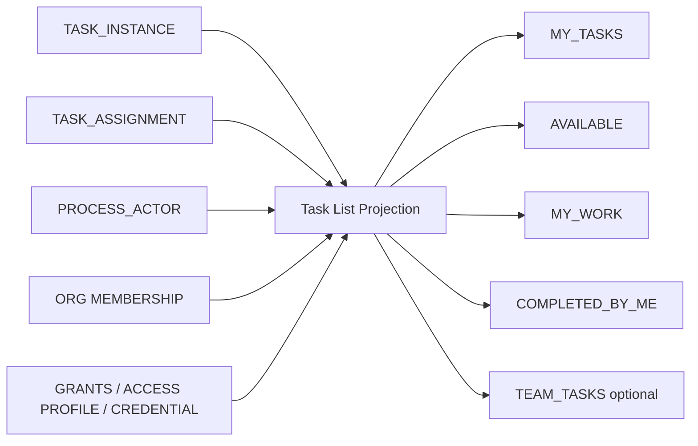

# Headless BPM — Canonical Logical ERD

Status: Informative companion  
Based on: `SPEC.md` 0.14.0  
Purpose: Visualize the implementation-independent logical model derived from `SPEC.md` without prescribing a physical database schema. This file does not introduce independent normative behavior.

Authority: `SPEC.md` 0.14.0 is the sole normative behavioral contract. Requirement and invariant IDs cited in this ERD are references to that source; prose and diagrams here are informative summaries only.

## 1. Design Principles

1. Separate **definition-time** objects from **runtime** objects.
2. Treat every activated BPMN Flow Node as a **Flow Node Instance**, not only task nodes.
3. Model User Task and Service Task work through the same runtime `Task Instance`, with specialized assignment, submission, attempt, and notification records.
4. Preserve exact Process-Version binding for every execution.
5. Preserve parallel-branch and synchronization state independently from tasks using **Flow Tokens** and Sequence Flow traversal history.
6. Make retries explicit through **Task Attempts**; a retry is not a new logical task.
7. Make waits explicit through **Timer Subscriptions** and **Message Subscriptions**.
8. Treat process variables/context as scoped runtime data, not a single opaque instance blob.
9. Separate execution history from security/administrative audit history.
10. Keep notification state separate from task completion state.
11. Record idempotency independently from business execution state.
12. Treat loop protection as durable execution state, not only validation metadata.
13. Separate request authentication (**Principal**) from business-origin attribution (**Initiator**) and process execution identity (**Process Actor**).
14. Model **Entry Point** as the controlled root-start boundary; public initiation is not equivalent to anonymous user creation.
15. Keep Platform Principals distinct from Process Actors; either may back a request Principal, but participation is not platform authority.
16. Allow Process Actors to be human or non-human and externally mastered by Actor Sources.
17. Separate inbound Actor Credentials from outbound External Integration credentials.
18. Model platform API keys as credentials owned by Platform Principals; effective key authority is bounded by the owner.
19. Represent authorization as stable actions over resource selectors with explicit allow/deny semantics.
20. Model Organization Units as an optional hierarchy independent from tenancy; actors may have many memberships.
21. Model optional API/MCP/public-entry consumption control independently from authorization, with strict rolling windows and weighted credit buckets.
22. Treat **Task List** as a derived actor-centric projection over Task, Assignment, Process Actor, Organization, and authorization state; do not create a second task-state authority.
23. Reserve **BPMN Participant** for the BPMN Collaboration/Pool concept; it is never a synonym for `PROCESS_ACTOR`.
24. Distinguish BPMN **Sequence Flow** inside a Process from **Message Flow** between BPMN Participants.
25. Distinguish **Call Activity** from **Sub-Process**; 0.13.0 represents the existing child-Process behavior as Call Activity and does not require executable embedded Sub-Process semantics.
26. Treat **BPMN 2.0 XML** as the canonical portable Process interchange representation while allowing implementation-specific internal persistence.
27. Treat **BPMN DI** as portable diagram-layout metadata that references BPMN semantic elements and never drives execution semantics.
28. Preserve stable BPMN definition identifiers independently from runtime Process/Task identifiers to support import/export round trips.
29. Use Mermaid only for informative ERD/system documentation; it is not a canonical BPMN Process notation.
30. Treat complete BPMN XML authoring and structured Flow Node/Sequence Flow authoring as two interfaces over the same `PROCESS_DRAFT` semantic model.
31. Treat BPMN validation/analysis results and rendered SVG diagrams as derived interface artifacts rather than canonical persisted process state.
32. Model administrative pause and recovery as explicit attributed runtime operations rather than direct state-table editing.
33. Preserve separate requesting Principal and effective Process Actor attribution for delegated/override actions.
34. Treat stale Operational Findings and Activity Stream items as diagnostic/read projections rather than new state authorities.
35. Treat Runtime Process Diagrams and Operations Summary as derived read projections; only Bulk Operations introduce new durable administrative resource state.
36. Keep the model logical: implementations may map these entities to relational rows, documents, event streams, key/value structures, or a combination.

## 2. Canonical Logical ERD

```mermaid
erDiagram
    PLATFORM_PRINCIPAL ||--|| PRINCIPAL : backs
    PROCESS_ACTOR ||--o| PRINCIPAL : backs_when_authenticated
    PRINCIPAL o|--o{ PROCESS_INSTANCE : invokes
    PRINCIPAL o|--o{ INITIATOR_ATTRIBUTION : may_be_initiator

    PLATFORM_PRINCIPAL ||--o{ API_KEY_CREDENTIAL : owns
    PLATFORM_PRINCIPAL ||--o{ AUTHORIZATION_GRANT : receives
    API_KEY_CREDENTIAL ||--o{ AUTHORIZATION_GRANT : constrained_by
    PRINCIPAL o|--o{ AUDIT_EVENT : causes
    PRINCIPAL o|--o{ BULK_OPERATION : requests
    PRINCIPAL o|--o{ IDEMPOTENCY_RECORD : scopes_authenticated
    ENTRY_POINT o|--o{ IDEMPOTENCY_RECORD : scopes_public_start
    PLATFORM_PRINCIPAL ||--o{ CONSUMPTION_POLICY_ASSOC : limited_by
    API_KEY_CREDENTIAL ||--o{ CONSUMPTION_POLICY_ASSOC : limited_by
    ENTRY_POINT ||--o{ CONSUMPTION_POLICY_ASSOC : limited_by

    ACTOR_SOURCE ||--o{ PROCESS_ACTOR : masters
    ACTOR_SOURCE o|--o{ ENTRY_POINT : resolves_actor_via
    ACTOR_SOURCE o|--o{ ORGANIZATION_UNIT : masters
    ACTOR_SOURCE o|--o{ ACTOR_ORG_MEMBERSHIP : masters
    ORGANIZATION_UNIT o|--o{ ORGANIZATION_UNIT : parent_of
    ORGANIZATION_UNIT ||--o{ ACTOR_ORG_MEMBERSHIP : has
    PROCESS_ACTOR ||--o{ ACTOR_ORG_MEMBERSHIP : member_of
    PLATFORM_PRINCIPAL o|--o| PROCESS_ACTOR : optionally_links
    PROCESS_ACTOR ||--o{ ACTOR_CREDENTIAL : authenticates_with
    ACTOR_CREDENTIAL ||--o{ ACTOR_GRANT : restricted_by
    PROCESS_ACTOR ||--o{ ACTOR_GRANT : receives
    PROCESS_ACTOR ||--o{ PROCESS_ACCESS_PROFILE_ASSOC : uses
    ACTOR_CREDENTIAL ||--o{ PROCESS_ACCESS_PROFILE_ASSOC : uses
    PROCESS_ACTOR ||--o{ CONSUMPTION_POLICY_ASSOC : limited_by
    ACTOR_CREDENTIAL ||--o{ CONSUMPTION_POLICY_ASSOC : limited_by
    PROCESS_ACCESS_PROFILE ||--o{ PROCESS_ACCESS_PROFILE_ASSOC : assigned_via
    PROCESS_ACCESS_PROFILE ||--o{ PROCESS_ACCESS_RULE : contains
    CONSUMPTION_LIMIT_POLICY ||--o{ CONSUMPTION_POLICY_ASSOC : assigned_via
    CONSUMPTION_LIMIT_POLICY ||--o{ HARD_WINDOW_LIMIT : defines
    CONSUMPTION_LIMIT_POLICY ||--o{ POLICY_CREDIT_BUCKET : uses
    CREDIT_BUCKET_DEFINITION ||--o{ POLICY_CREDIT_BUCKET : referenced_by
    CREDIT_BUCKET_DEFINITION ||--o{ CREDIT_OPERATION_COST : prices
    CREDIT_BUCKET_DEFINITION ||--o{ CREDIT_BUCKET_INSTANCE : instantiated_as
    CREDIT_BUCKET_INSTANCE ||--o{ CREDIT_BUCKET_LEDGER_ENTRY : records
    PROCESS_ACTOR ||--o{ TASK_ASSIGNMENT : receives
    PROCESS_ACTOR ||--o{ TASK_ATTEMPT : performs
    PROCESS_ACTOR ||--o{ USER_TASK_SUBMISSION : submits
    PROCESS_ACTOR ||--o{ TASK_NOTIFICATION : receives
    PROCESS_ACTOR o|--o{ EXTERNAL_INTEGRATION : represented_by
    EXTERNAL_INTEGRATION ||--o| OUTBOUND_CREDENTIAL_REF : authenticates_outbound

    COLLABORATION ||--|{ BPMN_PARTICIPANT : contains
    COLLABORATION ||--o{ MESSAGE_FLOW_DEFINITION : contains
    BPMN_PARTICIPANT o|--o| PROCESS_VERSION : references_process
    PROCESS_VERSION ||--o{ LANE : defines
    LANE ||--o{ LANE_FLOW_NODE_REF : contains
    FLOW_NODE_DEFINITION ||--o{ LANE_FLOW_NODE_REF : classified_by
    BPMN_PARTICIPANT ||--o{ MESSAGE_FLOW_DEFINITION : source_or_target

    PROCESS ||--o{ ENTRY_POINT : exposed_by
    PROCESS_VERSION o|--o{ ENTRY_POINT : pinned_by
    ENTRY_POINT o|--o{ PROCESS_INSTANCE : starts_root
    PROCESS_INSTANCE ||--o| INITIATOR_ATTRIBUTION : root_attribution
    PROCESS_ACTOR o|--o{ INITIATOR_ATTRIBUTION : subject_or_resolved_as

    PROCESS ||--o| PROCESS_DRAFT : has_draft
    PROCESS ||--o{ PROCESS_VERSION : publishes
    PROCESS_DRAFT ||--o{ BPMN_DOCUMENT_ARTIFACT : imports_exports
    PROCESS_VERSION ||--o{ BPMN_DOCUMENT_ARTIFACT : exports_as
    PROCESS_VERSION ||--|{ FLOW_NODE_DEFINITION : contains
    PROCESS_VERSION ||--o{ SEQUENCE_FLOW_DEFINITION : contains
    FLOW_NODE_DEFINITION ||--o{ DATA_MAPPING : maps

    FLOW_NODE_DEFINITION ||--o| USER_TASK_CONFIG : configures
    FLOW_NODE_DEFINITION ||--o| SERVICE_TASK_CONFIG : configures
    FLOW_NODE_DEFINITION ||--o| CATCH_EVENT_CONFIG : configures
    FLOW_NODE_DEFINITION ||--o| CALL_ACTIVITY_CONFIG : configures

    USER_TASK_CONFIG }o--o| FORM_SCHEMA : uses
    USER_TASK_CONFIG }o--o| ASSIGNMENT_POLICY : assigns_by
    SERVICE_TASK_CONFIG }o--|| TASK_TYPE_DEFINITION : implements
    SERVICE_TASK_CONFIG }o--o| ASSIGNMENT_POLICY : assigns_by
    SERVICE_TASK_CONFIG }o--o| RETRY_POLICY : retries_by
    SERVICE_TASK_CONFIG }o--o| TIMEOUT_POLICY : times_out_by
    CALL_ACTIVITY_CONFIG }o--|| PROCESS_VERSION : invokes_published

    PROCESS_VERSION ||--o{ LOOP_GUARD_DEFINITION : protects_cycles
    LOOP_GUARD_DEFINITION ||--|{ FLOW_NODE_DEFINITION : covers

    PROCESS_VERSION ||--o{ PROCESS_INSTANCE : executes_as
    PROCESS_INSTANCE o|--o{ PROCESS_INSTANCE : parent_of
    PROCESS_INSTANCE ||--o{ ADMINISTRATIVE_PAUSE : pause_history
    PROCESS_INSTANCE ||--o{ ADMIN_INTERVENTION : interventions
    PROCESS_INSTANCE ||--o{ OPERATIONAL_FINDING : findings
    %% Runtime Process Diagram and Operations Summary are derived projections and intentionally not persisted state authorities.
    PROCESS_ACTOR o|--o{ ADMIN_INTERVENTION : effective_actor
    BULK_OPERATION ||--o{ BULK_OPERATION_TARGET_RESULT : target_results
    PROCESS_INSTANCE ||--o{ EXECUTION_SEGMENT : segmented_as
    PROCESS_INSTANCE ||--o{ LOOP_GUARD_STATE : guards
    LOOP_GUARD_DEFINITION ||--o{ LOOP_GUARD_STATE : instantiated_as
    PROCESS_INSTANCE ||--o{ FLOW_NODE_INSTANCE : activates
    FLOW_NODE_DEFINITION ||--o{ FLOW_NODE_INSTANCE : instantiates

    PROCESS_INSTANCE ||--o{ FLOW_TOKEN : owns
    FLOW_TOKEN ||--o{ FLOW_NODE_INSTANCE : drives
    SEQUENCE_FLOW_DEFINITION ||--o{ SEQUENCE_FLOW_INSTANCE : realizes
    PROCESS_INSTANCE ||--o{ SEQUENCE_FLOW_INSTANCE : records
    FLOW_TOKEN ||--o{ SEQUENCE_FLOW_INSTANCE : moves_via

    FLOW_NODE_INSTANCE ||--o| TASK_INSTANCE : creates
    TASK_INSTANCE ||--o{ TASK_ASSIGNMENT : assigned_to
    TASK_INSTANCE ||--o{ TASK_ATTEMPT : attempts
    %% TASK_LIST is a derived projection over TASK_INSTANCE + TASK_ASSIGNMENT + actor/org/auth state; it is intentionally not a persisted entity.

    TASK_INSTANCE ||--o{ USER_TASK_SUBMISSION : receives
    FORM_SCHEMA ||--o{ USER_TASK_SUBMISSION : validates

    PROCESS_INSTANCE ||--o{ CONTEXT_VARIABLE : owns
    FLOW_NODE_INSTANCE o|--o{ CONTEXT_VARIABLE : scopes

    FLOW_NODE_INSTANCE ||--o{ TIMER_SUBSCRIPTION : waits_on
    FLOW_NODE_INSTANCE ||--o{ MESSAGE_SUBSCRIPTION : waits_on
    MESSAGE_SUBSCRIPTION o|--o| INBOUND_MESSAGE : consumes

    PROCESS_INSTANCE ||--o{ EXECUTION_EVENT : history
    FLOW_NODE_INSTANCE o|--o{ EXECUTION_EVENT : concerns
    TASK_INSTANCE o|--o{ EXECUTION_EVENT : concerns
    %% ACTIVITY_STREAM_ITEM is a derived projection over EXECUTION_EVENT + AUDIT_EVENT and is intentionally not an independent history authority.

    PROCESS_INSTANCE ||--o{ INCIDENT : has
    FLOW_NODE_INSTANCE o|--o{ INCIDENT : at
    TASK_INSTANCE o|--o{ INCIDENT : at

    TASK_INSTANCE ||--o{ TASK_NOTIFICATION : emits
    TASK_NOTIFICATION ||--o| EMAIL_NOTIFICATION : human_channel
    TASK_NOTIFICATION ||--o| MACHINE_NOTIFICATION : machine_channel
    EMAIL_NOTIFICATION ||--o{ EMAIL_DELIVERY_ATTEMPT : delivery
    EXTERNAL_INTEGRATION ||--o{ EMAIL_DELIVERY_ATTEMPT : provider

    PRINCIPAL {
      string principal_ref PK "logical security identity"
      enum principal_kind "PLATFORM|PROCESS_ACTOR"
      uuid platform_principal_id FK "nullable"
      uuid actor_id FK "nullable"
    }

    PLATFORM_PRINCIPAL {
      uuid principal_id PK
      enum principal_type "ADMIN|USER|MACHINE"
      string auth_subject UK
      string display_name
      enum status "ACTIVE|DISABLED"
      timestamp created_at
    }

    ACTOR_SOURCE {
      uuid source_id PK
      string source_key UK
      string name
      enum authority "INTERNAL|EXTERNAL"
      enum sync_mode "PUSH|PULL|JUST_IN_TIME"
      enum status "ACTIVE|DISABLED"
    }

    ORGANIZATION_UNIT {
      uuid org_unit_id PK
      uuid parent_org_unit_id FK "nullable root"
      uuid source_id FK "nullable"
      string org_key
      string external_org_id "nullable"
      string name
      enum status "ACTIVE|INACTIVE"
      json attributes
      timestamp last_synced_at
    }

    ACTOR_ORG_MEMBERSHIP {
      uuid membership_id PK
      uuid actor_id FK
      uuid org_unit_id FK
      uuid source_id FK "nullable"
      string external_membership_id "nullable"
      enum status "ACTIVE|INACTIVE"
      timestamp effective_from "nullable"
      timestamp effective_to "nullable"
      json attributes
    }

    PROCESS_ACTOR {
      uuid actor_id PK
      uuid source_id FK "nullable"
      uuid linked_platform_principal_id FK "nullable"
      string external_subject_id "nullable"
      enum actor_type "HUMAN|SERVICE|EXTERNAL_SYSTEM|AGENT|WORKER|MCP_CLIENT"
      enum lifecycle_status "ACTIVE|INACTIVE|SUSPENDED|RETIRED"
      enum runtime_availability "AVAILABLE|DEGRADED|UNAVAILABLE|UNKNOWN|N_A"
      string display_name
      string email "nullable"
      json attributes
      timestamp last_synced_at
    }

    API_KEY_CREDENTIAL {
      uuid credential_id PK
      uuid principal_id FK
      string key_prefix UK
      string secret_verifier
      enum status "ACTIVE|REVOKED|EXPIRED"
      timestamp created_at
      timestamp expires_at
      timestamp revoked_at
      timestamp last_used_at
      uuid rotated_from_credential_id FK
    }

    ACTOR_CREDENTIAL {
      uuid actor_credential_id PK
      uuid actor_id FK
      string credential_prefix UK
      string secret_verifier
      enum status "ACTIVE|REVOKED|EXPIRED"
      timestamp created_at
      timestamp expires_at
      timestamp last_used_at
    }

    AUTHORIZATION_GRANT {
      uuid grant_id PK
      enum subject_type "PLATFORM_PRINCIPAL|API_KEY"
      uuid platform_principal_id FK "nullable when API_KEY"
      uuid credential_id FK "nullable when PLATFORM_PRINCIPAL"
      string action
      string resource_type
      string resource_selector
      enum effect "ALLOW|DENY"
      timestamp created_at
    }

    ACTOR_GRANT {
      uuid actor_grant_id PK
      enum subject_type "PROCESS_ACTOR|ACTOR_CREDENTIAL"
      uuid actor_id FK "nullable when credential"
      uuid actor_credential_id FK "nullable when actor"
      string action
      string entry_point_selector "nullable"
      string process_selector
      string flow_node_selector "nullable"
      string task_selector "nullable"
      string event_selector "nullable"
      string organization_selector "nullable"
      enum organization_scope "SELF_ONLY|SELF_AND_DESCENDANTS|nullable"
      enum effect "ALLOW|DENY"
    }

    PROCESS_ACCESS_PROFILE {
      uuid access_profile_id PK
      string profile_key UK
      string name
      enum status "ACTIVE|DISABLED"
      string description
      timestamp created_at
      timestamp updated_at
    }

    PROCESS_ACCESS_PROFILE_ASSOC {
      uuid association_id PK
      uuid access_profile_id FK
      uuid actor_id FK "nullable when credential-targeted"
      uuid actor_credential_id FK "nullable when actor-targeted"
      timestamp created_at
    }

    PROCESS_ACCESS_RULE {
      uuid access_rule_id PK
      uuid access_profile_id FK
      enum interface "REST|MCP"
      string operation_id "REST Operation ID or MCP Tool ID"
      string logical_action
      string entry_point_selector "nullable"
      string process_selector "nullable"
      string version_selector "nullable"
      string process_instance_selector "nullable"
      string flow_node_selector "nullable"
      string task_selector "nullable"
      string event_selector "nullable"
      string notification_selector "nullable"
      string organization_selector "nullable"
      enum organization_scope "SELF_ONLY|SELF_AND_DESCENDANTS|nullable"
      enum effect "ALLOW|DENY"
    }

    CONSUMPTION_LIMIT_POLICY {
      uuid limit_policy_id PK
      string policy_key UK
      string name
      enum status "ACTIVE|DISABLED"
      string description
      timestamp created_at
      timestamp updated_at
    }

    CONSUMPTION_POLICY_ASSOC {
      uuid association_id PK
      uuid limit_policy_id FK
      enum subject_type "PLATFORM_PRINCIPAL|API_KEY|PROCESS_ACTOR|ACTOR_CREDENTIAL|ENTRY_POINT"
      uuid subject_id
      timestamp created_at
    }

    HARD_WINDOW_LIMIT {
      uuid hard_limit_id PK
      uuid limit_policy_id FK
      enum window_type "SECOND|MINUTE|HOUR|DAY"
      integer max_operations
      string operation_selector "nullable means all matching operations"
      enum interface "REST|MCP|PUBLIC_HTTP|MULTI"
    }

    POLICY_CREDIT_BUCKET {
      uuid policy_credit_bucket_id PK
      uuid limit_policy_id FK
      uuid credit_bucket_definition_id FK
      enum instance_scope "SUBJECT_PRIVATE|SHARED"
      string sharing_key_expression "nullable"
    }

    CREDIT_BUCKET_DEFINITION {
      uuid credit_bucket_definition_id PK
      string bucket_key UK
      string name
      enum status "ACTIVE|DISABLED"
      bigint capacity
      enum refill_type "NO_REFILL|CONTINUOUS|PERIODIC"
      bigint refill_amount "nullable"
      integer refill_interval_seconds "nullable"
      string periodic_rule "nullable"
      integer default_operation_cost "nullable"
    }

    CREDIT_OPERATION_COST {
      uuid credit_operation_cost_id PK
      uuid credit_bucket_definition_id FK
      enum interface "REST|MCP"
      string operation_id
      integer credit_cost
    }

    CREDIT_BUCKET_INSTANCE {
      uuid credit_bucket_instance_id PK
      uuid credit_bucket_definition_id FK
      enum instance_scope "SUBJECT_PRIVATE|SHARED"
      string instance_key UK
      bigint available_credits
      timestamp last_refill_at
      bigint revision
    }

    CREDIT_BUCKET_LEDGER_ENTRY {
      uuid ledger_entry_id PK
      uuid credit_bucket_instance_id FK
      enum entry_type "CONSUME|REFILL|TOP_UP|ADJUST|RESET"
      bigint delta
      bigint balance_after
      string operation_id "nullable"
      string principal_ref "nullable"
      string reason "nullable"
      timestamp occurred_at
    }

    OUTBOUND_CREDENTIAL_REF {
      uuid outbound_credential_ref_id PK
      string secret_store_reference
      string auth_scheme
      enum status "ACTIVE|DISABLED"
    }

    PROCESS {
      uuid process_id PK
      string process_key UK
      string name
      string created_by_principal_ref FK
      timestamp created_at
    }

    PROCESS_DRAFT {
      uuid draft_id PK
      uuid process_id FK_UK
      bigint revision
      string bpmn_process_id "stable BPMN semantic id"
      json draft_model
      json bpmn_di_state "nullable; presentation only"
      json opaque_extension_state "nullable preserved extensions"
      timestamp updated_at
    }

    COLLABORATION {
      uuid collaboration_id PK
      string collaboration_key UK
      string bpmn_element_id UK
      string name
    }

    BPMN_PARTICIPANT {
      uuid bpmn_participant_id PK
      uuid collaboration_id FK
      uuid process_version_id FK "nullable for black-box Participant"
      string participant_key
      string bpmn_element_id
      string name "Pool label / business role"
    }

    LANE {
      uuid lane_id PK
      uuid process_version_id FK
      uuid parent_lane_id FK "nullable"
      string lane_key
      string bpmn_element_id
      string name
      uuid organization_unit_id FK "nullable metadata reference only"
    }

    LANE_FLOW_NODE_REF {
      uuid lane_flow_node_ref_id PK
      uuid lane_id FK
      uuid node_def_id FK
    }

    MESSAGE_FLOW_DEFINITION {
      uuid message_flow_def_id PK
      uuid collaboration_id FK
      uuid source_bpmn_participant_id FK
      uuid target_bpmn_participant_id FK
      string bpmn_element_id
      string message_name "nullable"
      string correlation_definition "nullable"
    }

    PROCESS_VERSION {
      uuid process_version_id PK
      uuid process_id FK
      string version
      string bpmn_process_id "stable BPMN semantic id"
      string content_hash
      boolean has_bpmn_di
      json bpmn_di_state "nullable; presentation only"
      json opaque_extension_state "nullable preserved extensions"
      timestamp published_at
      string published_by_principal_ref FK
    }

    BPMN_DOCUMENT_ARTIFACT {
      uuid bpmn_document_artifact_id PK
      uuid draft_id FK "nullable"
      uuid process_version_id FK "nullable"
      enum artifact_scope "DRAFT|PUBLISHED_VERSION"
      string bpmn_version "2.0.2"
      string definitions_id "nullable"
      boolean has_bpmn_di
      string content_digest
      timestamp generated_at
    }

    LOOP_GUARD_DEFINITION {
      uuid loop_guard_def_id PK
      uuid process_version_id FK
      string region_key
      enum classification "BOUNDED|INTENTIONALLY_UNBOUNDED"
      int max_region_entries
      int max_sequence_flows_per_segment
      int max_no_progress_entries
      json progress_marker_definition
      decimal warning_threshold_ratio
      bool rollover_allowed
    }

    EXECUTION_SEGMENT {
      uuid segment_id PK
      uuid instance_id FK
      int segment_no
      bigint segment_event_count
      bigint segment_sequence_flow_count
      timestamp started_at
      timestamp ended_at
      string rollover_reason
    }

    LOOP_GUARD_STATE {
      uuid loop_guard_state_id PK
      uuid instance_id FK
      uuid loop_guard_def_id FK
      bigint lifetime_region_entries
      bigint segment_region_entries
      bigint segment_sequence_flow_count
      int no_progress_count
      string progress_fingerprint
      timestamp last_progress_at
      enum status "NORMAL|WARNING|TRIGGERED"
    }

    FLOW_NODE_DEFINITION {
      uuid node_def_id PK
      uuid process_version_id FK
      string flow_node_key
      string bpmn_element_id "unique within BPMN document/version"
      enum flow_node_type "START_EVENT|END_EVENT|USER_TASK|SERVICE_TASK|EXCLUSIVE_GATEWAY|PARALLEL_GATEWAY|INTERMEDIATE_CATCH_EVENT|CALL_ACTIVITY"
      string name
      json config
    }

    SEQUENCE_FLOW_DEFINITION {
      uuid sequence_flow_def_id PK
      uuid process_version_id FK
      uuid from_node_def_id FK
      uuid to_node_def_id FK
      string bpmn_element_id "unique within BPMN document/version"
      string condition_expression
      integer evaluation_order
      boolean is_default
    }

    DATA_MAPPING {
      uuid mapping_id PK
      uuid node_def_id FK
      enum direction "INPUT|OUTPUT"
      string target_path
      string expression
    }

    FORM_SCHEMA {
      uuid form_schema_id PK
      string schema_format "e.g. JSON_SCHEMA"
      string schema_version
      string content_hash
      json schema_document
    }

    ASSIGNMENT_POLICY {
      uuid assignment_policy_id PK
      enum target_actor_type "HUMAN|NON_HUMAN"
      string assignment_expression
      uuid organization_unit_id FK "nullable"
      enum organization_scope "SELF_ONLY|SELF_AND_DESCENDANTS|nullable"
      boolean claim_required
    }

    USER_TASK_CONFIG {
      uuid node_def_id PK_FK
      uuid form_schema_id FK
      uuid assignment_policy_id FK
      string due_at_expression
      string follow_up_at_expression
      string priority_expression
    }

    TASK_TYPE_DEFINITION {
      uuid task_type_id PK
      string task_type_key UK
      json input_contract
      json output_contract
      string owner
    }

    RETRY_POLICY {
      uuid retry_policy_id PK
      integer max_attempts
      enum backoff_type "NONE|FIXED|LINEAR|EXPONENTIAL"
      integer initial_delay_ms
      integer max_delay_ms
      integer jitter_ms
    }

    TIMEOUT_POLICY {
      uuid timeout_policy_id PK
      integer total_timeout_ms
      integer attempt_timeout_ms
      integer response_timeout_ms
      enum timeout_action "RETRY|FAIL_TASK|FAIL_PROCESS|ROUTE_FAILURE"
    }

    SERVICE_TASK_CONFIG {
      uuid node_def_id PK_FK
      uuid task_type_id FK
      uuid assignment_policy_id FK
      uuid retry_policy_id FK
      uuid timeout_policy_id FK
    }

    CATCH_EVENT_CONFIG {
      uuid node_def_id PK_FK
      enum catch_event_kind "TIMER|MESSAGE|CONDITIONAL"
      string timer_expression
      string message_name_expression
      string correlation_key_expression
    }

    CALL_ACTIVITY_CONFIG {
      uuid node_def_id PK_FK
      uuid target_process_version_id FK
    }

    ENTRY_POINT {
      uuid entry_point_id PK
      string entry_point_key UK
      uuid process_id FK
      enum version_policy "PINNED_VERSION|LATEST_PUBLISHED"
      uuid pinned_process_version_id FK "nullable"
      enum access_mode "AUTHENTICATED|PUBLIC|INTERNAL"
      string input_contract_ref
      enum initiator_mode "FROM_PRINCIPAL|FROM_REQUEST|ANONYMOUS|SYSTEM"
      enum actor_resolution "NONE|RESOLVE_IF_EXISTS|JUST_IN_TIME|REQUIRED"
      uuid actor_source_id FK "nullable"
      string actor_match_rule "nullable"
      string public_route_key "nullable routing identifier"
      enum status "ACTIVE|DISABLED"
      timestamp created_at
      timestamp updated_at
    }

    INITIATOR_ATTRIBUTION {
      uuid initiator_attribution_id PK
      uuid root_instance_id FK_UK
      enum initiator_kind "PRINCIPAL|PROCESS_ACTOR|EXTERNAL|ANONYMOUS|SYSTEM"
      string principal_ref FK "nullable"
      uuid actor_id FK "nullable"
      string external_subject_type "nullable"
      string external_subject_id "nullable"
      json subject_snapshot "nullable"
      uuid resolved_actor_id FK "nullable"
      json source_metadata "nullable"
      timestamp created_at
    }

    PROCESS_INSTANCE {
      uuid instance_id PK
      uuid process_version_id FK
      uuid entry_point_id FK "required for external root; nullable child"
      string invoked_by_principal_ref FK "nullable"
      uuid parent_instance_id FK
      uuid parent_flow_node_instance_id FK
      uuid root_instance_id FK
      string correlation_id
      enum status "RUNNING|WAITING|PAUSED|COMPLETED|FAILED|CANCELLED"
      string start_interface "CLI|REST|MCP|PUBLIC_HTTP|INTERNAL|CALL_ACTIVITY"
      timestamp started_at
      timestamp ended_at
    }

    ADMINISTRATIVE_PAUSE {
      uuid pause_id PK
      uuid instance_id FK
      string requested_by_principal_ref FK
      enum scope "SELF_ONLY|SELF_AND_DESCENDANTS"
      string reason
      string ticket_reference "nullable"
      timestamp paused_at
      timestamp resumed_at "nullable"
      string resumed_by_principal_ref FK "nullable"
      uuid parent_pause_id FK "nullable cascade link"
    }

    ADMIN_INTERVENTION {
      uuid intervention_id PK
      uuid instance_id FK
      string requested_by_principal_ref FK
      uuid effective_actor_id FK "nullable"
      enum action_mode "NONE|ON_BEHALF_OF|ADMIN_OVERRIDE"
      enum intervention_type "RELEASE_STALE_CLAIM|REASSIGN_TASK|RETRY_WORK|CONTEXT_PATCH|TASK_COMPLETE|CANCEL_INSTANCE"
      string target_type
      string target_id
      string expected_state "or revision guard"
      string reason
      string ticket_reference "nullable"
      string idempotency_key
      timestamp occurred_at
      json result_summary
    }

    OPERATIONAL_FINDING {
      uuid finding_id PK "logical/persisted or synthesized reference"
      uuid instance_id FK
      string resource_type
      string resource_id "nullable"
      enum finding_type "WAITING_OVERDUE|CLAIM_STALE|RETRY_STALE|INCIDENT_BLOCKED|NO_PROGRESS_SUSPECTED"
      timestamp observed_at
      string threshold_rule
      json evidence
      enum status "OPEN|CLEARED|ACKNOWLEDGED"
    }

    BULK_OPERATION {
      uuid bulk_operation_id PK
      string requested_by_principal_ref FK
      enum action_type "RETRY_INCIDENTS|CANCEL_INSTANCES|PAUSE_INSTANCES|RESUME_INSTANCES|REASSIGN_TASKS|RELEASE_STALE_CLAIMS"
      string preview_id
      string frozen_selection_hash
      string reason
      string ticket_reference "nullable"
      string idempotency_key
      enum status "PENDING|RUNNING|COMPLETED|COMPLETED_WITH_ERRORS|FAILED"
      integer target_count
      integer succeeded_count
      integer failed_count
      integer skipped_count
      timestamp created_at
      timestamp started_at "nullable"
      timestamp completed_at "nullable"
    }

    BULK_OPERATION_TARGET_RESULT {
      uuid bulk_target_result_id PK
      uuid bulk_operation_id FK
      string target_type
      string target_id
      enum status "SUCCEEDED|FAILED|SKIPPED"
      string error_code "nullable"
      string resulting_state "nullable"
      json details
      timestamp evaluated_at
    }

    FLOW_TOKEN {
      uuid token_id PK
      uuid instance_id FK
      uuid parent_token_id FK
      enum status "ACTIVE|WAITING|CONSUMED|CANCELLED"
      timestamp created_at
      timestamp ended_at
    }

    FLOW_NODE_INSTANCE {
      uuid flow_node_instance_id PK
      uuid instance_id FK
      uuid node_def_id FK
      uuid token_id FK
      integer activation_no
      enum status "PENDING|ACTIVE|WAITING|COMPLETED|FAILED|CANCELLED|SKIPPED"
      timestamp started_at
      timestamp ended_at
    }

    SEQUENCE_FLOW_INSTANCE {
      uuid sequence_flow_instance_id PK
      uuid instance_id FK
      uuid token_id FK
      uuid sequence_flow_def_id FK
      uuid from_flow_node_instance_id FK
      uuid to_flow_node_instance_id FK
      timestamp taken_at
    }

    TASK_INSTANCE {
      uuid task_id PK
      uuid flow_node_instance_id FK
      enum task_kind "USER_TASK|SERVICE_TASK"
      enum status "PENDING|AVAILABLE|CLAIMED|COMPLETED|FAILED|CANCELLED"
      integer priority
      timestamp available_at
      timestamp claimed_at
      timestamp due_at
      timestamp follow_up_at
      timestamp completed_at
      uuid completed_by_actor_id FK "nullable for ADMIN_OVERRIDE"
      string completed_by_principal_ref FK "nullable admin requestor"
      enum completion_mode "NORMAL|ON_BEHALF_OF|ADMIN_OVERRIDE"
      json input_snapshot
      json output
    }

    TASK_ASSIGNMENT {
      uuid assignment_id PK
      uuid task_id FK
      uuid actor_id FK
      enum assignment_role "POTENTIAL_OWNER|ASSIGNEE"
      timestamp assigned_at
      timestamp revoked_at
    }

    TASK_ATTEMPT {
      uuid attempt_id PK
      uuid task_id FK
      integer attempt_no
      uuid actor_id FK
      enum status "SCHEDULED|CLAIMED|RUNNING|SUCCEEDED|FAILED|TIMED_OUT|CANCELLED"
      timestamp claimed_at
      timestamp lease_expires_at
      timestamp started_at
      timestamp heartbeat_at
      timestamp ended_at
      string failure_code
      string failure_message
      json output
    }

    USER_TASK_SUBMISSION {
      uuid submission_id PK
      uuid task_id FK
      uuid actor_id FK "effective actor; nullable for override"
      string requested_by_principal_ref FK "nullable admin requestor"
      enum action_mode "NORMAL|ON_BEHALF_OF|ADMIN_OVERRIDE"
      uuid form_schema_id FK
      timestamp submitted_at
      enum validation_status "ACCEPTED|REJECTED"
      json submitted_data
      json validation_errors
    }

    CONTEXT_VARIABLE {
      uuid variable_id PK
      uuid instance_id FK
      uuid flow_node_instance_id FK "null=root scope"
      string name
      json value
      integer revision
      timestamp updated_at
    }

    TIMER_SUBSCRIPTION {
      uuid timer_subscription_id PK
      uuid flow_node_instance_id FK
      timestamp fire_at
      enum status "OPEN|FIRED|CANCELLED"
      timestamp created_at
    }

    MESSAGE_SUBSCRIPTION {
      uuid message_subscription_id PK
      uuid flow_node_instance_id FK
      string message_name
      string correlation_key
      enum status "OPEN|CONSUMED|CANCELLED|EXPIRED"
      timestamp opened_at
      timestamp expires_at
    }

    INBOUND_MESSAGE {
      uuid inbound_message_id PK
      string external_message_id
      string message_name
      string correlation_key
      json payload
      timestamp received_at
      timestamp expires_at
      uuid consumed_subscription_id FK
      enum status "RECEIVED|CORRELATED|UNMATCHED|EXPIRED|DUPLICATE"
    }

    EXECUTION_EVENT {
      uuid execution_event_id PK
      uuid instance_id FK
      bigint sequence_no
      uuid flow_node_instance_id FK
      uuid task_id FK
      string event_type
      timestamp occurred_at
      string principal_ref FK "nullable"
      enum actor_context "PRINCIPAL|SYSTEM"
      json payload
    }

    INCIDENT {
      uuid incident_id PK
      uuid instance_id FK
      uuid flow_node_instance_id FK
      uuid task_id FK
      string incident_type
      enum status "OPEN|RESOLVED"
      string error_code
      string message
      timestamp created_at
      timestamp resolved_at
      string resolved_by_principal_ref FK
    }

    TASK_NOTIFICATION {
      uuid notification_id PK
      uuid task_id FK
      uuid recipient_actor_id FK
      string notification_type
      timestamp created_at
    }

    EMAIL_NOTIFICATION {
      uuid notification_id PK_FK
      string recipient_email_snapshot
      enum dispatch_status "PENDING|SENT|FAILED"
      timestamp last_attempt_at
    }

    EMAIL_DELIVERY_ATTEMPT {
      uuid delivery_attempt_id PK
      uuid notification_id FK
      uuid integration_id FK
      integer attempt_no
      enum status "PENDING|SENT|FAILED"
      string provider_message_id
      string error_code
      string error_message
      timestamp attempted_at
    }

    MACHINE_NOTIFICATION {
      uuid notification_id PK_FK
      enum status "OPEN|ACKNOWLEDGED|EXPIRED"
      json payload
      timestamp acknowledged_at
      string acknowledged_by_principal_ref FK
      timestamp expires_at
    }

    EXTERNAL_INTEGRATION {
      uuid integration_id PK
      string integration_type
      string name
      string credential_reference
      json configuration
      enum status "ACTIVE|DISABLED"
    }

    IDEMPOTENCY_RECORD {
      uuid idempotency_record_id PK
      string principal_ref FK "nullable for PUBLIC start"
      uuid entry_point_id FK "nullable except entry-point start scope"
      string operation
      string idempotency_key
      string request_hash
      string result_resource_type
      string result_resource_id
      enum status "IN_PROGRESS|SUCCEEDED|FAILED"
      timestamp created_at
      timestamp expires_at
    }

    AUDIT_EVENT {
      uuid audit_event_id PK
      string principal_ref FK "nullable"
      uuid effective_actor_id FK "nullable"
      enum action_mode "NORMAL|ON_BEHALF_OF|ADMIN_OVERRIDE|SYSTEM"
      enum actor_context "PRINCIPAL|SYSTEM|UNAUTHENTICATED"
      uuid entry_point_id FK "nullable"
      string action
      string target_type
      string target_id
      string resulting_state
      string request_correlation_id
      string reason "nullable"
      string ticket_reference "nullable"
      timestamp occurred_at
      json details
    }
```

## 3. Why These Entities Are Needed

### 3.0 Consumption limiting and credits

`CONSUMPTION_LIMIT_POLICY` is separate from authorization. It determines whether an already-authorized operation may be admitted at the current time. `HARD_WINDOW_LIMIT` represents strict rolling ceilings for second/minute/hour/day windows. `CREDIT_BUCKET_DEFINITION` defines reusable weighted capacity/refill/cost semantics; `CREDIT_BUCKET_INSTANCE` holds the durable subject-private or shared balance and `CREDIT_BUCKET_LEDGER_ENTRY` preserves auditable balance changes.

A single subject may have multiple policies and multiple buckets. Admission is conjunctive across all applicable hard windows and credit buckets. Implementations may use a specialized distributed limiter rather than persist each request as a relational row, provided the observable semantics remain equivalent.

### 3.1 BPMN 2.0 model boundary

`COLLABORATION`, `BPMN_PARTICIPANT`, `LANE`, and `MESSAGE_FLOW_DEFINITION` preserve BPMN meanings. A `BPMN_PARTICIPANT` is the business entity/role represented by a Pool and may reference a Process Version; it is never an execution identity. `LANE` classifies/organizes Flow Nodes inside a Process and may carry an optional Organization Unit reference as metadata, but such a reference has no authorization effect by itself. `MESSAGE_FLOW_DEFINITION` represents communication between BPMN Participants and is distinct from `SEQUENCE_FLOW_DEFINITION`, which orders Flow Nodes inside one Process.

`PROCESS_ACTOR` is a Headless BPM extension for the human/non-human runtime identity performing work. The same real-world company or person may be related to both a BPMN Participant and a Process Actor, but the records and semantics remain independent.

### 3.1.1 BPMN interchange boundary

BPMN 2.0 XML is the canonical portable representation of the supported semantic model. `BPMN_DOCUMENT_ARTIFACT` represents the logical import/export artifact and may be stored or synthesized on demand; it does not require a dedicated physical table. `bpmn_process_id` and `bpmn_element_id` fields preserve the BPMN definition identities needed for stable round-trip interchange and remain distinct from Headless BPM runtime IDs.

BPMN DI is presentation-only. `bpmn_di_state` denotes the logical layout information required to preserve imported/exported BPMN diagram planes, shapes, edges, bounds, and waypoints. Changing that state does not change Process execution, authorization, assignment, or runtime history. A valid Process may have no BPMN DI at all, and Headless BPM need not auto-layout it.

Complete BPMN document import/replacement and structured Flow Node/Sequence Flow edits both converge on the same `PROCESS_DRAFT`. The ERD therefore does not model a second proprietary authoring entity or workflow representation for CLI/REST/MCP edits. Validation and analysis are read-only projections over supplied BPMN XML; successful structured edits update the same logical Draft objects represented by `FLOW_NODE_DEFINITION`, `SEQUENCE_FLOW_DEFINITION`, BPMN identifiers, extensions, and DI state.

A rendered SVG diagram is also a derived interface artifact. It is generated from the requested Draft or Process Version plus retained `bpmn_di_state`; it is not a definition entity, execution entity, or authoritative persistence record. When no usable DI exists, render availability is absent rather than implying automatic layout.

`opaque_extension_state` denotes preserved namespaced `extensionElements` that Headless BPM does not execute. Recognized Headless BPM extensions may map into normal logical fields/configuration; unknown extensions are never an implicit source of executable behavior.

### 3.2 Principal, Entry Point, Initiator, and Process Actor

`PRINCIPAL` is a logical security union over authenticated Platform Principal and Process Actor identities. It represents **who authenticated the request**, and need not be a physical table. `ENTRY_POINT` represents **how a root process may start**. `INITIATOR_ATTRIBUTION` represents **who or what caused the business process to exist**. `PROCESS_ACTOR` represents **who performs work later**.

A `PUBLIC` Entry Point may create a root `PROCESS_INSTANCE` with no Principal and with an `EXTERNAL` or `ANONYMOUS` Initiator. This does not create a Process Actor. If the Entry Point declares `RESOLVE_IF_EXISTS`, `JUST_IN_TIME`, or `REQUIRED`, identity resolution may link `INITIATOR_ATTRIBUTION.resolved_actor_id` to a Process Actor while preserving the original Initiator kind and subject snapshot.

A root `PROCESS_INSTANCE.entry_point_id` is immutable historical attribution. `invoked_by_principal_ref` is nullable for unauthenticated public starts. Child Process Instances created by Call Activity use parent/root lineage rather than a new external Entry Point and expose the root Initiator through that lineage.

### 3.3 Process definition vs runtime

`PROCESS` identifies the business Process across time. `PROCESS_DRAFT` is the mutable unpublished authoring state. `PROCESS_VERSION` is an immutable published snapshot. `FLOW_NODE_DEFINITION` and `SEQUENCE_FLOW_DEFINITION` describe the published executable model; `FLOW_NODE_INSTANCE` and `SEQUENCE_FLOW_INSTANCE` record what actually happened.

A published `PROCESS_VERSION` is the internal representation of the SPEC.md concept **Process Version**. Only Published Process Versions may back new `PROCESS_INSTANCE` records.

### 3.4 Flow Node Instance is mandatory

Not every runtime node is a Task. Exclusive/Parallel Gateways, Intermediate Catch Events, Start/End Events, and Call Activities still need runtime identity, timestamps, lifecycle, history, and failure attribution. `FLOW_NODE_INSTANCE` therefore sits between `PROCESS_INSTANCE` and `TASK_INSTANCE`.

### 3.5 Flow Token is separate from Task

Parallel Gateway divergence and convergence require durable branch state. A `FLOW_TOKEN` represents one active logical execution path. A diverging Parallel Gateway may create child tokens; a converging Parallel Gateway consumes/synchronizes the required incoming tokens according to the published Process semantics. This prevents a task table from becoming a hidden process-state table.

### 3.6 Task definition/config vs runtime Task Instance vs attempt

Three layers are intentionally separate:

- `TASK_TYPE_DEFINITION`: reusable Service Task work contract and defaults.
- `TASK_INSTANCE`: one logical User Task or Service Task unit of work in a Process execution.
- `TASK_ATTEMPT`: one actual Service Task execution/claim attempt, including retry/timeout details.

A retry creates a new `TASK_ATTEMPT`, not a new `TASK_INSTANCE`.

### 3.7 Assignment is a relationship

`TASK_ASSIGNMENT` is not a single `assignee_id` field. A User Task may have one or more BPMN Potential Owners before claim/direct assignment and at most one current Headless BPM Assignee when exclusive ownership applies. Assignment history must survive claim, release, and reassignment, so each relationship is separately recorded and may be revoked.

Additional BPMN resource-role or Headless BPM delegation concepts may be added later; 0.14.0 summarizes the specified Potential Owner and Assignee semantics.

### 3.7.1 Task List is a derived work projection

`TASK_LIST` is intentionally **not** a persisted canonical entity in this ERD. It is an actor-scoped projection computed from:

- `TASK_INSTANCE` current state and scheduling metadata;
- active/historical `TASK_ASSIGNMENT` relationships;
- `PROCESS_ACTOR` lifecycle/type;
- `ACTOR_ORG_MEMBERSHIP` and `ORGANIZATION_UNIT` scope when applicable;
- `ACTOR_GRANT`, `PROCESS_ACCESS_PROFILE`, credential, and current authorization state.

The canonical logical views are `MY_TASKS`, `AVAILABLE`, `MY_WORK`, `COMPLETED_BY_ME`, and optional `TEAM_TASKS`. This avoids duplicating task state into per-user inbox tables. Implementations may maintain indexes/materialized projections for performance, but protected results must be revalidated against current security-sensitive eligibility.

A claim updates `TASK_INSTANCE`/`TASK_ASSIGNMENT`; the resulting Task List changes are derived. Email and `MACHINE_NOTIFICATION` remain delivery artifacts and never become the source of work ownership.



### 3.8 Forms and submissions

`FORM_SCHEMA` is immutable/versioned content referenced by a User Task definition. `USER_TASK_SUBMISSION` preserves who submitted which data against which schema and whether it passed validation. Rejected submissions do not complete the Task.

### 3.9 Scoped execution context

`CONTEXT_VARIABLE` supports root process scope and node-local scope. This is more complete than a single opaque Process Instance JSON object because Call Activity child Processes, parallel branches, forms, mappings, and local task data need scope boundaries.

An implementation may physically persist context as JSON snapshots/event deltas rather than one row per variable.

### 3.10 Intermediate Catch Events require durable subscriptions

`TIMER_SUBSCRIPTION` and `MESSAGE_SUBSCRIPTION` are runtime state. A waiting node must remain discoverable and recoverable after process/server restart. `INBOUND_MESSAGE` provides message identity, correlation, TTL/deduplication, and correlation outcome.

Exact event buffering and correlation semantics remain a SPEC.md product decision.

### 3.11 Execution history vs audit history

`EXECUTION_EVENT` captures process behavior: Flow Node activation, Sequence Flow traversal, task state change, timer firing, variable update, pause/resume effect, etc. `AUDIT_EVENT` captures accountable operations: publication, administration, task actions, intervention/delegation, cancellations, notification acknowledgements, and other externally attributable actions. The 0.14.0 Activity Stream is a derived chronological projection over these sources; no independent `ACTIVITY_STREAM` state table is implied.

They may share one physical event store, but they are distinct logical concepts.

### 3.11.1 Runtime diagrams, fleet summary, and bulk administration

A Runtime Process Diagram is derived from the Process Instance's exact bound `PROCESS_VERSION`, retained BPMN DI, `FLOW_NODE_INSTANCE` state, `SEQUENCE_FLOW_INSTANCE` history, and Incident/lifecycle state. No `RUNTIME_DIAGRAM` persistence entity is implied.

The Operations Summary is likewise a read-only authorized aggregate over Process Instances, Tasks, Incidents, and Operational Findings. Implementations may materialize a projection for performance, but it is not a state authority and must expose its observation point/freshness when applicable.

`BULK_OPERATION` is durable because a fleet-scale mutation can outlive one request and must expose progress/results. `BULK_OPERATION_TARGET_RESULT` records per-target outcomes; it does not replace the normal execution/audit records generated by each successful underlying action. The preview's frozen target set may be stored directly, by immutable selection artifact, or by an equivalent reference/hash.

### 3.12 Incidents are first-class

A failure is not always the same as a terminal process failure. `INCIDENT` gives a durable object for a blocked or degraded execution condition and makes failures inspectable. Whether incidents are manually resolvable is still a product-policy decision.

### 3.13 User and Service Task notifications remain separate

`TASK_NOTIFICATION` is common metadata only. The channel-specific state is split:

- `EMAIL_NOTIFICATION` + `EMAIL_DELIVERY_ATTEMPT` for humans.
- `MACHINE_NOTIFICATION` for the durable non-human Notification Center.

Acknowledging a `MACHINE_NOTIFICATION` never changes `TASK_INSTANCE.status` by itself.

### 3.14 Idempotency is not business state

`IDEMPOTENCY_RECORD` prevents repeated API/MCP/CLI mutation requests from causing duplicate state transitions. It records Principal or public Entry Point scope, logical operation, key, request identity, and prior result independently of the Task or Process state.

### 3.15 Loop protection is explicit runtime state

`LOOP_GUARD_DEFINITION` represents the immutable policy generated or declared for each published cyclic region. `LOOP_GUARD_STATE` stores counters and no-progress state that survive worker restart, retries, incident recovery, and execution-segment rollover. `EXECUTION_SEGMENT` bounds segment-local history for intentionally long-running Processes without changing the logical `PROCESS_INSTANCE` identity.

Cycle discovery should use strongly connected components rather than enumerating every simple cycle. Tarjan SCC is the recommended implementation because it is linear in nodes plus edges and gives one stable cyclic region for overlapping cycles. Runtime hard stops are counter-based; progress fingerprints supplement them and must not be the only protection mechanism.

### 3.16 Optional organization hierarchy and membership

`ORGANIZATION_UNIT` is an optional classification tree/forest, not a tenant boundary. `parent_org_unit_id` permits multi-layer structures while the acyclicity invariant prevents loops. `ACTOR_ORG_MEMBERSHIP` is a separate many-to-many relation so one actor can simultaneously belong to multiple organizations and membership can change without changing actor identity.

`ACTOR_GRANT`, `PROCESS_ACCESS_RULE`, and `ASSIGNMENT_POLICY` may carry an organization selector plus `SELF_ONLY` or `SELF_AND_DESCENDANTS`. Organization scope is always an additional narrowing condition. It does not grant platform authority and does not replace process/node/task/event scoping.

## 4. SPEC-derived Integrity Relationships

This section is an informative cross-reference. It summarizes logical integrity relationships used by the ERD and points to the authoritative requirement/invariant IDs in `SPEC.md`. It does not create additional conformance rules.

| # | Informative ERD relationship | Normative source in `SPEC.md` |
|---:|---|---|
| 1 | A Process Instance is created from and remains bound to one published Process Version. | `EXEC-001`, `INV-001` |
| 2 | Published Process Version content is immutable. | `WF-014` |
| 3 | Each activated Flow Node has a distinct Flow Node Instance associated with the Process Instance and its bound Process Version. | `EXEC-003`, `INV-001`, `INV-002` |
| 4 | One task-node activation produces at most one logical Task Instance; retries are Task Attempts. | `INV-003` |
| 5 | Repeated activation of the same Flow Node is unambiguously ordered/distinguished. | `EXEC-004`, `INV-002` |
| 6 | User Task completion is constrained to the actor type/authority defined for User Tasks. | `INV-006` |
| 7 | Service Task completion is constrained to the actor type/authority defined for Service Tasks. | `INV-006` |
| 8 | Schema-governed User Task completion depends on accepted, authorized submission semantics. | `HUM-007`, `HUM-009` |
| 9 | Assignment history survives claim/release/reassignment, and actor-driven completion retains the completing actor. | `HUM-004`, `HUM-009` |
| 10 | Task Attempt numbering is unique/strictly increasing within one Service Task Instance. | `INV-007` |
| 11 | Execution Events form an ordered, append-only history per Process Instance; a physical unique sequence key is one valid implementation realization. | `EXEC-018` |
| 12 | One Message Subscription is consumed at most once under the specified single-consumer semantics. | `INV-008` |
| 13 | A non-human Notification Center entry is addressed to one resolved Non-Human Actor per required recipient. | `NOT-005` |
| 14 | Email delivery state is separate from User Task completion state. | `INV-005`, `NOT-004`, `HUM-011` |
| 15 | Notification acknowledgement is separate from Task completion state. | `INV-005`, `NOT-007` |
| 16 | Idempotency-key scope differs between authenticated mutations and unauthenticated public Entry Point starts. | `IDEM-001` |
| 17 | A Call Activity child Process Instance retains parent and root lineage. | `EXEC-013` |
| 18 | Process Instance cancellation cascades consistently to active runtime work. | `INV-010`, `EXEC-015` |
| 19 | Every published Cyclic Region has an effective Loop Guard Definition. | `LOOP-003` |
| 20 | Runtime loop-guard state/counters represent the effective guard policy for an executing Process Instance. | `LOOP-003`, `LOOP-005` |
| 21 | Lifetime loop counters survive retry, restart, Incident recovery, and segment rollover unless explicitly/auditably reset as allowed. | `LOOP-013` |
| 22 | Execution Segments provide ordered rollover units within the same logical Process Instance; `(instance_id, segment_no)` is an informative logical-key recommendation, not an independent conformance rule. | `LOOP-011`, `LOOP-012` |
| 23 | Segment rollover preserves Process Instance identity and lifetime loop counters. | `LOOP-011`, `LOOP-013` |
| 24 | A loop-guard Incident exposes the triggering guard/counters/history and blocked next activation for recovery. | `LOOP-007`, `LOOP-014` |
| 25 | Organization Unit parent relationships are acyclic. | `INV-012`, `ORG-003` |
| 26 | Process Actor to Organization Unit membership is many-to-many and independent from actor identity. | `ORG-004` |
| 27 | Membership lifecycle/source authority preserves logical membership identity; duplicate external-source updates are not modeled as new logical units/memberships. | `ORG-005`, `ORG-006` |
| 28 | Organization-derived assignment/authorization uses active membership and explicit `SELF_ONLY` / `SELF_AND_DESCENDANTS` scope. | `ORG-007`, `ORG-008` |
| 29 | Organization membership does not create platform authority or tenancy. | `INV-013`, `ORG-010` |
| 30 | Membership/hierarchy changes affect subsequent decisions without rewriting historical assignment/completion/audit attribution. | `ORG-009` |
| 31 | Every externally initiated root Process Instance starts through one Entry Point; Call Activity child creation is an internal continuation. | `ENTRY-002`, `INV-017` |
| 32 | Every root Process Instance records one Initiator attribution; child lineage exposes the root Initiator. | `INIT-001`, `EXEC-013` |
| 33 | Entry Point version policy resolves the exact published Process Version atomically at start. | `ENTRY-003`, `EXEC-001` |
| 34 | A public Entry Point can start without a Principal and does not create a synthetic anonymous Principal. | `PRIN-003`, `ENTRY-005` |
| 35 | Principal, Initiator, and Process Actor are independent roles and do not transfer authority by identity coincidence. | `INV-016`, `PRIN-002`, `INIT-004` |
| 36 | Later JIT actor resolution does not rewrite original Initiator attribution. | `INV-018`, `INIT-005` |
| 37 | Disabling an Entry Point blocks subsequent starts without rewriting existing instance/start attribution. | `ENTRY-009`, `INV-017` |
| 38 | Public Entry Point exposure grants only the explicitly configured start boundary and does not act as a general credential. | `ENTRY-005`, `ENTRY-006`, `ENTRY-010` |
| 39 | BPMN Participant is reserved for Collaboration/Pool semantics and remains distinct from Process Actor identity. | `BPMN-002` |
| 40 | Sequence Flow remains intra-Process ordering; Message Flow remains inter-Participant communication. | `BPMN-007`, `INV-022` |
| 41 | Call Activity targets a separately published Process Version and is distinct from embedded Sub-Process semantics. | `BPMN-006`, `WF-010` |
| 42 | Potential Owner represents User Task eligibility; Assignee represents current exclusive runtime ownership where applicable. | `BPMN-004`, `HUM-003` |
| 43 | Task List membership is derived from authoritative task/assignment/actor/organization/authorization state rather than becoming a second task-state authority. | `INV-019`, `TLIST-001` |
| 44 | Exclusive claim results in at most one committed assignee/owner presentation. | `HUM-003`, `INV-020` |
| 45 | `COMPLETED_BY_ME` is historical and does not reactivate terminal work. | `TLIST-006` |
| 46 | Notification delivery/acknowledgement does not independently change Task List membership. | `TLIST-015`, `INV-019` |
| 47 | BPMN DI/layout metadata is presentation-only and cannot alter process/runtime semantics. | `INV-023`, `BPMN-011` |
| 48 | Supported no-op BPMN import/export preserves semantic identity and equivalent executable semantics while keeping runtime IDs separate. | `INV-024`, `BPMN-013`, `BPMN-015` |
| 49 | Unknown BPMN extensions are preserved safely or rejected explicitly and never become guessed executable behavior. | `BPMN-014`, `BPMN-010` |
| 50 | BPMN DI is optional for semantic validation/publication/execution; a Process can be valid without diagram layout. | `BPMN-012` |
| 51 | BPMN XML document authoring and structured Flow Node/Sequence Flow authoring converge on one Process Draft semantic model. | `INV-025`, `BPMN-017`, `BPMN-018` |
| 52 | SVG diagram rendering is derived/read-only and unavailable without usable BPMN DI unless a separate explicit layout operation exists. | `INV-026`, `BPMN-022`, `BPMN-023` |
| 53 | Administrative pause is non-terminal and preserves existing execution state/history while blocking new progression until resume/cancel. | `OPS-001`, `OPS-002`, `INV-027` |
| 54 | Administrative recovery appends attributed facts instead of rewriting prior execution/audit/assignment history. | `INV-028`, `OPS-005`, `OPS-007` |
| 55 | `ON_BEHALF_OF` / `ADMIN_OVERRIDE` retain the requesting Admin separately from any effective Process Actor. | `INV-029`, `OPS-009`, `OPS-012` |
| 56 | Operational Findings are diagnostic observations rather than mutation/state authority. | `INV-030`, `OPS-013`, `OPS-015` |
| 57 | Activity Stream is a derived authorized projection traceable to Execution/Audit source events. | `INV-031`, `ACT-001`, `ACT-005` |
| 58 | Runtime Process Diagram is derived from the bound Process Version/DI and runtime state without becoming execution authority. | `INV-032`, `OPS-017`, `OPS-018` |
| 59 | Operations Summary is an authorized read-only aggregate that cannot leak inaccessible resource counts. | `INV-033`, `OPS-019`, `OPS-020` |
| 60 | Bulk Operations use frozen previewed targets and preserve normal single-target mutation/audit semantics. | `INV-034`, `OPS-021`, `OPS-025` |

## 5. SPEC.md 0.14.0 Alignment

This informative ERD is aligned to the normative behavior in `SPEC.md` 0.14.0. The list below summarizes that alignment; the cited `SPEC.md` requirements and invariants remain authoritative:

1. BPMN 2.0.2 semantic baseline and reserved BPMN terminology.
2. BPMN Participant/Pool is distinct from Headless BPM Process Actor identity.
3. BPMN User Task with Potential Owner semantics and Headless BPM Assignee runtime ownership.
4. BPMN Exclusive/Parallel Gateway, Intermediate Catch Event, Sequence Flow, and Call Activity semantics.
5. Call Activity is distinct from embedded Sub-Process; embedded Sub-Process execution remains deferred.
6. Sequence Flow within a Process is distinct from Message Flow between BPMN Participants.
7. Correlation ID lookup semantics.
8. Message-event subscription, correlation, buffering, deduplication, and expiry.
9. User Task Potential Owner/Assignee claim, release, and reassignment lifecycle.
10. User Task due/follow-up/priority metadata.
11. Service Task Attempts, retries, backoff, claim expiry, and timeout behavior.
12. First-class Incident creation, blocking, retry, resolve, and audit behavior.
13. Process-root vs Flow Node-local context scope and atomic output publication.
14. Ordered Execution Event history distinct from Audit Events.
15. Email delivery-attempt state separate from User Task state.
16. Atomic logical cancellation cascade across tasks, attempts, catch-event waits, branches, notifications, and Call Activity child Processes.
17. Layered loop protection: static cyclic-region discovery, runtime budgets, no-progress detection, recursion/event-hop limits, incidents, and safe Execution Segment rollover.
18. Actor REST/MCP capability profiles with per-operation allowlists and process-resource scopes.
19. Optional multi-layer Organization Units, many-to-many Actor memberships, descendant-aware assignment, and organization-scoped authorization.
20. Principal as the authenticated request-security role, distinct from Initiator and Process Actor.
21. First-class Entry Points for authenticated, public, and internal root Process initiation with explicit version/input policies.
22. Immutable Initiator attribution supporting Principal, Process Actor, External, Anonymous, and System origins without mandatory onboarding.
23. Explicit optional Actor resolution from an Initiator, including resolve-only and just-in-time creation semantics.
24. Actor Task List as a derived cross-Process work projection with My Tasks, Available, My Work, completion history, optional Team Tasks, filtering, and claim-driven visibility.
25. BPMN 2.0 XML import/export as the canonical portable Process interchange boundary.
26. BPMN DI preservation as presentation-only diagram interchange that cannot change execution semantics.
27. Stable BPMN definition IDs, atomic Draft import, immutable published-version export, and no-op semantic round-trip preservation.
28. Namespaced Headless BPM `extensionElements` and explicit handling of unknown third-party extensions.
29. External BPMN viewer/editor neutrality; Mermaid remains informative ERD/system documentation only.
30. Complete-document XML authoring and structured CLI/REST/MCP node/flow authoring operate on the same Process Draft model.
31. Non-persisting BPMN validation/analysis are interface projections, not persistent domain entities.
32. SVG diagram rendering is derived from BPMN semantics plus retained BPMN DI, is read-only, and does not become canonical process state.
33. Non-terminal Process Instance pause/resume with safe quiescence, timer/input behavior, and optional descendant cascade.
34. Typed Administrative Intervention with expected-state/idempotency guards and explicit prohibition on arbitrary token/history rewriting.
35. `ON_BEHALF_OF` and `ADMIN_OVERRIDE` administrative action modes with dual Principal/Process-Actor attribution.
36. Stale/suspect Operational Findings and operational-status inspection are diagnostic and do not mutate execution by themselves.
37. Unified Activity Stream provides read-only Process Instance/Process activity over authoritative Execution/Audit records.
38. Runtime Process Instance diagram overlay renders current/historical execution state on the bound BPMN DI without mutating runtime state.
39. Fleet Operations Summary aggregates authorized Process Instance, Task, Incident, and Operational Finding counts for monitoring.
40. Preview-first Bulk Operations execute a frozen target set with per-target revalidation/results and preserve underlying single-target history.
41. CLI help/version plus liveness/readiness/system-status discovery are interface/operational projections and introduce no required persistent business entity.

The ERD remains informative about physical persistence: implementations may map these logical concepts differently if the normative behavior remains conformant.

## 6. Deliberately Deferred from the Canonical ERD

The reviewed systems contain useful features that are **not required by Headless BPM 0.14.0** and should not be smuggled into the model as assumptions:

- tenant/workspace/namespace data-isolation model (Organization Units are supported but are not tenants);
- user groups and group membership;
- scheduled/time-based process-start Trigger Definitions;
- replay/restart/resubmission lineage;
- process labels/search attributes;
- SLA policies;
- worker pools/groups/tags and capacity management;
- deployment packages/resource bundles;
- attachments/files/object storage;
- manual incident repair/recovery commands;
- multi-approval quorum rules;
- secrets/credential storage implementation.

They can be added later if the product chooses them.

## 7. Open ERD Decisions

1. Given BPMN 2.0 XML is the canonical portable interchange format, should internal Process persistence be normalized Flow Nodes/Sequence Flows, BPMN/XML documents, or both?
2. Should `EXECUTION_EVENT` be authoritative event-sourced state or a derived/parallel history record?
3. Are `FLOW_TOKEN` records persisted directly, or is equivalent branch state reconstructed from Flow Node/Sequence Flow history?
4. Which database-level indexing/partitioning strategy is used for high-volume execution, event, notification, and audit records?
5. Which logical entities share physical storage or event streams without weakening the distinct behavioral contracts in `SPEC.md` 0.14.0?

## Identity, Initiation, Actor, BPMN Participant, Credential, and Authorization Semantics

- `BPMN_PARTICIPANT` is a BPMN Collaboration/Pool party and must not be used as a runtime actor or authorization subject.
- `PROCESS_ACTOR` is the Headless BPM runtime work identity and is intentionally not named Participant.
- `LANE` is BPMN classification/modeling metadata. An optional Organization Unit link does not create membership, assignment eligibility, or authorization.
- `SEQUENCE_FLOW_DEFINITION` remains inside one Process Version; `MESSAGE_FLOW_DEFINITION` connects BPMN Participants in a Collaboration.
- `CALL_ACTIVITY_CONFIG` references a separately published Process Version; embedded BPMN Sub-Process execution is not modeled as the same entity.
- `BPMN_DOCUMENT_ARTIFACT` is the logical BPMN 2.0 XML import/export boundary and may be generated on demand rather than persisted.
- `bpmn_process_id` / `bpmn_element_id` preserve BPMN definition identity and are separate from Headless BPM runtime identifiers.
- `bpmn_di_state` is layout/presentation state only; it cannot influence execution semantics.
- `opaque_extension_state` preserves non-executed extension metadata when safe; unknown extensions do not gain executable meaning by being present.
- `PRINCIPAL` is the authenticated request-security role. It is logically backed by either `PLATFORM_PRINCIPAL` or an authenticated `PROCESS_ACTOR`; it need not be a dedicated physical table.
- `PLATFORM_PRINCIPAL` represents identities that operate Headless BPM itself; `PROCESS_ACTOR` represents identities that perform process work.
- `ENTRY_POINT` is the controlled contract for externally or internally starting a root process. It is not an identity and grants no authority outside its configured start operation.
- `INITIATOR_ATTRIBUTION` records the immutable business origin of the root Process Instance. It may reference a Principal, Process Actor, external subject, anonymous source, or System.
- A `PUBLIC` Entry Point may have no Principal. No anonymous Principal or Process Actor is created merely because a public request started a process.
- A real-world subject may be represented as Platform Principal, Initiator, and/or Process Actor, but each role is evaluated independently.
- A JIT-resolved Process Actor may be linked through `resolved_actor_id` without changing the original Initiator kind or subject attribution.
- `ACTOR_SOURCE` may externally master actor identity/lifecycle. `(source_id, external_subject_id)` is unique when present.
- Human and Non-Human Actors share the same actor identity model; type determines applicable execution behavior.
- `ACTOR_CREDENTIAL` is inbound to Headless BPM and is process-scoped.
- `OUTBOUND_CREDENTIAL_REF` is used by Headless BPM to authenticate to a third party and must reference protected secret storage rather than contain plaintext secrets.
- Platform API keys belong only to Platform Principals; actor credentials belong only to Process Actors. Either credential type may establish the Principal for one request within its own authorization domain.
- `ACTOR_GRANT` can constrain action by Process/Flow Node/Task/Event scope; task relationship remains part of effective authorization.
- `PROCESS_ACCESS_PROFILE` is an interface capability allowlist for Process Actors; it can permit only selected REST Operation IDs and/or selected MCP Tool IDs.
- `PROCESS_ACCESS_RULE` combines interface, operation/tool ID, logical action, and process-resource selector. Effective access is an intersection with Actor Grants and current assignment/task relationship, never a union that expands authority.
- `PROCESS_ACCESS_PROFILE_ASSOC` allows reusable profiles to be attached either to an actor generally or to one specific Actor Credential.
- Existing task assignment history is retained when an actor becomes inactive; new assignment is prohibited.
- `ORGANIZATION_UNIT` and `ACTOR_ORG_MEMBERSHIP` are optional; an actor may belong to zero or many units.
- Organization hierarchy and membership may be internally managed or externally mastered by an Actor Source.
- Organization selectors in grants/access rules/assignment policies support `SELF_ONLY` and `SELF_AND_DESCENDANTS`; they narrow access and never create platform authority or tenant isolation.


## 8. Reference Implementation Mapping (informative)

The reference implementation (`src/db/schema.ts`) maps this logical model to PostgreSQL as follows. This section is an
implementation companion only; it adds no behavioural, cardinality or integrity requirement.

| Logical entity | Physical representation |
|---|---|
| PLATFORM_PRINCIPAL, API_KEY_CREDENTIAL | `platform_principals`, `api_keys` (SHA-256 verifier; `restrictions` jsonb) |
| PROCESS_ACTOR, ACTOR_SOURCE, ACTOR_CREDENTIAL | `actors`, `actor_sources`, `actor_credentials`; unique `(actor_source_id, external_subject_id)` |
| AUTHORIZATION_GRANT, ACTOR_GRANT | one table `authorization_grants` (`subject_type` PRINCIPAL/API_KEY/ACTOR/ACTOR_CREDENTIAL, `effect`, `scope` jsonb incl. `org` selector) |
| PROCESS_ACCESS_PROFILE (+ASSOC, +RULE) | `process_access_profiles` (rules jsonb), `process_access_profile_assocs` |
| ORGANIZATION_UNIT, ACTOR_ORG_MEMBERSHIP | `organization_units` (self-referencing parent), `actor_org_memberships` |
| CONSUMPTION_LIMIT_POLICY, HARD_WINDOW_LIMIT, POLICY_CREDIT_BUCKET | `consumption_limit_policies` (window columns + `bucket_ids`), `consumption_policy_assocs` |
| CREDIT_BUCKET_DEFINITION/COST/INSTANCE/LEDGER_ENTRY | `credit_bucket_definitions` (costs jsonb), `credit_bucket_instances`, `credit_ledger`; exact sliding-window log in `consumption_log` |
| PROCESS, PROCESS_DRAFT, BPMN_DOCUMENT_ARTIFACT | `processes`, `process_drafts` (canonical BPMN XML), `process_versions` (immutable XML + compiled snapshot; trigger forbids UPDATE/DELETE) |
| FLOW_NODE_DEFINITION, SEQUENCE_FLOW_DEFINITION, DATA_MAPPING, FORM_SCHEMA, ASSIGNMENT_POLICY, USER/SERVICE_TASK_CONFIG, RETRY/TIMEOUT_POLICY, CATCH_EVENT_CONFIG, CALL_ACTIVITY_CONFIG, LOOP_GUARD_DEFINITION | not separate tables: the *effective, immutable* definition is the `compiled` jsonb of the Process Version (`nodes`, `flows`, `regions`) |
| ENTRY_POINT, INITIATOR_ATTRIBUTION | `entry_points`; initiator is an immutable jsonb on `process_instances` |
| PROCESS_INSTANCE, EXECUTION_SEGMENT, LOOP_GUARD_STATE, ADMINISTRATIVE_PAUSE | `process_instances` (+`pause` jsonb sources), `execution_segments`, `loop_guard_state` |
| FLOW_TOKEN, FLOW_NODE_INSTANCE, SEQUENCE_FLOW_INSTANCE | `flow_tokens` (`ready|waiting|consumed|cancelled`), `flow_node_instances` (unique `(instance, node, activation_seq)`), `sequence_flow_instances` |
| CONTEXT_VARIABLE | `process_instances.context` (root) and `flow_node_instances.local_vars` (Flow Node-local) — jsonb, not rows; every change is an `execution_events` fact |
| TASK_INSTANCE, TASK_ASSIGNMENT, TASK_ATTEMPT, USER_TASK_SUBMISSION | `tasks` (unique `fni_id` ⇒ INV-003), `task_assignments`, `task_attempts` (unique `(task_id, attempt_no)` ⇒ INV-007), `user_task_submissions` |
| TIMER_SUBSCRIPTION, MESSAGE_SUBSCRIPTION, INBOUND_MESSAGE | `timer_subscriptions`, `message_subscriptions`, `inbound_messages` (partial unique `external_message_id`) |
| EXECUTION_EVENT, AUDIT_EVENT | `execution_events` (unique `(instance, seq)`), `audit_events`; both guarded by append-only triggers |
| INCIDENT | `incidents` |
| TASK_NOTIFICATION, EMAIL_NOTIFICATION, EMAIL_DELIVERY_ATTEMPT, MACHINE_NOTIFICATION | `email_notifications`, `email_delivery_attempts`, `machine_notifications` (unique `(task, actor, type)`) |
| ADMIN_INTERVENTION, OPERATIONAL_FINDING | `admin_interventions`; findings are derived on demand (not persisted) |
| BULK_OPERATION, BULK_OPERATION_TARGET_RESULT | `bulk_previews` (frozen target set), `bulk_operations`, `bulk_operation_results` |
| EXTERNAL_INTEGRATION, OUTBOUND_CREDENTIAL_REF | `external_integrations` (`credential_ref` = name of a protected secret; plaintext never stored) |
| IDEMPOTENCY_RECORD | `idempotency_records` (PK `(scope_key, operation, idem_key)`) |
| BPMN_PARTICIPANT / LANE / MESSAGE_FLOW | preserved inside the Draft/Version BPMN document and parsed on demand |
