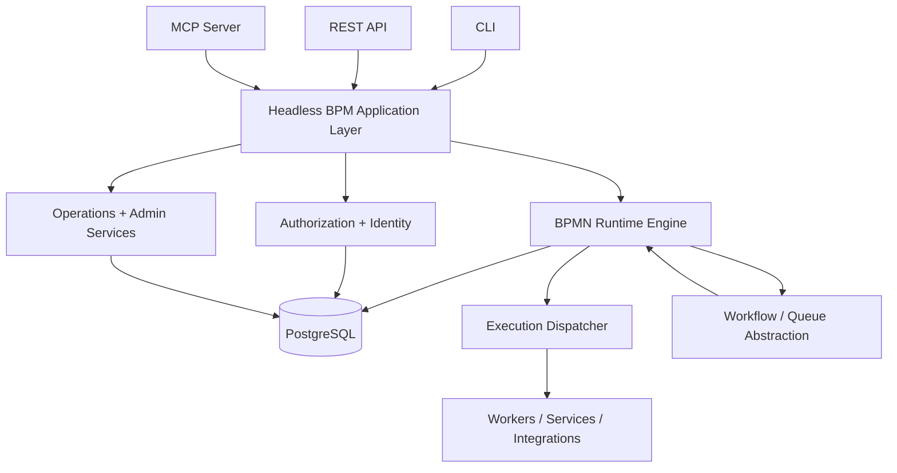

<!-- SPDX-License-Identifier: Apache-2.0 -->

# Headless BPM

**Headless BPM** is a durable, BPMN 2.0-aligned business-process orchestration system designed to be operated entirely through **CLI, REST APIs, and MCP** rather than through a built-in graphical user interface.

The project is specification-first. `SPEC.md` defines the authoritative behavioral contract, while `TRACE.md` and `ERD.md` provide traceability and logical design context. The current specification release is **Headless BPM 0.14.0** and follows the **SPEC.md / SPECmd.app spec-driven development approach**.

> **Project status:** v0.14.0 is the current specification baseline; implementation evidence in `TRACE.md` is intentionally still marked `TBD` / `Planned` until code and tests exist.

---

## Why Headless BPM?

Many BPM products combine workflow execution, administration, task management, and a large proprietary UI into one platform. Headless BPM takes a different approach:

- **BPMN remains the process model.**
- **The engine is API-first and automation-first.**
- **Humans, services, workers, AI agents, and MCP clients can participate in the same process.**
- **Administrative recovery is explicit, typed, authorized, and audited.**
- **Runtime state is durable and inspectable without depending on a web console.**
- **CLI, REST, and MCP expose the same underlying behavior rather than separate product surfaces.**

The goal is to make BPM orchestration usable as infrastructure: scriptable, observable, durable, auditable, and suitable for both human operators and software agents.

---

## Specification-first development

Headless BPM follows the **SPEC.md** approach documented at:

- https://github.com/SPECmd-app/SPEC.md
- https://github.com/SPECmd-app/specmd-cli

The specification set is part of the product contract, not secondary documentation.

### Authoritative and companion files

| File | Role |
|---|---|
| `SPEC.md` | **Authoritative normative behavioral specification** |
| `TRACE.md` | Informative traceability from requirements to design, implementation, and verification evidence |
| `ERD.md` | Informative logical entity/relationship model derived from the specification |
| `CHANGELOG_0.14.0.md` | Release-level summary of changes introduced in v0.14.0 |
| `examples/starter-kit-request.bpmn` | Example BPMN 2.0 process used as a reference artifact |

If a companion document conflicts with `SPEC.md`, **`SPEC.md` wins**.

Normative requirements use BCP 14 language such as **MUST**, **MUST NOT**, **SHOULD**, **SHOULD NOT**, and **MAY**.

---

## Current version

**Headless BPM specification:** `0.14.0`  
**SPEC.md Core:** `0.4.3`  
**SPEC.md Optional:** `0.4.3`  
**Status:** Draft

Version 0.14.0 adds:

- runtime Process Instance diagram overlays;
- fleet-wide Operations Summary;
- preview-first Bulk Operations;
- standardized CLI help/discovery;
- system version and operational status discovery;
- liveness and readiness health checks.

These are additive to the administrative recovery and observability capabilities introduced in 0.13.x.

---

## Core principles

### 1. BPMN 2.0 is canonical

Headless BPM uses **OMG BPMN 2.0.2** terminology and semantics for concepts that BPMN defines.

- **BPMN 2.0 XML** is the canonical portable process representation.
- **BPMN Diagram Interchange (BPMN DI)** is the canonical portable layout representation.
- **SVG** is derived display output only.
- **Mermaid** may be used for documentation diagrams but is never a process-authoring or execution format.

Headless BPM deliberately avoids introducing a proprietary workflow DSL that competes with BPMN.

### 2. One semantic model, multiple interfaces

A process may be authored through:

1. complete BPMN XML import/replacement; or
2. structured Flow Node / Sequence Flow operations through CLI, REST, or MCP.

Both modes operate on the **same Process Draft semantic model**.

A flow such as this must remain valid:

```text
BPMN XML import
    ↓
MCP Flow Node edit
    ↓
REST Sequence Flow edit
    ↓
BPMN XML export
```

### 3. Runtime state is durable

A Process Instance is durable and reconstructable from persisted state. Runtime correctness must not depend on:

- one application process remaining alive;
- one worker keeping in-memory state;
- a specific queue delivery happening exactly once;
- a specific UI session.

### 4. Administrative recovery preserves historical truth

Operators can recover processes, but cannot arbitrarily rewrite history or teleport BPMN execution tokens.

Administrative actions are:

- typed;
- authorized;
- state-checked;
- idempotent where required;
- attributable;
- auditable.

### 5. Principal, Initiator, Process Actor, and BPMN Participant are different concepts

Headless BPM intentionally separates:

- **Principal** — who authenticated the request;
- **Initiator** — who or what caused the root process to exist;
- **Process Actor** — who or what performs process work;
- **BPMN Participant** — the BPMN Collaboration / Pool concept.

These identities may refer to the same real-world party, but they are not interchangeable.

---

## Supported executable BPMN subset

Headless BPM 0.14.0 requires support for the following executable Flow Node types:

- Start Event
- End Event
- User Task
- Service Task
- Exclusive Gateway
- Parallel Gateway
- Intermediate Catch Event
  - Timer
  - Message
  - Conditional
- Call Activity

The specification does **not** claim complete support for every BPMN 2.0 element or conformance class.

Examples of currently unsupported/deferred execution semantics include embedded executable Sub-Processes, Inclusive Gateways, Event-Based Gateways, Complex Gateways, and complete Collaboration execution.

---

## High-level architecture

The specification is implementation-independent, but the current recommended implementation target is **TypeScript + Vercel + PostgreSQL**.



### Recommended deployment interpretation

Use **Vercel** for:

- REST handlers;
- MCP endpoints;
- admin queries;
- runtime SVG rendering;
- system info/status;
- asynchronous execution dispatch;
- optional Vercel Workflow / Queue integration.

Use **PostgreSQL** as the authoritative system of record for:

- Process and Process Version identity;
- canonical BPMN XML / retained DI;
- Process Instances;
- Flow Node Instances;
- Sequence Flow history;
- Task Instances and attempts;
- assignment/claim state;
- context;
- timers/subscriptions;
- incidents;
- idempotency;
- audit/history;
- administrative operations.

Vercel-specific infrastructure should remain behind abstractions such as:

```text
ExecutionDispatcher
AsyncJobQueue
TimerScheduler
ExternalIntegrationExecutor
```

The BPM model and runtime semantics should not depend on Vercel-specific concepts.

---

## Process lifecycle

A Process has a stable identity and a mutable **Draft**.

```text
Process
  └─ Draft (mutable)
       └─ validate
       └─ publish
            └─ Process Version (immutable)
                  └─ Process Instance
```

Key rules:

- Drafts are mutable and not startable.
- Publication creates an immutable Process Version.
- Existing Process Instances remain bound to the exact Process Version they started with.
- Publishing a new version never mutates older Process Versions.

Root Process Instances are started through explicit **Entry Points**, which define the allowed start contract, access mode, target version policy, accepted input, and identity-resolution behavior.

---

## Process Instance lifecycle

Logical Process Instance states include:

```text
running
waiting
paused
completed
failed
cancelled
```

`paused` is a non-terminal administrative execution freeze. It is distinct from cancelling an instance and distinct from suspending a Process Actor.

A paused instance preserves state and cannot admit new process progression until authorized resume.

---

## Human and machine work

### User Tasks

User Tasks support:

- Potential Owners;
- Assignee;
- claim;
- unclaim;
- reassignment;
- form/schema interaction;
- explicit completion;
- due/follow-up metadata;
- human attribution.

Actor-centric Task List views include:

- `MY_TASKS`
- `AVAILABLE`
- `MY_WORK`
- `COMPLETED_BY_ME`
- optional `TEAM_TASKS`

### Service Tasks

Service Tasks support:

- machine/non-human Process Actors;
- claim/release;
- stable Task Attempt identity;
- retries;
- backoff;
- timeout;
- completion/failure contracts;
- incident creation where appropriate.

Each actual execution attempt is separately represented and auditable.

---

## Events, waits, and composition

Intermediate Catch Events support durable waits for:

- timers;
- messages;
- declared conditions.

Call Activities invoke separately published Processes and create separate child Process Instances with explicit lineage and input/output mapping.

A child Process Instance retains:

- parent Process Instance identity;
- parent Flow Node Instance identity;
- root Process Instance identity.

---

## Administrative operations and recovery

Headless BPM provides explicit operational controls rather than arbitrary database editing.

### Pause / resume

Operators can pause and resume non-terminal Process Instances.

Pause may target:

- `SELF_ONLY`
- `SELF_AND_DESCENDANTS`

Already-dispatched external side effects cannot be undone by pausing.

### Typed Administrative Interventions

Supported intervention types include:

- `RELEASE_STALE_CLAIM`
- `REASSIGN_TASK`
- `RETRY_WORK`
- `CONTEXT_PATCH`
- `TASK_COMPLETE`
- `CANCEL_INSTANCE`

Interventions must preserve process/runtime integrity and historical truth.

### Administrative action modes

Two distinct modes exist:

- `ON_BEHALF_OF`
- `ADMIN_OVERRIDE`

They are deliberately not impersonation.

The authenticated Admin Principal must always remain distinguishable from any effective Process Actor.

---

## Operational Findings

Operational Findings are diagnostic observations, not automatic mutations.

Required finding types include:

- `WAITING_OVERDUE`
- `CLAIM_STALE`
- `RETRY_STALE`
- `INCIDENT_BLOCKED`
- `NO_PROGRESS_SUSPECTED`

A stale process is not automatically a broken process. Long waits may be legitimate business behavior.

Findings provide evidence to help an operator decide whether to pause, retry, reassign, intervene, or cancel.

---

## Activity Stream

Headless BPM exposes a unified read-only Activity Stream that combines:

- **Execution Events** — what the engine did;
- **Audit Events** — who requested or caused protected/admin-visible actions.

The Activity Stream is a **projection**, not a new source of truth.

Execution History and Audit History remain separate authoritative records.

Activity can be queried at:

- Process Instance level;
- Process-wide level across instances.

---

## Runtime Process Instance diagram

Version 0.14.0 adds runtime diagram rendering for active and historical Process Instances.

The runtime SVG is derived from:

```text
Exact bound Process Version
+ retained BPMN DI
+ authorized runtime/history state
= runtime Process Instance SVG
```

The diagram can represent applicable runtime states such as:

- active/waiting nodes;
- completed nodes;
- failed/incident nodes;
- cancelled/skipped nodes;
- traversed Sequence Flows;
- repeated/loop execution where representable.

Rendering is read-only and never mutates BPMN or execution state.

---

## Fleet Operations Summary

The Operations Summary gives administrators an authorized fleet-level operational view without requiring a GUI dashboard.

Typical aggregates include:

- running / waiting / paused Process Instances;
- actionable / claimed / overdue tasks;
- open Incidents;
- Operational Findings.

Authorization is applied before aggregate disclosure so counts cannot leak inaccessible resources.

---

## Bulk Operations

Version 0.14.0 introduces preview-first bulk administration.

The conceptual flow is:

```text
query
  ↓
preview
  ↓
explicit execution
  ↓
frozen target set
  ↓
per-target authorization + state revalidation
  ↓
individual atomic operations
  ↓
durable per-target results + aggregate result
```

Bulk Operations reuse existing single-target semantics. They do **not** create stronger administrative privileges.

Supported bulk actions include operations such as:

- incident retry;
- Process Instance cancel;
- Process Instance pause/resume;
- task reassignment;
- stale claim release.

Partial success is allowed and must remain inspectable.

---

## CLI

The executable name is implementation-defined. Examples below use `hbpm`.

Headless BPM 0.14.0 standardizes CLI discoverability and behavior.

### Core usability

```bash
hbpm -h
hbpm --help
hbpm help
hbpm help process-instance
hbpm process-instance --help
hbpm version
hbpm --version
hbpm status
```

CLI design follows established CLI best practices, including:

- `-h` / `--help` at every command level;
- human-readable output by default;
- machine-readable JSON where appropriate;
- stdout for primary output;
- stderr for diagnostics/errors/progress;
- predictable non-zero exit codes;
- typo suggestions where practical;
- automation-safe behavior;
- dry-run / preview patterns for impactful operations.

Reference:

https://github.com/arturtamborski/cli-best-practices

### Logical command families

Examples include:

```text
help
version
status
process
bpmn
diagram
entry-point
process-instance
flow-node
sequence-flow
task-list
user-task
service-task
event
incident
notification
identity
actor
actor-source
organization
operations
bulk-operation
```

The exact executable syntax may vary, but logical behavior must remain equivalent to the specification.

---

## REST API

The REST API is versioned and exposes the same domain model as CLI and MCP.

### System / health

```http
GET /health/live
GET /health/ready
GET /v1/system/info
GET /v1/system/status
```

`/health/live` and `/health/ready` are intentionally minimal and suitable for infrastructure probes.

Detailed operational/dependency information belongs in authorized system endpoints.

### Representative process APIs

```http
POST /v1/processes
GET  /v1/processes
GET  /v1/processes/{process_id}
POST /v1/processes/{process_id}/validate
POST /v1/processes/{process_id}/publish
```

### BPMN APIs

```http
POST /v1/bpmn/validate
POST /v1/bpmn/analyze
POST /v1/processes/import-bpmn
PUT  /v1/processes/{process_id}/draft/bpmn
GET  /v1/processes/{process_id}/draft/bpmn
GET  /v1/processes/{process_id}/versions/{version_id}/bpmn
```

### Runtime / operations APIs

Representative operations include:

```http
GET  /v1/process-instances/{id}
POST /v1/process-instances/{id}/pause
POST /v1/process-instances/{id}/resume
POST /v1/process-instances/{id}/cancel
POST /v1/process-instances/{id}/interventions
GET  /v1/process-instances/{id}/operational-status
GET  /v1/process-instances/{id}/activity
GET  /v1/process-instances/{id}/diagram.svg

GET  /v1/operations/summary
```

Bulk Operations use the canonical preview-first REST flow:

```http
POST /v1/bulk-operations/preview
POST /v1/bulk-operations
GET  /v1/bulk-operations
GET  /v1/bulk-operations/{bulk_operation_id}
GET  /v1/bulk-operations/{bulk_operation_id}/results
```

Execution must reference a valid preview / frozen target-set identity.

For the complete canonical interface contract, see `SPEC.md`.

---

## MCP

MCP exposes the same core process, task, administration, and observability capabilities for AI agents and MCP clients.

Representative tools include:

```text
system_info
system_status

process_list
process_get
process_create
process_update
process_validate
process_publish

bpmn_validate
bpmn_analyze
process_bpmn_import
process_bpmn_export
process_diagram_render

process_instance_get
process_instance_list
process_instance_pause
process_instance_resume
process_instance_intervene
process_instance_operational_status
process_instance_diagram_render
process_instance_activity

operations_summary
bulk_operation_preview
bulk_operation_execute
bulk_operation_get
bulk_operation_results
```

MCP is not a privileged shortcut. The same authorization, state, idempotency, and audit rules apply.

---

## Identity and authorization

The security model separates platform administration from process participation.

### Platform identities

- Platform Admin
- Platform User
- Platform Machine Principal
- API-key credentials

### Process identities

- Human Process Actor
- Service
- External System
- Agent
- Worker
- MCP Client

Process Actor status does not automatically grant platform-management access.

### Authorization model

Protected operations map to stable logical permission/action identifiers.

The general rule is **default deny** unless authority is explicitly granted or implicit Admin authority applies according to implementation policy.

Authorization must occur before protected disclosure as well as before mutation.

---

## Organization model

Optional Organization Units support hierarchical organizational structure and actor membership.

Important distinctions:

- Organization Unit is **not** a tenant.
- Organization Unit is **not** a BPMN Lane.
- BPMN Lane metadata may refer to organizational concepts, but does not itself grant authorization.

---

## Notifications

Headless BPM separates notifications from task completion.

A notification may inform a human or non-human actor that work exists, but:

> delivery, reading, acknowledgement, or claim never completes a task by itself.

The specification includes:

- User Task email notification and delivery status;
- a durable non-human Notification Center.

---

## Incidents

Incidents represent runtime problems requiring retry, resolution, intervention, or cancellation.

An Incident blocks the affected Flow Node from successful progression but does not itself imply that the entire Process Instance is terminal.

Incident resolution must not rewrite a failed Task Attempt as if it had succeeded.

---

## Durability, concurrency, and idempotency

A conforming implementation must be safe under:

- multiple API instances;
- multiple workers;
- duplicate requests;
- duplicate queue delivery;
- worker crashes;
- retries;
- concurrent task claims;
- concurrent branch execution;
- delayed callbacks;
- stale clients.

Recommended PostgreSQL mechanisms include:

- transactions;
- foreign keys and uniqueness constraints;
- row-level locking;
- optimistic state/version guards;
- idempotency records;
- `SELECT ... FOR UPDATE`;
- `SKIP LOCKED` for competing work claims where appropriate.

Correctness must not depend on process-local in-memory mutexes.

---

## PostgreSQL storage guidance

PostgreSQL is the recommended implementation database, although the specification remains implementation-independent.

Use relational columns for:

- identity;
- lifecycle;
- joins;
- assignment;
- authorization;
- integrity;
- status and timestamps.

Use JSONB for extensible data such as:

- process context;
- task input/output;
- external metadata;
- forms;
- integration configuration;
- extension metadata.

Canonical BPMN XML / DI should remain preserved as the portable source artifact for each published Process Version.

---

## Vercel implementation guidance

Vercel is a suitable target provided that Vercel Functions are treated as disposable compute rather than process state containers.

A recommended model is:

```text
Request / event
    ↓
Vercel Function / Workflow / Queue consumer
    ↓
load authoritative state from PostgreSQL
    ↓
perform one safe transaction / transition
    ↓
commit state + history
    ↓
finish / dispatch next work
```

A business process may last milliseconds, hours, months, or longer. Its lifecycle must not be tied to the lifetime of one serverless invocation.

Long-duration BPM timers should remain durable BPM runtime records even if a provider scheduler is used to wake execution.

---

## System health and status

Headless BPM distinguishes:

### Liveness

```http
GET /health/live
```

Answers whether the service process is alive.

### Readiness

```http
GET /health/ready
```

Answers whether the deployment is capable of serving work using required runtime dependencies.

### System information

```http
GET /v1/system/info
```

May expose authorized implementation metadata such as:

- product/runtime version;
- API compatibility/version;
- SPEC compatibility version;
- build identifier where available.

### System operational status

```http
GET /v1/system/status
```

Supports logical status such as:

```text
HEALTHY
DEGRADED
UNAVAILABLE
```

Detailed status is authenticated and must not leak secrets, credentials, or sensitive infrastructure information.

---

## Observability philosophy

Headless BPM deliberately separates several kinds of operational information:

| Capability | Purpose |
|---|---|
| Execution History | Authoritative history of what the process engine did |
| Audit History | Authoritative record of protected/admin actions and attribution |
| Activity Stream | Unified read-only projection of execution + audit history |
| Operational Status | Current detailed state of one Process Instance |
| Operational Findings | Diagnostic indicators that something may require attention |
| Operations Summary | Fleet-level authorized aggregates |
| Runtime Diagram | Visual projection of one instance over BPMN DI |

None of the derived views replace authoritative execution/audit state.

---

## What is intentionally not implemented in v0.14.0

The specification currently records several future/deferred topics and does **not** require them in v0.14.0, including:

- Process Instance migration between immutable published Process Versions;
- dedicated fleet-wide timers/jobs/subscriptions/claim-lease administration;
- a standardized Prometheus/OpenTelemetry metrics contract;
- process-performance analytics / SLA / bottleneck reporting;
- first-class operational alert rules and alert-delivery integrations.

These must not be treated as implemented capabilities merely because they are discussed in the specification.

See `SPEC.md` for the complete current Open Issues list.

---

## Repository layout

A specification repository currently contains the following core artifacts:

```text
.
├── README.md
├── SPEC.md
├── TRACE.md
├── ERD.md
├── CHANGELOG_0.14.0.md
└── examples/
    └── starter-kit-request.bpmn
```

A future implementation repository may additionally organize code along lines such as:

```text
src/
├── domain/
├── application/
├── persistence/
├── bpmn/
├── engine/
├── authorization/
├── integrations/
├── api/
├── mcp/
├── cli/
└── observability/
```

This source layout is implementation guidance, not part of the normative product contract.

---

## Suggested implementation workflow

1. Read `SPEC.md` completely.
2. Review `TRACE.md` and `ERD.md`.
3. Inspect the current repository and implementation state.
4. Implement in small vertical slices.
5. Map implementation and tests back to requirement IDs.
6. Keep `TRACE.md` implementation/verification evidence current.
7. Keep `ERD.md` aligned when the logical model materially changes.
8. Keep examples and changelog accurate.
9. Run SPECmd validation / Blackbox checks as tooling allows.
10. Do not silently change normative behavior to fit implementation convenience.

If the specification leaves a normal implementation detail open, select a simple production-quality solution consistent with the invariants.

If an externally observable ambiguity would materially affect conformance, raise it explicitly rather than guessing.

---

## Verification and testing

The intended implementation should include:

- domain unit tests;
- PostgreSQL integration tests;
- API contract tests;
- CLI tests;
- MCP tests;
- BPMN XML / DI round-trip tests;
- concurrency and race-condition tests;
- idempotency tests;
- restart/recovery tests;
- authorization leakage tests;
- acceptance tests tied to SPEC requirement and acceptance IDs.

`TRACE.md` is designed to record the relationship between normative obligations and their implementation/verification evidence.

Until implementation exists, `TBD` and `Planned` are the correct values rather than invented evidence.

---

## SPECmd / cognitive validation

Headless BPM currently declares SPEC.md Core and Optional version `0.4.3`.

The project should be checked with the current SPECmd CLI when compatible tooling is available, including the Blackbox cognitive check.

Relevant project:

https://github.com/SPECmd-app/specmd-cli

The Blackbox review is intended to help verify that externally observable interfaces have sufficient semantic input/output definition and that interface behavior traces back to the normative specification.

Tooling-version limitations should be reported honestly rather than bypassed by silently validating against an older standard.

---

## Design boundaries

Headless BPM intentionally does **not** define:

- a built-in GUI;
- a proprietary visual designer;
- one mandatory database schema;
- one mandatory cloud provider;
- one mandatory worker framework;
- one mandatory queue technology;
- one mandatory authentication protocol;
- every BPMN element.

The specification defines observable behavior and integrity guarantees while allowing implementation choices that do not alter conformance.

---

## Example mental model

A simple request process may look like:

```text
Start
  ↓
Validate Request     (Service Task)
  ↓
Manager Approval     (User Task)
  ↓
Approved?            (Exclusive Gateway)
  ├─ No  → End Rejected
  └─ Yes
       ↓
Fulfil Request       (Service Task)
       ↓
End Completed
```

That same process can be:

- imported as BPMN XML;
- inspected or modified through structured APIs while still a Draft;
- published as an immutable Process Version;
- started through an Entry Point;
- worked by humans and machines;
- observed via CLI, REST, or MCP;
- paused/resumed or recovered administratively;
- rendered as a runtime BPMN diagram;
- included in fleet Operations Summary;
- acted on through safe preview-first Bulk Operations.

---

## Contributing to the specification and implementation

When making changes:

1. preserve stable requirement IDs whenever possible;
2. update normative behavior in `SPEC.md`, not only in code;
3. update `TRACE.md` when implementation/verification evidence changes;
4. update `ERD.md` when the logical model changes materially;
5. add or update acceptance scenarios for externally observable behavior;
6. update the version changelog;
7. keep examples valid;
8. never claim deferred Open Issues as implemented features;
9. preserve BPMN terminology where BPMN defines the concept;
10. keep CLI, REST, and MCP behavior aligned through shared domain semantics.

The goal is to keep code, specification, traceability, and evidence synchronized rather than allowing documentation to become a retrospective artifact.

---

## License

These artifacts are licensed under [Apache-2.0](../LICENSE), as is the rest of the [SPEC.md examples repository](https://github.com/SPECmd-app/spec-md-examples) that contains them.

---

## References

- Headless BPM specification: `SPEC.md`
- SPECmd / SPEC.md: https://github.com/SPECmd-app/SPEC.md
- SPECmd CLI: https://github.com/SPECmd-app/specmd-cli
- BPMN: https://www.bpmn.org/
- CLI best practices reference: https://github.com/arturtamborski/cli-best-practices

---

**Headless BPM 0.14.0** — durable BPMN orchestration without requiring a built-in GUI.
