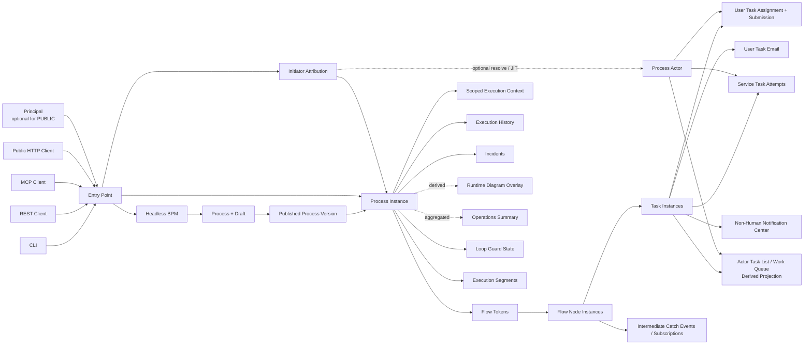

# Headless BPM Specification

## Specification Contract

This document is the implementation-independent behavioral contract for Headless BPM.

Uppercase **MUST**, **MUST NOT**, **SHOULD**, **SHOULD NOT**, and **MAY** use BCP 14 semantics. Normative requirements define conformance. Examples, diagrams, notes, rationale, and implementation guidance are informative unless explicitly marked normative.

This SPEC.md is authoritative for required product behavior. A conforming implementation MAY use different languages, frameworks, databases, queues, event stores, cloud services, deployment topologies, and internal architectures unless explicitly constrained here. Logical entities defined here do not require one physical table or service per entity.

If an unspecified implementation choice cannot materially alter observable conformance, the implementer MAY choose an appropriate solution. If an omission or ambiguity could materially affect observable behavior, state, data semantics, security, privacy, interoperability, durability, or recovery, it MUST be surfaced as `TBD` / Open Issue rather than guessed.

The front-matter `diagrams: mermaid` option applies only to informative architecture/system diagrams embedded in this `SPEC.md`. It does **not** define the notation or interchange format for BPMN Process models. Canonical Process interchange and diagram semantics are defined by the BPMN XML and BPMN DI requirements below.

### Informative Companion Documents

The root `SPEC.md` is the sole normative behavioral contract for Headless BPM 0.14.0. The following directly referenced companion documents are informative and do not independently define conformance:

- `TRACE.md` — retrospective traceability from normative obligations to logical design areas and planned/actual evidence.
- `ERD.md` — derived logical visualization of entities, relationships, cardinalities, and integrity relationships already defined by this `SPEC.md`.

If either companion conflicts with `SPEC.md`, `SPEC.md` is authoritative. A requirement, invariant, interface rule, or other conformance obligation is normative only when defined by `SPEC.md` (or by a future module explicitly identified here as normative).

## 1. Overview and Scope

Headless BPM is a durable business-process orchestration system with **no built-in graphical user interface**. Administrators and platform users operate Headless BPM through CLI, REST APIs, and MCP. Root Process initiation is governed by explicit **Entry Points**. Each start distinguishes the authenticated **Principal** that invoked Headless BPM, when one exists, from the business **Initiator** that caused the Process Instance to exist and from the **Process Actors** that perform work during execution.

Headless BPM **follows BPMN 2.0 principles and terminology according to the guidelines published at https://www.bpmn.org/** and uses the Object Management Group (OMG) **BPMN 2.0.2** normative specification and machine-readable schemas referenced there as its semantic and interchange baseline. Where Headless BPM models a concept that has a BPMN 2.0 equivalent, this specification MUST use the BPMN term and preserve its semantic intent. Headless BPM-specific concepts such as Principal, Initiator, Process Actor, Entry Point, Process Version, Process Instance runtime records, Task List, Incident, and durability/authorization controls are explicit extensions to BPMN terminology. Beginning with 0.12.0, portable Process import/export uses **BPMN 2.0 XML**, and portable process-diagram layout uses **BPMN Diagram Interchange (BPMN DI)**. This does **not** by itself claim support for every BPMN 2.0 element, execution semantic, or conformance class; supported executable elements remain the explicit subset defined by this specification.

Beginning with 0.12.3, **BPMN 2.0 is also the canonical authoring model**: a Process Draft may be created or changed either by supplying a complete BPMN 2.0 XML document or by structured Flow Node / Sequence Flow authoring operations through CLI, REST, or MCP. Both authoring modes operate on the same BPMN semantic model and MUST remain mutually interoperable. Headless BPM also exposes a read-only diagram-rendering capability that derives SVG from retained BPMN DI; SVG is presentation output only and is never a canonical Process definition.

Beginning with 0.13.0, Headless BPM adds **administrative operations and recovery** for non-terminal Process Instances: audited pause/resume, typed interventions, stale-execution detection, explicit `ON_BEHALF_OF` versus `ADMIN_OVERRIDE` action modes, and a unified read-only Activity Stream over execution and audit history. These controls preserve published Process semantics and historical truth rather than allowing arbitrary token or database-state rewrites.

Beginning with 0.14.0, Headless BPM adds **fleet-scale operations visibility and safe bulk administration**: runtime Process Instance diagram overlays, an authorized Operations Summary, and preview-first Bulk Operations that reuse existing single-target semantics rather than creating privileged alternate mutations. It also standardizes CLI discoverability plus system version, liveness, readiness, and detailed operational-status discovery for operators and automation.

A Process may combine User Tasks, Service Tasks, external systems, workers, AI agents, MCP clients, and external/public Initiators in one execution. A `PUBLIC` Entry Point MAY create a Process Instance without first onboarding the external person or system as a Principal or Process Actor. Process-Actor status MUST NOT by itself grant platform-administration access, and Initiator status MUST NOT by itself grant process-work authority. User Task work is represented as assignable work with machine-readable form schemas and email notification. Service Task work is represented as automated/non-human work with process-scoped credentials or outbound integrations, durable programmatic notification, claims, attempts, retries, and completion contracts.

### 1.1 BPMN 2.0 Alignment

Headless BPM reserves BPMN-defined terminology for BPMN-defined meanings. In particular:

- **Process**, **Flow Node**, **Start Event**, **End Event**, **Task**, **User Task**, **Service Task**, **Gateway**, **Exclusive Gateway**, **Parallel Gateway**, **Sequence Flow**, **Call Activity**, **Sub-Process**, **Participant**, **Pool**, **Lane**, **Collaboration**, and **Message Flow** use BPMN 2.0 semantic meanings.
- BPMN **Participant** means a business entity or business role participating in a Collaboration and is commonly represented by a Pool. It MUST NOT be used as the name for an individual human, worker, service, agent, or other runtime identity.
- **Process Actor** is a Headless BPM extension for a human or non-human runtime identity that may perform process work. A Process Actor is distinct from a BPMN Participant even when the same real-world organization/person/system is related to both.
- **Potential Owner** is used for the BPMN human-resource concept describing a person eligible to claim and work on a User Task. **Assignee** is a Headless BPM runtime/API term for the current exclusive actual owner after direct assignment or claim.
- Existing Headless BPM child-process invocation semantics are modeled as BPMN **Call Activity** because they invoke a separately defined Process and create a separate child Process Instance. BPMN **Sub-Process** is reserved for an Activity whose contained Process is embedded in the parent Process scope and MUST NOT be treated as a synonym for Call Activity.
- Headless BPM MAY add runtime, identity, API, durability, work-management, or security extensions around BPMN elements, but an extension MUST NOT redefine the underlying BPMN concept.
- **BPMN 2.0 XML** is the canonical portable serialization for Process models. An implementation MAY store an equivalent internal representation, but import/export MUST preserve the supported BPMN semantics.
- **BPMN Diagram Interchange (BPMN DI)** is the canonical portable diagram-layout representation. Diagram geometry and presentation MUST NOT change execution semantics.
- Complete-document BPMN XML authoring and structured element-by-element authoring through CLI/REST/MCP are two interfaces over the same canonical BPMN Process Draft; neither establishes a second proprietary workflow language.
- A rendered SVG process diagram is a derived presentation artifact produced from BPMN semantics plus retained BPMN DI. SVG is never authoritative process state and cannot replace BPMN XML/DI interchange.
- Mermaid MAY be used for informative Headless BPM architecture/system diagrams in documentation, but Mermaid flowcharts MUST NOT be treated as the canonical notation or interchange representation of a BPMN Process.

### 1.2 Actors and Identity Roles

- **Principal** — authenticated security identity under which one request to Headless BPM is authorized and attributed. A Principal may be backed by a Platform Principal or an authenticated Process Actor.
- **Platform Admin** — human Platform Principal with system-wide administrative authority.
- **Platform User** — human Platform Principal allowed to author or operate platform resources within granted permissions.
- **Platform Machine Principal** — non-human Platform Principal used for platform-level automation and administration.
- **Initiator** — business-origin attribution for the root Process Instance: the person, organization, system, Process Actor, Principal, external subject, or anonymous source whose action caused the process to exist.
- **Process Actor** — Headless BPM runtime identity, distinct from a BPMN Participant, that may be human or non-human and may perform process work without thereby gaining platform authority.
- **Human Actor** — Process Actor representing a person who performs User Task work.
- **Non-Human Actor** — Process Actor representing a service, external system, worker, AI agent, or MCP client that performs Service Task work.
- **Actor Source** — authoritative system that defines a Process Actor and may update its lifecycle/status attributes.
- **System** — internal engine identity used only to attribute engine-generated state changes such as timer firing or automatic retry.
- **External Email Service** — implementation-defined service that attempts outbound email delivery.

### 1.3 In Scope

- BPMN-aligned Process modeling, validation, versioning, publishing, explicit Entry Points, and execution;
- BPMN 2.0 XML import/export for the supported Process subset, including BPMN DI preservation when supplied;
- durable runtime identity for Process Instances, Flow Node activations, execution branches, Sequence Flow traversal, and Task Instances;
- User Task and Service Task assignment, actor-centric Task Lists/work queues, and completion;
- schema-defined User Task forms and submissions;
- BPMN-aligned Events, Sequence Flows, Exclusive/Parallel Gateways, loops, Intermediate Catch Events, and Call Activities;
- process-root and Flow Node-local execution context with declared input/output mappings;
- Service Task attempts, retries, backoff, timeouts, and claims;
- incident creation, inspection, and authorized resolution;
- administrative pause/resume, typed recovery interventions, on-behalf-of/override actions, stale-execution detection, and unified activity inspection;
- CLI, REST, and MCP interaction surfaces, including CLI help/discovery and runtime system version/health/status inspection;
- User Task email notification and delivery status;
- durable non-human Notification Center;
- Principal/Initiator attribution, public and authenticated root initiation, execution history, audit history, cancellation, idempotency, and failure handling;
- Platform Principal administration, generic human/non-human Process Actors, Actor Source synchronization, process-scoped credentials, outbound integrations, and resource authorization;
- optional multi-layer Organization Units, Actor-to-organization memberships, and organization-aware assignment/authorization;
- optional per-subject API/MCP consumption limits using hard rolling windows and weighted credit buckets.

### 1.4 Out of Scope

- a built-in GUI, visual process designer, dashboard, form renderer, task inbox UI, or web portal;
- prescribing a specific physical database schema, queue, broker, event store, process engine, email vendor, MCP SDK, or programming language;
- support for every BPMN 2.0 element, execution semantic, choreography/conversation semantic, conformance class, or vendor extension beyond the explicitly required subset in this specification;
- executable embedded Sub-Process semantics, Inclusive/Event-Based/Complex Gateways, choreography execution, or complete Collaboration execution unless added by a later specification;
- business-domain-specific processes or forms;
- multi-tenant/workspace data-isolation semantics, billing tenants, user groups unrelated to Organization Units, SLA management, worker-pool capacity management, file attachments, deployment bundles, or scheduled/time-based process-start triggers unless added by a later specification;
- requiring a human to use anything other than an external client of CLI, REST, or MCP.

## 2. Context and Definitions

**Process** — BPMN 2.0 Process represented by Headless BPM as a stable logical business-process identity across revisions. Its executable model is a graph of Flow Nodes connected by Sequence Flows.

**Draft** — mutable unpublished model for one Process. A Draft is not startable.

**Process Version** — Headless BPM extension representing one immutable published snapshot of a Process, including Flow Nodes, Sequence Flows, schemas, mappings, and execution policies.

**BPMN Document** — portable BPMN 2.0 XML document conforming to the OMG BPMN XML serialization used to import or export one or more supported Process/Collaboration models and optional BPMN DI.

**BPMN Diagram Interchange (BPMN DI)** — BPMN-standard diagram-layout data that references BPMN semantic model elements and records diagram planes, shapes, bounds, edges, and waypoints needed for interoperable rendering. BPMN DI is presentation/layout information and does not define execution semantics.

**Structured BPMN Authoring** — element-oriented creation/update/removal of BPMN Flow Nodes and Sequence Flows through CLI, REST, or MCP. Structured authoring is a convenience surface over the same Process Draft semantic model used by BPMN XML import/export.

**BPMN Validation Result** — non-persisting machine-readable diagnostics produced by validating supplied BPMN XML against XML well-formedness, required references, supported BPMN semantics, Headless BPM extension rules, and publication-blocking constraints.

**BPMN Analysis Result** — non-persisting machine-readable summary of supplied BPMN XML, such as Process identities, supported element counts/types, BPMN DI presence, extension namespaces, and unsupported constructs; analysis does not create or modify a Process Draft.

**Rendered Process Diagram** — derived read-only presentation output, canonically SVG in this specification, rendered from a Draft or Process Version using its retained BPMN semantics and BPMN DI. A Rendered Process Diagram is not a BPMN interchange artifact and is not executable state.

**Headless BPM Extension Elements** — namespaced BPMN `extensionElements` used to carry Headless BPM-specific portable configuration where no BPMN core element exists. Such extensions MUST NOT redefine BPMN core semantics.

**Flow Node Definition** — immutable definition-time representation of one BPMN Flow Node in a Process Version. This version requires Start Event, End Event, User Task, Service Task, Exclusive Gateway, Parallel Gateway, Intermediate Catch Event, and Call Activity.

**Start Event** — BPMN Event that establishes a start point for a Process.

**End Event** — BPMN Event that represents a terminal path outcome within a Process.

**User Task** — BPMN Task performed by a human where Headless BPM manages task lifecycle, Potential Owners/Assignee, form/schema interaction, and completion. It is distinct from a BPMN Manual Task.

**Service Task** — BPMN Task representing automated/non-human service work. Headless BPM extends its execution with Process Actor assignment, claims, Task Attempts, retries, timeouts, and programmatic completion.

**Exclusive Gateway** — BPMN Gateway used to select one outgoing Sequence Flow according to evaluated conditions/default-flow semantics and to merge alternative paths where applicable.

**Parallel Gateway** — BPMN Gateway used to create concurrent outgoing paths when diverging and to synchronize applicable incoming paths when converging.

**Intermediate Catch Event** — BPMN catching Event used by Headless BPM for durable `TIMER`, `MESSAGE`, or `CONDITIONAL` waits.

**Call Activity** — BPMN Activity that invokes a separately defined Process. In Headless BPM a Call Activity binds an exact target Process Version and creates a separate child Process Instance with explicit input/output mappings and lineage.

**Sub-Process** — BPMN Activity containing an embedded Process within the parent Process scope. It is semantically distinct from Call Activity. Executable embedded Sub-Process semantics are not required by this version.

**Sequence Flow Definition** — immutable definition-time representation of a BPMN Sequence Flow between Flow Node Definitions, optionally with a condition or default-flow role where BPMN permits it.

**Process Instance** — one runtime execution bound to exactly one Process Version.

**Correlation ID** — optional request-supplied business correlation value attached to a Process Instance for lookup. It is not globally unique unless a deployment imposes an additional policy.

**Flow Token** — logical execution path used to represent active branches, forks, synchronization, and cancellation. It is an implementation-independent runtime abstraction; implementations may persist equivalent branch state differently.

**Flow Node Instance** — one runtime activation of one Flow Node Definition in one Process Instance. Re-entering the same Flow Node through a loop creates another Flow Node Instance.

**Cyclic Region** — a maximal set of Flow Node Definitions that can reach one another through directed Sequence Flows and therefore forms a strongly connected cyclic region; a self-loop is also a Cyclic Region.

**Loop Guard Definition** — immutable protection policy attached to a published Cyclic Region, defining finite runtime budgets, progress detection, and guard-trigger behavior.

**Loop Guard State** — runtime counters and progress state for one Loop Guard Definition within one Process Instance.

**Execution Segment** — one bounded history segment of a Process Instance. A rollover creates a new segment while preserving the same logical Process Instance identity and lifetime loop-protection counters.

**Progress Marker** — process-defined value or expression whose material change proves forward business progress for no-progress loop detection.

**Sequence Flow Instance** — historical runtime record that a particular Sequence Flow was traversed by a particular active branch.

**Task Instance** — runtime unit created from a User Task or Service Task Flow Node Instance. One Task Flow Node activation creates one logical Task Instance.

**Collaboration** — BPMN model describing interaction among Participants, primarily through Message Flows. Complete executable Collaboration support is not required by this version.

**Participant** — BPMN business entity or business role involved in a Collaboration and commonly represented graphically by a Pool. A Participant is not a Process Actor.

**Pool** — BPMN graphical representation/container of a Participant in a Collaboration. Pool rendering is not required because Headless BPM is headless.

**Lane** — BPMN partition within a Process/Pool used to organize or categorize Flow Nodes. A Lane MAY reference organizational or role metadata but MUST NOT be treated as an Organization Unit or authorization grant by itself.

**Message Flow** — BPMN connector showing message exchange between Participants. It is distinct from Sequence Flow, which orders Flow Nodes within a Process.

**Principal** — authenticated security identity for a request. A Principal is a request/security role, not a business-process role. It is backed by either a Platform Principal or an authenticated Process Actor; a public request may have no Principal.

**Platform Principal** — persistent identity that operates Headless BPM itself. Types are Platform Admin, Platform User, and Platform Machine Principal. When authenticated, a Platform Principal acts as the Principal for that request.

**Entry Point** — configured and independently securable contract through which a root Process Instance may be started. It identifies the process target/version-selection policy, access mode, accepted input contract, Initiator-resolution policy, and Process Actor resolution policy.

**Initiator** — immutable business-origin attribution of a root Process Instance. Initiator kinds are `PRINCIPAL`, `PROCESS_ACTOR`, `EXTERNAL`, `ANONYMOUS`, or `SYSTEM`. An Initiator may exist without a Principal or Process Actor.

**External Initiator** — Initiator supplied as business data rather than as an authenticated Headless BPM identity. It MAY carry an external subject identifier, external subject type, display/contact attributes, and source metadata, subject to data-minimization and redaction policy.

**Process Actor** — Headless BPM runtime identity, distinct from a BPMN Participant, that may be `HUMAN`, `SERVICE`, `EXTERNAL_SYSTEM`, `AGENT`, `WORKER`, or `MCP_CLIENT`. When authenticated with an Actor Credential it acts as the Principal for that request. A Process Actor remains distinct from a Platform Principal even when both refer to the same real-world person/system.

**Actor Source** — external or internal authority for Process Actor identity, lifecycle, and attributes.

**Actor Credential** — inbound credential by which a Process Actor authenticates to process-scoped Headless BPM APIs. It MUST NOT imply platform-management authority.

**Process Access Profile** — reusable actor-facing capability policy that explicitly allowlists REST Operation IDs and/or MCP Tool IDs and narrows them by Entry Point, process, version, execution, node, task, message, notification, or equivalent process-resource scope.

**REST Operation ID** — stable logical identifier for one actor-facing REST operation independent of deployment URL, for example `task.get`, `task.claim`, or `message.publish`.

**MCP Tool ID** — stable logical identifier for one actor-facing MCP tool independent of server implementation or alias.

**Consumption Limit Policy** — optional policy attached to a Platform Principal, Platform API Key, Process Actor, Actor Credential, or equivalent authenticated subject that constrains API/MCP consumption.

**Hard Window Limit** — finite maximum number of admitted operations within a rolling time window. This version supports windows of 1 second, 1 minute, 1 hour, and 1 day.

**Credit Bucket Definition** — reusable weighted-consumption definition containing a capacity, refill rule, and operation-cost mapping. Credits are logical usage units and are not currency.

**Credit Bucket State** — current available credits and refill/accounting state for one subject under one Credit Bucket Definition.

**Outbound Integration Credential** — credential used by Headless BPM to authenticate to an external system. It is logically distinct from Actor Credentials and MUST NOT be presented as a credential for inbound Headless BPM access.

**Task Assignment** — relationship describing who may act on or currently owns a Task Instance.

**Task List** — authorization-filtered, actor-centric projection of Task Instances that a Process Actor may currently view or act upon. A Task List is a logical query/result contract, not a separate process state machine, persisted business object, inbox message, or built-in GUI.

**My Tasks** — Task List view containing current non-terminal tasks for which the authenticated Process Actor holds direct active assignment or exclusive execution/completion authority.

**Available Tasks** — Task List view containing current non-terminal actionable tasks that the authenticated Process Actor is eligible to claim or, when explicitly allowed, complete as a Potential Owner without claim.

**My Work** — duplicate-free union of My Tasks and Available Tasks for one Process Actor.

**Completed by Me** — historical Task List view containing tasks whose successful terminal completion is attributed to the Process Actor.

**Team Tasks** — optional organization-scoped Task List view containing tasks visible through explicitly authorized Organization Unit assignment or supervision scope; organization membership alone does not grant this view.

**Potential Owner** — BPMN human-resource role identifying a Human Actor eligible to claim and work on a User Task. Potential Owner status does not provide exclusive ownership until claim or direct assignment succeeds.

**Assignee** — Headless BPM runtime/API term for the Process Actor currently holding exclusive actual ownership/completion authority for a claimed or directly assigned task, subject to authorization.

**User Task Submission** — one attempt by a human to submit data to a User Task. A rejected submission does not complete the task.

**Task Attempt** — one actual machine execution attempt for a Service Task. Retry creates a new Task Attempt, not a new Task Instance.

**Form Schema** — immutable machine-readable contract describing the fields, types, required values, and validation constraints for a User Task.

**Execution Context** — runtime data consisting of process-root variables and optional Flow Node-local variables.

**Timer Subscription** — durable wait registration that becomes satisfied at one specified instant.

**Message Subscription** — durable wait registration, opened by a `MESSAGE` Intermediate Catch Event, for a message name plus correlation key. This is a Headless BPM extension term for the durable persistence record; the catching Flow Node itself remains a BPMN Intermediate Catch Event (see BPMN-001, EVT-002).

**Inbound Message** — externally supplied message submitted to Headless BPM for correlation to an open Message Subscription. This is a Headless BPM extension term distinct from BPMN's Event Flow Node category (Start Event, End Event, Intermediate Catch Event) and from Execution Event/Audit Event (immutable history-log records); an Inbound Message is trigger data, not a Flow Node and not a history record.

**Incident** — durable record that an execution is blocked or degraded by a condition requiring automatic or authorized resolution.

**Notification Center** — durable machine-consumable inbox addressed to Non-Human Actors; it is not a GUI.

**Administrative Pause** — non-terminal operational hold on a Process Instance that preserves execution state while preventing new process progression until an authorized resume or cancellation.

**Administrative Intervention** — explicit authorized recovery mutation against a non-terminal Process Instance or its current runtime resources. It is typed, reasoned, idempotent, state-checked, and audited; it is not arbitrary database editing.

**Administrative Action Mode** — `ON_BEHALF_OF` when an Admin performs an otherwise valid business action for an identified Process Actor, or `ADMIN_OVERRIDE` when an Admin explicitly overrides normal actor-assignment/eligibility rules while preserving all other process/data integrity constraints.

**Operational Finding** — machine-readable observation that a Process Instance or runtime resource may require attention, such as overdue waiting, stale claim, overdue retry, blocked Incident, or suspected no-progress. A finding is diagnostic and does not itself mutate execution state.

**Activity Stream** — authorized read-only chronological projection that combines Execution Events and Audit Events for one Process Instance or one Process across instances while retaining each source record's identity/category.

**Runtime Process Diagram** — authorized read-only SVG rendering of the exact BPMN Process Version bound to a Process Instance, enriched with derived runtime execution state while preserving BPMN DI as layout authority.

**Operations Summary** — authorized fleet-level read-only aggregate over Process Instances, Tasks, Incidents, and Operational Findings for operational monitoring.

**Bulk Operation** — durable administrative execution request that applies one supported existing administrative action to a frozen previewed target set, with per-target state/authorization revalidation and results.

**Execution Event** — ordered process-history event describing what the engine did.

**Audit Event** — attributable security/administrative history describing who requested or caused a protected or externally visible change.

**Terminal** — one of `completed`, `failed`, or `cancelled` where applicable.

Timestamps MUST be representable as ISO 8601 values. Named time zones MUST use IANA identifiers when a named zone is required. Public textual interfaces MUST support UTF-8. Absent, `null`, empty string, empty collection, zero, and `false` are distinct unless an explicit schema states otherwise.

## 3. System Model

### 3.1 Logical Model



The diagram is informative. Normative behavior is defined below.
This Mermaid diagram describes Headless BPM system architecture only. It is not a BPMN Process diagram. Portable Process diagrams use BPMN 2.0 XML with BPMN DI.

### 3.2 Initiation and Identity Model

Every externally initiated **root** Process Instance starts through exactly one Entry Point. Child Process Instances created by Call Activity nodes are internal runtime continuations and do not require a second external Entry Point.

The model separates four questions:

1. **Principal — Who authenticated this request?** A request may have one authenticated Principal or, for a `PUBLIC` Entry Point, no Principal.
2. **Entry Point — Through what controlled contract may this process start?** The Entry Point constrains process target, version selection, access mode, input, Initiator resolution, and optional actor resolution.
3. **Initiator — Who or what caused this business process to exist?** The Initiator is business attribution and does not itself grant authorization.
4. **Process Actor — Who or what performs work in the process?** Actor identity is created/resolved only when process interaction requires it or the Entry Point explicitly requests it.

Principal, Initiator, and Process Actor are independent roles. They MAY refer to the same real-world subject, but one role MUST NOT implicitly create or authorize either of the others.

A public request MAY therefore have no Principal, an `EXTERNAL` or `ANONYMOUS` Initiator, and no Process Actor. If later interaction requires a durable actor identity, the configured Entry Point/Actor Source MAY resolve or create one using the actor-resolution semantics in this specification without changing the original Initiator subject attribution.

### 3.3 Definition Lifecycle

1. A Process has a stable identity.
2. Its Draft is mutable and may be validated repeatedly.
3. Publication validates the complete Draft and creates a new immutable Process Version.
4. Publication MUST NOT mutate prior Process Versions.
5. Existing Process Instances continue using the exact Process Version with which they started.

### 3.4 Runtime Activation Model

Every activated Flow Node Definition creates a Flow Node Instance. Required executable Flow Node kinds in this version are Start Event, End Event, User Task, Service Task, Exclusive Gateway, Parallel Gateway, Intermediate Catch Event, and Call Activity. A Task Instance exists only for User Task and Service Task Flow Node Instances.

When a Sequence Flow is traversed, the traversal MUST be attributable to its source Flow Node Instance and resulting target Flow Node Instance through a Sequence Flow Instance or an implementation-independent equivalent history record. When a Process contains a loop, each re-entry to a Flow Node is a distinct activation and MUST be distinguishable from earlier activations.

A diverging Exclusive Gateway selects the permitted outgoing Sequence Flow according to published conditions/default semantics. A diverging Parallel Gateway activates every configured outgoing Sequence Flow. A converging Parallel Gateway synchronizes the applicable active incoming branches according to the published join scope.

### 3.5 Process Instance Lifecycle

A Process Instance has logical execution states `running`, `waiting`, `paused`, `completed`, `failed`, and `cancelled`. `running`/`waiting` may transition to `paused`; an authorized resume returns a paused instance to the execution state implied by its persisted runtime resources. `waiting` means no immediately executable progress exists because the instance awaits a Task, Catch Event, child Process Instance, retry delay, converging Gateway, or Incident resolution. `paused` is an administrative hold, not a terminal business outcome. A terminal Process Instance MUST NOT resume.

### 3.6 Flow Node Instance Lifecycle

A Flow Node Instance has logical states `active`, `waiting`, `completed`, `failed`, `cancelled`, and `skipped` where applicable.

- Start Event, Exclusive Gateway, diverging Parallel Gateway, and End Event SHOULD normally complete without external work.
- A converging Parallel Gateway MAY wait until its synchronization condition is satisfied.
- User Task and Service Task Flow Nodes wait on their Task Instance.
- Intermediate Catch Events wait on their configured Timer Subscription/Message Subscription or declared condition.
- Call Activities wait on the separate child Process Instance unless a future specification explicitly defines asynchronous call semantics.

### 3.7 Task Instance Lifecycle

A Task Instance has logical states `pending`, `available`, `claimed`, `completed`, `failed`, and `cancelled`.

- `pending` — created but not yet actionable because assignment/scheduling prerequisites are unresolved.
- `available` — actionable by one or more eligible Process Actors.
- `claimed` — exclusive completion authority is currently held by one Assignee/executor.
- `completed` — successful terminal outcome.
- `failed` — unsuccessful terminal outcome after applicable failure/retry policy is exhausted or explicitly applied.
- `cancelled` — no longer actionable because Process or task cancellation occurred.

### 3.8 Service Task Attempt Lifecycle

A Task Attempt has logical states `scheduled`, `claimed`, `running`, `succeeded`, `failed`, `timed_out`, and `cancelled`.

An attempt belongs to exactly one Service Task Instance and has a monotonically increasing `attempt_no` starting at `1`. `max_attempts` includes the initial attempt.

### 3.8.1 Optional Organization Model

Organization support is optional. A deployment with no Organization Units MUST remain conforming and MUST support Process Actors without organizational membership.

When Organization Units are used, they form one or more rooted hierarchies. Each Organization Unit has at most one parent, may have zero or more children, and MUST NOT participate in a parent/child cycle. A Process Actor may belong to zero, one, or multiple Organization Units.

Organization membership MAY be internally managed or externally mastered by an Actor Source. Organization hierarchy and membership are Headless BPM classification and scoping constructs; they do not automatically create BPMN Pools/Lanes, tenant isolation, or Platform Principal permissions. A BPMN Lane MAY reference an Organization Unit for modeling metadata, but Lane membership alone MUST NOT change authorization.

Assignment policies and Actor authorization MAY use an Organization Unit selector with an explicit `SELF_ONLY` or `SELF_AND_DESCENDANTS` scope.

### 3.8.2 Optional API/MCP Consumption-Control Model

Consumption controls are optional and independent from authorization. Authorization answers whether an operation is permitted; consumption control answers whether an otherwise authorized operation may be admitted now.

A subject MAY have zero or more Consumption Limit Policies. Applicable policies MAY define hard rolling-window limits for 1 second, 1 minute, 1 hour, and 1 day and MAY reference one or more Credit Bucket Definitions. Admission MUST be atomic across all applicable limits: an operation is admitted only when every applicable hard limit has capacity and every applicable credit bucket has sufficient credits for that operation.

Hard limits are strict ceilings, not best-effort targets. Credit buckets MAY permit configured bursts only within their available balance/capacity and MUST NOT override a hard-window limit.

### 3.9 User Task Assignment Model

User Tasks MUST support these assignment semantics:

- zero or more BPMN **Potential Owners** before claim;
- at most one active Headless BPM **Assignee** at a time;
- direct assignment may establish an Assignee without a Potential Owner claim;
- claim changes an available Potential Owner relationship to claimed and establishes the claimant as Assignee;
- unclaim removes the active Assignee and returns the task to `available` if eligible Potential Owners remain;
- authorized reassignment replaces the active Assignee and preserves assignment history.

Additional BPMN resource-role semantics MAY be implemented, but are not required by this version.

### 3.9.1 Actor Task List Model

Task discovery is modeled as a derived actor-centric projection over authoritative Task Instance, Task Assignment, Process Actor, Organization Unit membership, and authorization state. The Task List itself does not own independent task state.

The canonical Actor views are:

- `MY_TASKS` — directly assigned/owned actionable work for the Actor;
- `AVAILABLE` — unclaimed or otherwise available work for which the Actor is currently a Potential Owner or otherwise eligible executor;
- `MY_WORK` — the duplicate-free union of `MY_TASKS` and `AVAILABLE`;
- `COMPLETED_BY_ME` — historical successful completions attributed to the Actor;
- `TEAM_TASKS` — optional organization-scoped work visible only when separately authorized.

Task List queries are cross-Process by default: one Actor may see authorized work from multiple Processes and Process Instances in one result and may narrow it through filters. Claim, unclaim/release, reassignment, completion, cancellation, Actor lifecycle, organization membership, and authorization changes affect subsequent Task List evaluation.

Email and the Non-Human Notification Center are notification channels, not task-state authorities. A task may remain discoverable/actionable through the Task List even when notification delivery fails or is delayed, and notification acknowledgement MUST NOT remove otherwise actionable work.

### 3.10 Execution Context Model

A Process Instance has one process-root context. A Flow Node Instance MAY have Flow Node-local variables. Variable lookup MUST be deterministic: declared Flow Node-local values take precedence over root values of the same name within that Flow Node only.

Flow Nodes MUST consume data through declared input mappings. Successful Flow Node completion MUST publish declared output mappings atomically. Failed, timed-out, rejected, or cancelled work MUST NOT partially publish successful output mappings.

Call Activities receive mapped input as a separate child Process root context and return only explicitly mapped outputs; parent and child Process Instances MUST NOT share mutable context by reference.

### 3.11 Intermediate Catch Event and Correlation Model

A `TIMER` Intermediate Catch Event persists a due instant and fires at most once. A `MESSAGE` Intermediate Catch Event opens a durable subscription identified by message name and correlation key. A `CONDITIONAL` Intermediate Catch Event declares which context values may satisfy its condition.

Inbound external messages are correlated by declared message name plus correlation key. If an external message ID is supplied, duplicate submission of the same message ID within its retention period MUST NOT consume more than one subscription.

Default message-correlation mode is **single-consumer**: one Inbound Message consumes at most one open subscription. A future version may add BPMN Signal/broadcast semantics.

A Process may configure unmatched-message behavior as:

- `REJECT` — do not retain for later correlation; or
- `BUFFER_UNTIL_EXPIRY` — retain until a matching subscription or message expiry.

If not specified, `REJECT` is the default.

### 3.12 Incident Model

An Incident is non-terminal by itself. An open Incident blocks the affected Flow Node Instance from successful progression. The Process Instance is `waiting` while no other branch can make immediate progress and an Incident remains unresolved.

An Incident may be resolved by:

- successful automatic retry;
- authorized `retry` of the affected work;
- authorized `resolve` when the underlying condition has been corrected and the node may continue; or
- cancellation of the containing Process Instance.

Resolving an Incident MUST NOT silently mark a failed Task Attempt as succeeded.

### 3.13 History Model

Execution history and audit history are distinct logical records even if stored together physically.

Execution Events MUST be ordered per Process Instance and SHOULD include Flow Node activation/completion, Sequence Flow traversal, task state changes, attempts, variable publication, timer fire, event correlation, incident lifecycle, child process lifecycle, and cancellation.

Audit Events MUST capture protected administrative/user actions such as publication, identity changes, claims, completions, failures, reassignment, message publication, incident resolution, cancellation, and notification acknowledgement.

### 3.14 Invariants

### INV-001 — Exact version binding
A Process Instance MUST remain bound to the exact Process Version from which it started.

### INV-002 — Runtime activation identity
Every activated Flow Node Definition MUST have a distinct Flow Node Instance; repeated activation of the same node MUST NOT reuse the earlier Flow Node Instance identity.

### INV-003 — One logical task per Task Flow Node activation
A User Task or Service Task Flow Node Instance MUST create at most one logical Task Instance. Retries MUST create Task Attempts, not replacement Task Instances.

### INV-004 — Single task terminal outcome
A Task Instance MUST NOT transition successfully to more than one terminal outcome.

### INV-005 — Notification is not completion
Delivery, reading, claiming, or acknowledging a notification MUST NOT by itself complete the corresponding Task Instance.

### INV-006 — Actor/task-type enforcement
A User Task MUST require an authorized Human Actor; a Service Task MUST require an authorized Non-Human Actor unless the published Process Version explicitly delegates completion authority differently. Process Actor status alone MUST NOT grant platform-management authority.

### INV-007 — Attempt numbering
For one Service Task Instance, `attempt_no` MUST be unique and strictly increase for each new attempt.

### INV-008 — Single message consumption
One Message Subscription MUST be consumed at most once, and one Inbound Message in single-consumer mode MUST satisfy at most one Message Subscription.

### INV-009 — Atomic output publication
A node's declared successful output mappings MUST be published atomically or not published at all.

### INV-010 — Cancellation cascade
Cancelling a Process Instance MUST make all active work under that instance non-actionable and MUST prevent creation of new downstream work.

### INV-011 — History preservation
Cancellation, retry, reassignment, and incident resolution MUST preserve prior execution and audit history rather than rewriting it as if the earlier state never occurred.

### INV-012 — Organization hierarchy acyclicity
The Organization Unit parent relation MUST be acyclic; no Organization Unit may be its own ancestor.

### INV-013 — Organization membership is not platform authority
Organization Unit membership MUST NOT by itself create a Platform Principal, grant platform permissions, or bypass Process Access Profile, Actor Grant, credential, lifecycle, or task-relationship checks.

### INV-014 — Consumption controls do not grant authority
A Consumption Limit Policy, unused quota, or available credit MUST NOT authorize an operation that would otherwise be denied by authentication, authorization, actor relationship, lifecycle, Process Access Profile, or resource scope.

### INV-015 — Atomic consumption admission
For one admitted operation, all applicable hard-window counters and required credit deductions MUST be committed atomically with the admission decision or not consumed at all. Concurrent requests MUST NOT oversubscribe a hard limit or spend the same credit balance more than once.

### INV-016 — Principal, Initiator, and Process Actor independence
Being a Principal, being recorded as the Initiator, or existing as a Process Actor MUST NOT by itself confer either of the other roles or their authorization.

### INV-017 — Root Entry Point binding
Every externally initiated root Process Instance MUST remain attributable to exactly one Entry Point and to the exact Process Version selected by that Entry Point at start time.

### INV-018 — Initiator attribution preservation
The Initiator kind and attributed business subject of a root Process Instance MUST NOT change after start. A later identity-resolution link to an equivalent Process Actor MAY be added without rewriting the original Initiator attribution.

### INV-019 — Task List is a derived projection
Task List membership, relationship, and actionability MUST be derived from authoritative Task Instance, Task Assignment, Process Actor lifecycle, Organization Unit membership where applicable, and authorization state. Adding or removing an item from a Task List MUST NOT itself mutate the underlying Task Instance.

### INV-020 — Exclusive claim visibility
For a task requiring exclusive claim, one committed task state MUST NOT present that task as `MY_TASKS` for more than one Process Actor. After a successful claim, the task MUST cease to be `AVAILABLE` to competing Process Actors unless the published task policy explicitly supports shared/non-exclusive completion.

### INV-021 — BPMN Participant and Process Actor separation
A BPMN Participant and a Process Actor MUST remain semantically distinct. Creating, linking, assigning, authenticating, or authorizing a Process Actor MUST NOT implicitly create or alter a BPMN Participant/Pool, and BPMN Participant/Lane membership MUST NOT by itself grant Process Actor credentials or authorization.

### INV-022 — BPMN flow boundary
Sequence Flow MUST represent ordering within one BPMN Process and MUST NOT be used as Message Flow between distinct BPMN Participants. Where Collaboration/Message Flow modeling is supported, Message Flow MUST remain semantically distinct from Sequence Flow.

### INV-023 — BPMN semantic/diagram separation
BPMN DI coordinates, bounds, waypoints, labels, diagram planes, and other presentation metadata MUST NOT change Process execution semantics, authorization, assignment, or runtime identity.

### INV-024 — BPMN interchange semantic preservation
Importing and subsequently exporting a supported BPMN 2.0 Process without semantic edits MUST NOT materially change the supported BPMN semantic model. Where BPMN DI was supplied and retained, the export MUST preserve an equivalent diagram association with the same referenced BPMN semantic elements.

### INV-025 — One canonical BPMN authoring model
BPMN XML document authoring and structured CLI/REST/MCP Flow Node or Sequence Flow authoring MUST converge on one Process Draft semantic model. A Draft created by either mode MUST be inspectable and editable by the other mode without translation into a second proprietary workflow semantics model.

### INV-026 — Diagram rendering is derived and read-only
Rendering a Process diagram to SVG MUST NOT mutate the Process Draft, published Process Version, BPMN semantic model, BPMN DI, authorization state, or runtime state. The rendered SVG MUST be treated as derived presentation output only.

### INV-027 — Pause preserves execution state
Pausing a Process Instance MUST NOT complete, cancel, skip, retry, or otherwise fabricate runtime work; resume MUST continue from the persisted pre-pause runtime state plus any explicitly permitted durable inputs received while paused.

### INV-028 — Administrative recovery preserves history
Administrative pause/resume and Intervention MUST append new execution/audit facts and MUST NOT delete, rewrite, or reclassify prior committed execution, assignment, attempt, Incident, or audit history.

### INV-029 — Delegated/override attribution is explicit
An administrative business action MUST preserve the authenticated Admin Principal separately from any effective Process Actor and MUST identify whether the action used `ON_BEHALF_OF` or `ADMIN_OVERRIDE`; the system MUST NOT represent the Admin as having authenticated as that Actor.

### INV-030 — Stale detection is observational
An Operational Finding MUST NOT by itself mutate task/process state, release a claim, retry work, complete a task, resolve an Incident, or cancel an instance.

### INV-031 — Activity Stream is a derived projection
Activity Stream results MUST be derived from authorized Execution/Audit records, MUST retain source identity/category, and MUST NOT become an independent state or history authority.

### INV-032 — Runtime diagram is derived and non-authoritative
A Runtime Process Diagram MUST be derived from the immutable Process Version bound to the Process Instance, retained BPMN DI, and authorized runtime state/history. Rendering MUST NOT mutate execution, BPMN semantics, BPMN DI, or historical records.

### INV-033 — Operations Summary is a read-only authorized aggregate
Operations Summary values MUST be derived only from resources the caller is authorized to observe and MUST NOT become an independent process/task/incident state authority or leak inaccessible resource existence through counts or dimensions.

### INV-034 — Bulk execution preserves single-target semantics
Each target mutation performed by a Bulk Operation MUST satisfy the same authorization, state validation, idempotency, audit/history preservation, and process semantics as the corresponding single-target operation; bulk execution MUST NOT create a stronger mutation primitive.

## 4. Requirements

### 4.1 BPMN 2.0 Alignment

### BPMN-001 — Semantic baseline
Where this specification models a concept defined by BPMN 2.0, Headless BPM MUST use the BPMN terminology and preserve the semantic intent defined by OMG BPMN 2.0.2 as referenced through https://www.bpmn.org/. A Headless BPM extension MAY add runtime or operational semantics but MUST NOT silently redefine the BPMN concept.

### BPMN-002 — Participant terminology reserved
The term `Participant` MUST be reserved for the BPMN Collaboration/Pool concept. Human users, services, external systems, workers, agents, and MCP clients that perform runtime process work MUST be modeled as Process Actors rather than BPMN Participants.

### BPMN-003 — Required BPMN Flow Node subset
The required executable BPMN Flow Node subset for this version MUST include Start Event, End Event, User Task, Service Task, Exclusive Gateway, Parallel Gateway, Intermediate Catch Event, and Call Activity. Unsupported BPMN Flow Node types MUST be rejected as unsupported rather than silently mapped to a different semantic type.

### BPMN-004 — User Task resource terminology
Human assignment for a User Task MUST use BPMN `Potential Owner` semantics for actors eligible to claim/work the task. Headless BPM MAY expose `Assignee` as its runtime/API term for the current exclusive actual owner, but Assignee semantics MUST NOT weaken BPMN Potential Owner behavior.

### BPMN-005 — Gateway semantics
Conditional one-of-many routing MUST be modeled as an Exclusive Gateway with conditional/default Sequence Flows. Concurrent fork/synchronization MUST be modeled as diverging/converging Parallel Gateway behavior. `Decision`, `Parallel Split`, and `Join` MUST NOT be exposed as canonical Flow Node types in a conforming 0.14.0 Process model.

### BPMN-006 — Call Activity and Sub-Process distinction
A Call Activity that invokes a reusable separately defined Process MUST remain distinct from a BPMN Sub-Process embedded in a parent Process. The existing Headless BPM child-Process behavior MUST use Call Activity semantics and MUST create explicit parent/child Process Instance lineage.

### BPMN-007 — Sequence Flow and Message Flow distinction
Sequence Flow MUST represent execution ordering inside one Process. Message Flow, when Collaboration modeling is supported, MUST represent message exchange between BPMN Participants and MUST NOT be substituted for Sequence Flow.

### BPMN-008 — BPMN conformance claims
Following BPMN terminology/principles MUST NOT be represented as complete BPMN 2.0 interchange or execution conformance unless the implementation separately validates the applicable OMG normative serialization, model, and execution requirements.

### BPMN-009 — Canonical BPMN XML interchange
Headless BPM MUST support import and export of BPMN 2.0 XML for the executable BPMN subset required by this specification. The portable document MUST use the OMG BPMN 2.0 XML serialization and BPMN namespaces/schema model applicable to BPMN 2.0.2. An implementation MAY use a different internal persistence representation, but that representation MUST NOT be exposed as a substitute for BPMN XML interchange.

### BPMN-010 — BPMN XML validation and unsupported elements
BPMN XML import MUST reject malformed XML, invalid required references, and BPMN elements whose semantics are unsupported by the targeted operation. Unsupported executable elements MUST produce a stable validation/unsupported-element error rather than being silently dropped, converted to another Flow Node type, or executed with guessed semantics.

### BPMN-011 — BPMN DI interchange
When an imported BPMN Document contains BPMN DI, Headless BPM MUST preserve enough BPMN DI information to export an equivalent diagram whose shapes/edges continue to reference the same BPMN semantic elements. BPMN DI MUST remain presentation-only and MUST NOT alter execution behavior.

### BPMN-012 — Diagram-optional headless model
A Process model MUST NOT require BPMN DI in order to validate, publish, or execute if its BPMN semantic model is otherwise complete. Headless BPM is not required to auto-generate diagram layout for a BPMN Document that contains no BPMN DI. If a Process diagram is exported or exchanged as a canonical portable diagram, it MUST use BPMN DI rather than Mermaid or another non-BPMN notation.

### BPMN-013 — BPMN identifier stability
For supported imported BPMN elements, Headless BPM MUST preserve stable BPMN element identifiers across a no-op import/export round trip unless an explicit authorized edit changes identity. Runtime identifiers such as Process Instance or Task Instance IDs MUST remain separate from BPMN definition identifiers.

### BPMN-014 — Headless BPM extension namespace
Portable Headless BPM configuration that is not represented by BPMN core semantics MAY be serialized in namespaced BPMN `extensionElements`. Headless BPM-defined extensions MUST use an implementation/version-identifiable namespace and MUST NOT change the meaning of a BPMN core element. Unrecognized extensions MUST NOT be silently executed; an implementation MUST either preserve them as opaque portable metadata when safe or reject the import with an explicit unsupported-extension result.

### BPMN-015 — BPMN import/export round-trip
For the supported BPMN subset, a no-op import/export round trip MUST preserve executable BPMN semantics, BPMN element identity, supported expressions/configuration, and retained BPMN DI associations. XML lexical equivalence, whitespace, namespace-prefix choice, element ordering where semantically irrelevant, and identical waypoint serialization are not required.

### BPMN-016 — Reference renderer/editor neutrality
Headless BPM MUST NOT require a built-in graphical modeler. A deployment MAY use `bpmn-js` as a reference BPMN 2.0 viewer/editor integration or MAY use another BPMN 2.0-compatible tool. Renderer/editor choice MUST NOT change the canonical BPMN XML/DI interchange contract.

### BPMN-017 — Canonical BPMN authoring model
All Process Draft authoring operations, whether performed by BPMN XML import/replace or by structured CLI, REST, or MCP element operations, MUST operate on the same BPMN 2.0 semantic model. An interface-specific authoring representation MUST NOT establish an alternative proprietary Process semantics model. Every valid supported Draft MUST remain exportable as BPMN 2.0 XML without loss of supported executable semantics.

### BPMN-018 — Structured element authoring equivalence
Headless BPM MUST support structured Draft authoring of at least the supported BPMN Flow Node types and Sequence Flows through CLI and REST, and MUST expose equivalent MCP tools when process-authoring MCP is enabled. Structured create/update/delete operations MUST preserve BPMN element identity rules, BPMN semantic constraints, extension rules, and Draft-only mutability. Applying a structured edit then exporting BPMN XML MUST produce semantics equivalent to applying the corresponding edit to the BPMN model.

### BPMN-019 — Non-persisting BPMN validation and analysis
Headless BPM MUST expose non-persisting BPMN validation and analysis operations. Validation MUST return machine-readable diagnostics for malformed XML, unresolved references, unsupported elements/extensions, and other publication-blocking conditions without creating or modifying a Process. Analysis MUST return an authorized machine-readable structural summary of the supplied BPMN document without creating or modifying a Process and MUST NOT disclose external protected resources merely because the document references them.

### BPMN-020 — BPMN document upload/input forms
The REST BPMN import operation MUST accept a complete BPMN 2.0 XML document as raw XML and MUST support file upload of a `.bpmn`/XML document through a documented multipart form. Both forms MUST invoke the same logical import operation and validation semantics. CLI BPMN import MUST accept a local BPMN document or standard input. When process-authoring MCP is enabled, the MCP BPMN import capability MUST accept the BPMN XML content or an authorized file/resource reference that resolves to the same document bytes.

### BPMN-021 — Atomic create/replace import
A BPMN document import that creates a new Process Draft or replaces an existing Draft MUST be atomic. Validation failure MUST leave the target Draft unchanged and a failed new-Process import MUST NOT leave a partially created executable Process. Importing BPMN XML into an existing Draft MUST preserve the Draft identity while replacing its BPMN semantic/DI content only after successful validation.

### BPMN-022 — Derived SVG diagram rendering
Headless BPM MUST expose a read-only operation that renders a Draft or immutable Process Version to SVG using its BPMN semantic model and retained BPMN DI. The rendering implementation is implementation-defined; `bpmn-js` MAY be used as a reference renderer, but the API/CLI/MCP contract MUST NOT require a specific rendering library. Rendering MUST preserve BPMN element/DI associations visually and MUST NOT create or alter executable semantics.

### BPMN-023 — Diagram rendering requires layout
If a requested Process Draft or Process Version has no usable BPMN DI, the SVG render operation MUST fail with a stable `BPMN_DI_NOT_AVAILABLE` error or equivalent and MUST NOT silently invent layout. Automatic layout, if added later, MUST be a distinct explicit operation and MUST NOT be implied by diagram rendering.

### 4.2 Headless Operation, Principals, Entry Points, Initiators, Process Actors, Credentials, and Authorization

### SYS-001 — Headless product boundary
Headless BPM MUST provide no built-in GUI, visual process designer, dashboard, form renderer, task inbox UI, or web portal.

### SYS-002 — Runtime system information
Headless BPM MUST expose runtime system information sufficient to identify the running implementation version, supported public API version or versions, declared Headless BPM SPEC compatibility version, and a build identifier when the implementation provides one. System information MUST describe the running software and MUST NOT be inferred only from static documentation metadata.

### SYS-003 — Liveness and readiness
The service MUST expose distinct liveness and readiness checks. Liveness MUST indicate whether the service process is responsive. Readiness MUST indicate whether the service can accept normal Headless BPM requests using its required persistence and runtime dependencies. These checks MUST be read-only, MUST return machine-detectable success/failure status, and SHOULD expose only minimal non-sensitive detail suitable for orchestration and load-balancing systems. When a readiness or liveness check fails, the implementation MUST record the underlying failure detail (for example the specific connectivity or dependency error) to a server-side, operator-only channel such as application logs, distinct from the check's own minimal public response, so an operator can diagnose the cause without that detail ever being exposed through the check's own interface.

### SYS-004 — Detailed system status
An authorized operator MUST be able to inspect a detailed system status whose overall state is at least `HEALTHY`, `DEGRADED`, or `UNAVAILABLE` (or stable equivalents) and which includes observation time plus status of required runtime components such as authoritative persistence and execution services. Uptime/start time MAY be included. Detailed status MUST NOT expose secrets, credentials, or protected configuration values.

### IDN-001 — Platform-principal types
Every Platform Principal MUST have exactly one type: `ADMIN`, `USER`, or `MACHINE`.

### IDN-002 — Admin authority
A Platform Admin MUST be able to manage Platform Principals, Process Actors, Actor Sources, credentials, system-level integrations, authorization grants, and all Processes, Process Instances, incidents, and audit records subject to non-destructive history rules.

### IDN-003 — Platform-user authority
A Platform User MUST be able to create, edit, validate, publish, manage/use Entry Points, start, inspect, cancel, and interact with Processes/Process Instances only to the extent granted by platform authorization policy.

### IDN-004 — Platform machine identity
Each Platform Machine Principal MUST have a distinct machine identity authenticated and authorized independently from human Platform Principals.

### IDN-005 — Platform-principal lifecycle
An Admin MUST be able to create, inspect, update, enable, disable, and list Platform Principals. Disabling a principal MUST prevent new authenticated platform actions by that principal without deleting historical attribution.

### IDN-006 — Stable platform identity
A Platform Principal MUST have a stable system identifier and unique authentication subject. Mutable attributes such as email or display name MUST NOT change historical principal identity.

### PRIN-001 — Principal resolution
Every authenticated Headless BPM request MUST resolve to exactly one Principal security context before protected authorization is evaluated. The Principal MUST identify whether it is backed by a Platform Principal or Process Actor and MUST retain the authenticated credential identity where credential-specific restrictions apply.

### PRIN-002 — Principal is a security role
Principal status MUST describe authentication/attribution for the current request only. Acting as a Principal MUST NOT by itself make the subject an Initiator, Process Actor, or Platform Principal beyond the backing identity that authenticated the request.

### PRIN-003 — No synthetic anonymous Principal
A `PUBLIC` Entry Point MAY accept a request without authentication. Such a request MUST have no Principal; the system MUST NOT create a durable or synthetic "anonymous user" Principal solely to satisfy initiation.

### PRIN-004 — Principal attribution
When a Principal exists, the resulting start mutation, Audit Event, and root Process Instance start metadata MUST retain stable attribution to that Principal or its stable backing identity and presented credential where applicable.

### ENTRY-001 — First-class Entry Point
Headless BPM MUST model Entry Point as a first-class administrable resource distinct from Process, Principal, Initiator, and Process Actor.

### ENTRY-002 — Root start through Entry Point
Every externally initiated root Process Instance MUST be started through exactly one enabled Entry Point. Direct CLI, REST, or MCP start operations MUST resolve to an Entry Point before creating the root Process Instance. Call Activity child creation is exempt because it is an internal runtime continuation.

### ENTRY-003 — Process target and version selection
An Entry Point MUST identify exactly one Process and MUST declare a version-selection policy of `PINNED_VERSION` or `LATEST_PUBLISHED`. `PINNED_VERSION` MUST identify one published Process Version. `LATEST_PUBLISHED` MUST resolve one published version atomically at start. The resulting Process Instance MUST retain the exact selected Process Version.

### ENTRY-004 — Input contract
An Entry Point MUST declare or reference a machine-readable start-input contract. A request that does not satisfy the contract MUST fail with `VALIDATION_FAILED` before a Process Instance is created.

### ENTRY-005 — Access mode
An Entry Point MUST declare an access mode of `AUTHENTICATED`, `PUBLIC`, or `INTERNAL`. `AUTHENTICATED` requires a valid Principal; `PUBLIC` does not require a Principal but MAY record one when valid credentials are supplied; credentials presented to a `PUBLIC` Entry Point MUST be validated and an invalid credential MUST NOT be silently downgraded to an unauthenticated request. `INTERNAL` MUST NOT be directly invokable from an externally exposed interface.

### ENTRY-006 — Public isolation
A `PUBLIC` Entry Point MUST authorize only initiation through that specific Entry Point. Public access MUST NOT implicitly grant process listing, process publication, arbitrary Process Instance start, task access, Actor access, audit access, or invocation of another Entry Point.

### ENTRY-007 — Initiator-resolution policy
An Entry Point MUST declare how Initiator attribution is produced using one of `FROM_PRINCIPAL`, `FROM_REQUEST`, `ANONYMOUS`, or `SYSTEM`. `FROM_PRINCIPAL` is invalid when no Principal is present. `SYSTEM` is valid only for an authorized internal start path.

### ENTRY-008 — Actor-resolution policy
An Entry Point MUST declare a Process Actor resolution policy of `NONE`, `RESOLVE_IF_EXISTS`, `JUST_IN_TIME`, or `REQUIRED`. Actor resolution MUST be independent from Initiator attribution and MUST follow PART-014 through PART-016.

### ENTRY-009 — Entry Point lifecycle
An authorized Platform Principal MUST be able to create, inspect, update, enable, disable, and list Entry Points. Disabling an Entry Point MUST prevent subsequent root starts through it without altering existing Process Instances or historical attribution.

### ENTRY-010 — Public abuse and replay controls
A `PUBLIC` Entry Point MUST support deployment-configured request-size/input constraints and consumption/rate controls scoped to that Entry Point or an equivalent upstream protection boundary. Public mutation MUST support the idempotency semantics of IDEM-001 through IDEM-004 when an idempotency key is supplied.

### INIT-001 — Required root Initiator
Every root Process Instance MUST record exactly one Initiator attribution at successful creation. Child Process Instances MUST expose the root Initiator through root lineage and MUST NOT silently substitute a new business Initiator.

### INIT-002 — Initiator kinds
Initiator attribution MUST distinguish `PRINCIPAL`, `PROCESS_ACTOR`, `EXTERNAL`, `ANONYMOUS`, and `SYSTEM`. The selected kind MUST be consistent with the Entry Point's Initiator-resolution policy.

### INIT-003 — No onboarding prerequisite
An Initiator MUST NOT be required to exist as a Platform Principal, Principal, or Process Actor. An `EXTERNAL` Initiator MAY be represented only by declared request/source attributes, and an `ANONYMOUS` Initiator MAY have no subject identity at all.

### INIT-004 — Principal and Initiator separation
When a Principal invokes a Process Instance on behalf of a different business subject, the system MUST record the invoking Principal and the Initiator separately. The Principal MUST NOT overwrite the Initiator and the Initiator MUST NOT inherit the Principal's authorization.

### INIT-005 — Initiator immutability
After root Process Instance creation, the Initiator kind and attributed business subject MUST be immutable. Contact/display metadata MAY be corrected according to authorized data-governance policy, and an equivalent Process Actor resolution link MAY be added, but neither operation may change who or what originally initiated the process.

### INIT-006 — Initiator data is not authority
Initiator identifiers, email addresses, external subject IDs, names, organizations, and arbitrary attributes supplied in a request are business data. They MUST NOT be treated as authentication credentials or authorization grants.

### PART-001 — Generic Process Actor
A Process Actor MUST be modeled independently from a Platform Principal and MUST declare an Actor type from at least `HUMAN`, `SERVICE`, `EXTERNAL_SYSTEM`, `AGENT`, `WORKER`, or `MCP_CLIENT`.

### PART-002 — No implicit platform authority
Creating, synchronizing, assigning, or authenticating a Process Actor MUST NOT by itself create a Platform Principal or grant platform-level permissions such as process publication, identity administration, API-key administration, or audit access.

### PART-003 — Optional principal linkage
A Process Actor MAY be linked to one Platform Principal when both represent the same real-world subject, but authorization MUST evaluate platform permissions and process-participation permissions separately. Removing one identity MUST NOT silently delete the other unless explicitly requested and permitted.

### PART-004 — Actor Source
A Process Actor MAY declare an Actor Source and external subject identifier. The pair `(actor_source, external_subject_id)` MUST be unique when both are present.

### PART-005 — Externally mastered lifecycle
When a Process Actor is externally mastered, Headless BPM MUST accept authoritative lifecycle/status updates from its Actor Source through an authorized integration and MUST NOT independently reactivate or overwrite externally mastered lifecycle state except through an explicit source-authorized update.

### PART-006 — Actor lifecycle and availability
A Process Actor MUST have a lifecycle state sufficient to distinguish at least `ACTIVE`, `INACTIVE`, `SUSPENDED`, and `RETIRED`. A Non-Human Actor MAY additionally expose runtime availability such as `AVAILABLE`, `DEGRADED`, `UNAVAILABLE`, or `UNKNOWN`; runtime availability MUST NOT be conflated with lifecycle status.

### PART-007 — Assignment eligibility
An Actor that is not `ACTIVE` MUST NOT receive a new task assignment. If an already assigned actor becomes non-active, the existing task MUST remain historically attributable and MUST follow an explicit reassignment/escalation policy or create a `ACTOR_UNAVAILABLE` Incident; it MUST NOT be silently completed or skipped.

### PART-008 — Human-actor contact
A Human Actor assigned to an email-notified User Task MUST have a resolvable delivery address at the time notification is attempted; inability to resolve the address MUST be observable and MUST NOT complete or silently discard the task.

### PART-009 — Non-human process API access
A Non-Human Actor MAY authenticate to Headless BPM using an Actor Credential that grants only process-scoped capabilities required for assigned work. Such a credential MUST NOT grant platform-management capabilities merely because the same external system also has a Platform Principal.

### PART-010 — Process-scoped authorization
Actor authorization MUST support action plus process-resource scope. At minimum, an Actor Credential MUST be restrictable by Entry Point, Process/Version, Flow Node Definition, Task Instance, message scope, Organization Unit scope when organizations are enabled, or an implementation-independent equivalent selector.

### PART-011 — Task-derived actor authority
For task operations, effective actor authority MUST be the intersection of credential grants and the actor's current task relationship (for example Potential Owner, assignee, or executor). A credential with `task.complete` MUST NOT complete an unrelated task merely because the action name matches.

### PART-012 — Inbound/outbound credential separation
Credentials presented by a Process Actor to access Headless BPM MUST be logically distinct from credentials used by Headless BPM to call that actor or another third-party system. A secret configured for outbound integration MUST NOT authenticate an inbound Headless BPM request.

### PART-013 — Outbound third-party access
A Service Task MAY reference an External Integration that causes Headless BPM to call a third-party API. The integration MUST identify the permitted operation and a protected outbound credential reference; process authors MUST NOT need access to the plaintext credential.

### PART-014 — Actor synchronization modes
An Actor Source MAY support `PUSH`, `PULL`, or `JUST_IN_TIME` resolution. The selected mode and source authority MUST be inspectable. A synchronization operation MUST preserve stable actor identity when the same external subject is updated.

### PART-015 — Entry Point actor resolution
When an Entry Point uses `RESOLVE_IF_EXISTS`, `JUST_IN_TIME`, or `REQUIRED`, actor resolution MUST use the configured Actor Source and stable matching key or equivalent deterministic identity rule. `JUST_IN_TIME` MAY create a Process Actor when no equivalent actor exists; `RESOLVE_IF_EXISTS` MUST NOT create one; `REQUIRED` MUST fail the start when no actor can be resolved or created under its configured policy. JIT creation from request-supplied or otherwise unverified data MUST NOT by itself issue an Actor Credential, establish verified identity status, or grant authority beyond explicitly configured actor policy.

### PART-016 — No implicit actor creation
Starting a process, recording an Initiator, or accepting public Initiator attributes MUST NOT create a Process Actor unless the selected Entry Point explicitly permits or requires actor resolution. A later actor created for the same external subject MUST remain a separate identity record linked by explicit resolution, not by retroactively changing the Initiator.

### PCRED-001 — Actor Credential lifecycle
An Actor Credential MUST have a stable credential identifier, owning Process Actor, lifecycle state sufficient to distinguish `ACTIVE`, `REVOKED`, and `EXPIRED`, and MAY have an expiration instant. Non-active credentials MUST fail authentication.

### PCRED-002 — Actor Credential secret handling
A secret Actor Credential MUST follow one-time plaintext disclosure semantics equivalent to KEY-002: persistent storage MUST retain only a non-reversible verifier or equivalent protected representation, and the plaintext MUST NOT be retrievable after issuance/rotation.

### PCRED-003 — Actor Credential least privilege
An Actor Credential MUST NOT authorize a platform-level action and MUST NOT authorize process actions outside its explicit Actor/action/resource scope.

### PAC-001 — Process Access Profile
A Process Actor or Actor Credential MAY be associated with one or more Process Access Profiles. A profile MUST be inspectable and MUST explicitly identify the actor-facing operations it allows and the process-resource scopes to which those operations apply.

### PAC-002 — REST operation allowlist
A Process Access Profile MAY allow REST access only through explicitly listed REST Operation IDs. A listed operation MUST map to one or more versioned REST method/resource combinations, and an unlisted actor-facing REST operation MUST be denied for that profile.

### PAC-003 — MCP tool allowlist
A Process Access Profile MAY allow MCP access only through explicitly listed MCP Tool IDs. An unlisted MCP tool MUST NOT be invokable by an Actor authenticated under that profile, even if the tool is generally exposed by the MCP server.

### PAC-004 — Interface-independent action semantics
REST Operation IDs and MCP Tool IDs MUST map to the same stable logical action vocabulary used by actor authorization. Allowing a REST or MCP surface MUST NOT bypass PART-010 resource scoping, PART-011 task-derived authority, lifecycle state, credential state, or explicit deny rules.

### PAC-005 — Resource scope intersection
Effective Actor access MUST be the intersection of: actor lifecycle/availability policy; authenticated Actor Credential; Actor Grants; applicable Process Access Profiles; current Organization Unit membership when an organization selector is used; task/assignment relationship where required; requested operation; and requested process-resource scope. A broader profile or organization membership MUST NOT expand a narrower credential or assignment scope.

An applicable Process Access Profile is itself a source of allowed operations, not merely a filter over Actor Grants: when at least one ACTIVE Process Access Profile is associated with the Actor or its Actor Credential, a requested REST Operation ID or MCP Tool ID MUST appear in at least one associated profile's rule for that interface, or the request MUST be denied, regardless of any Actor Grant that would otherwise allow it. An operation permitted by an associated profile MAY be authorized without a corresponding explicit Actor Grant. When no Process Access Profile is associated with the Actor or Actor Credential, authorization is governed by PART-010/PART-011 and applicable Actor Grants alone. A Process Access Profile that lists no REST Operation IDs or MCP Tool IDs for the requested interface MUST deny that interface entirely; an empty or interface-less profile MUST NOT be treated as unrestricted, default, or fall-back access.

### PAC-006 — Actor-safe operation catalog
The system MUST expose a discoverable actor-safe operation catalog containing only process-participation functions. At minimum it MUST be possible to independently authorize: `entry_point.start`, `execution.read`, `context.read`, `task.list`, `task.read`, `task.claim`, `task.release`, `task.complete`, `task.fail`, `form.read`, `form.submit`, `message.publish`, `notification.list`, `notification.read`, `notification.acknowledge`, and, when organization support is enabled and explicitly granted, `organization.membership.read` and `task.team.list`.

### PAC-007 — Platform operations excluded by default
Process Access Profiles MUST NOT include platform-administration operations such as process create/update/publish, Entry Point create/update/enable/disable, identity administration, API-key administration, actor-source administration, authorization administration, integration-secret administration, or unrestricted audit access unless the request is authenticated to a Principal backed by a Platform Principal and is authorized under platform policy.

### PAC-008 — Actor API discovery
An authenticated Process Actor MUST be able to discover only the REST Operation IDs and MCP Tool IDs currently usable by that Actor/credential after authorization filtering. Discovery output MUST NOT imply permission to resources outside the returned scopes.

### PAC-009 — Profile lifecycle and change effect
An authorized Platform Principal MUST be able to create, inspect, update, disable, and list Process Access Profiles and associate/dissociate them with Process Actors or Actor Credentials. A disabled profile or removed association MUST affect subsequent authorization decisions without deleting historical usage attribution.

### PAC-010 — Profile auditability
Creation, modification, disabling, association, and removal of a Process Access Profile MUST be auditable with Principal, timestamp, affected Actor/credential, prior value, and resulting value or equivalent change representation.

### ORG-001 — Optional organization capability
Organization support MUST be optional. A conforming deployment MAY contain no Organization Units, and a Process Actor MAY exist and participate in processes without any organization membership.

### ORG-002 — Multi-layer hierarchy
When organizations are enabled, an Organization Unit MUST have a stable identifier, MAY have one parent Organization Unit, and MAY have any number of child Organization Units. Multiple root Organization Units MUST be supported.

### ORG-003 — Hierarchy cycle prevention
Creating or moving an Organization Unit MUST be rejected when the resulting parent relation would make that unit its own ancestor or otherwise create a hierarchy cycle.

### ORG-004 — Many-to-many actor membership
A Process Actor MAY belong to zero, one, or multiple Organization Units concurrently. One Organization Unit MAY contain zero or more Process Actors. Membership MUST be represented independently from actor identity so it can change without changing `actor_id`.

### ORG-005 — Membership lifecycle
An Actor Organization Membership MUST have a lifecycle sufficient to distinguish active from inactive membership and MAY carry effective-start/effective-end instants and source-specific attributes. Expired or inactive membership MUST NOT satisfy a current organization-scoped assignment or authorization check.

### ORG-006 — Externally mastered organization data
An Organization Unit or Actor Organization Membership MAY be externally mastered by an Actor Source. When externally mastered, Headless BPM MUST preserve the source authority and external identity needed to update the same logical unit or membership without creating duplicates.

### ORG-007 — Organization-aware assignment
An Assignment Policy MAY target an Organization Unit. The policy MUST explicitly state whether eligibility is `SELF_ONLY` or `SELF_AND_DESCENDANTS`. Only Process Actors with an active matching membership and an otherwise eligible lifecycle/type MUST become Potential Owners or assignees.

### ORG-008 — Organization-aware authorization
Actor Grants and Process Access Rules MAY include an Organization Unit selector. When present, authorization MUST require current matching membership and MUST explicitly distinguish `SELF_ONLY` from `SELF_AND_DESCENDANTS`; organization scope is an additional narrowing condition and MUST NOT broaden other authorization dimensions.

A Task Instance's Organization Unit scope, for the purpose of this narrowing condition, is derived from the Organization Unit selectors declared in its User Task Potential Owner/Assignee or Service Task executor assignment rule; if none is declared, it MAY instead be derived from the current assignee's or a Potential Owner's active Organization Unit membership. This derivation is diagnostic scoping only and MUST NOT itself grant or imply Potential Owner/assignee eligibility, which remains governed exclusively by ORG-007 and PART-011.

### ORG-009 — Membership-change effect and history
Organization hierarchy or membership changes MUST affect subsequent organization-derived assignment and authorization decisions. Such changes MUST NOT rewrite prior Task Assignments, completion attribution, Execution Events, or Audit Events.

### ORG-010 — Organization is not tenancy or platform authority
Organization Unit hierarchy and membership MUST NOT by themselves establish tenant data isolation, create Platform Principal permissions, or grant access to unrelated process resources. Any tenant isolation, if later introduced, MUST be specified independently.

### ORG-011 — Optional Process-Organization association
A deployment MAY associate a Process with one or more Organization Units for classification, discovery, and reporting purposes, independent of any Process Actor's own Organization Unit membership and independent of BPMN Lane/Pool modeling metadata (see Lane, INV-021). A Process-Organization association MUST NOT itself grant or narrow task assignment eligibility, authorization, or platform permissions (see ORG-010, INV-013), and its absence MUST NOT affect conformance. Where a deployment implements this association, an authorized Platform Principal MUST be able to add, list, and remove a Process's Organization Unit associations, and Process listing and Operations Summary queries MUST support filtering by an associated Organization Unit using the same `SELF_ONLY`/`SELF_AND_DESCENDANTS` scope semantics as ORG-007/ORG-008. Adding, changing, or removing a Process-Organization association MUST NOT alter the Process's BPMN semantics, published Process Versions, or historical Process Instance attribution.

### 4.2.1 Optional API/MCP/Public Entry Point Consumption Limits

### LIMIT-001 — Optional consumption limiting
Per-subject API/MCP consumption limiting and per-Entry-Point public-start limiting MUST be optional except where ENTRY-010 requires a protection boundary for a `PUBLIC` Entry Point. When no Consumption Limit Policy applies to an authenticated subject or Entry Point, this feature MUST NOT impose a specific quota, although independent deployment-wide safety limits MAY still apply.

### LIMIT-002 — Supported subjects
A Consumption Limit Policy MUST be attachable independently to at least a Platform Principal, Platform API Key Credential, Process Actor, Actor Credential, and Entry Point. Policies MAY additionally target reusable subject classes or collections, but the effective target-specific result MUST remain inspectable.

### LIMIT-003 — Interface coverage
A Consumption Limit Policy MAY apply to REST operations, MCP tools, public Entry Point HTTP starts, or combinations thereof. Equivalent logical actions MAY have the same or different consumption costs, but the effective interface-specific cost and limits MUST be inspectable. CLI operations MAY be included by deployment policy but are not required to consume API credits.

### LIMIT-004 — Hard rolling-window limits
A policy MAY define any combination of `per_second`, `per_minute`, `per_hour`, and `per_day` hard limits. Each configured value MUST be a non-negative integer representing the maximum number of admitted matching operations in the immediately preceding rolling window of 1 second, 60 seconds, 3600 seconds, or 86400 seconds respectively.

### LIMIT-005 — All hard limits are conjunctive
When multiple hard-window limits apply, an operation MUST be admitted only if admitting it would keep every applicable rolling-window count within its configured ceiling. Satisfying a longer window MUST NOT override an exhausted shorter window, and vice versa.

### LIMIT-006 — Hard-limit precision
A configured hard limit MUST be enforced as a strict ceiling under concurrency and across service instances. Implementations SHOULD use an exact sliding-window log, an equivalently exact distributed algorithm, or another mechanism that cannot admit more than the configured count inside the normative rolling interval. Approximate fixed-window counting MUST NOT be used to claim strict conformance because boundary bursts can exceed a rolling-window ceiling.

### LIMIT-007 — Reusable credit bucket definition
An authorized Admin MUST be able to create, inspect, update, disable, and list reusable Credit Bucket Definitions. A definition MUST include a stable identifier, positive capacity, refill rule, and operation-cost mapping. A disabled definition MUST not grant new credits but MUST preserve historical usage records.

### LIMIT-008 — Credit refill rule
A Credit Bucket Definition MUST define one of: `NO_REFILL`, `CONTINUOUS`, or `PERIODIC`. `CONTINUOUS` MUST define a refill amount/rate over time; `PERIODIC` MUST define a refill amount and interval/calendar rule. Refill MUST NOT increase available credits above bucket capacity unless an explicit administrative top-up policy separately allows over-capacity balance.

### LIMIT-009 — Weighted operation cost
A Credit Bucket Definition MUST be able to assign a non-negative integer credit cost to individual REST Operation IDs and MCP Tool IDs, with an optional default cost for unmatched operations. Cost `0` means the admitted operation does not consume that bucket.

### LIMIT-010 — Multiple credit buckets
A subject MAY be governed by multiple Credit Bucket Definitions simultaneously. An operation MUST be admitted only if every applicable bucket whose operation cost is greater than zero has sufficient available credits. Credits MUST be deducted from every such bucket atomically when the operation is admitted.

### LIMIT-011 — Credit bucket cannot bypass hard limit
Available credits, manual top-up, bucket capacity, or refill MUST NOT override an exhausted hard-window limit. Hard windows and credit buckets are independent conjunctive admission conditions.

### LIMIT-012 — Authorization before consumption
Authentication and authorization MUST be evaluated before quota/credit is committed. A request denied for authentication or authorization MUST NOT consume subject hard-window quota or credits. Implementations MAY apply separate unauthenticated abuse-protection limits outside this model.

### LIMIT-013 — Validation failure charging
By default, a request that passes authentication/authorization but fails syntactic or semantic validation before beginning the protected operation MUST NOT consume credits and SHOULD NOT consume subject hard-window quota. A deployment MAY configure charging of admitted validation attempts, but that policy MUST be explicit and inspectable.

### LIMIT-014 — Atomic admission and concurrency
The check of all applicable hard limits, all applicable credit balances, and the corresponding counter/balance mutation MUST be logically atomic for one operation. Concurrent requests MUST NOT cause counters to exceed configured hard limits or balances to become negative.

### LIMIT-015 — Rejected operation result
When a hard-window limit blocks an otherwise authorized REST request, the API MUST return HTTP `429` or an equivalent versioned transport result with logical error `RATE_LIMIT_EXCEEDED`. When credit exhaustion blocks it, the logical error MUST be `CREDIT_EXHAUSTED`. MCP MUST return equivalent machine-readable errors.

### LIMIT-016 — Retry information
A limit-rejection response SHOULD expose a safe `retry_after` duration or next-eligible instant when determinable, plus the limiting policy/window or bucket identifier. The response MUST NOT reveal another subject's usage or sensitive policy data.

### LIMIT-017 — Usage inspection
An authorized subject MUST be able to inspect its own effective hard limits, current window consumption, applicable credit-bucket balances, operation costs, and next refill/reset information. Admins with appropriate authority MUST be able to inspect the same for managed subjects.

### LIMIT-018 — Policy precedence and composition
When multiple Consumption Limit Policies apply, their limits MUST compose by intersection: the most restrictive remaining admission condition wins. Assignment of an additional policy MUST NOT silently relax an existing stricter hard limit or create additional effective credits unless an explicit replacement/override relationship is declared by administrative policy.

### LIMIT-019 — Credential and owner composition
A Platform API Key or Actor Credential MAY have stricter limits than its owning principal/Actor. When both owner-level and credential-level policies apply, both MUST be enforced; using another credential MUST NOT consume or bypass the first credential's credential-specific bucket unless the policies explicitly share a bucket identity.

### LIMIT-020 — Shared credit bucket
A Credit Bucket Definition MAY be instantiated as a subject-private bucket or an explicitly shared bucket. A shared bucket MUST declare its sharing key/scope, and all subjects consuming that shared instance MUST atomically debit the same balance. Accidental sharing by equal display name or policy name MUST NOT occur.

### LIMIT-021 — Administrative top-up and reset
An authorized Admin MAY top up credits, reset a hard-window state only where deployment policy permits, or replace a subject policy. Such operations MUST be auditable with actor, reason, prior value/state, resulting value/state, and timestamp. Ordinary users and Process Actors MUST NOT reset their own consumption state unless explicitly authorized.

### LIMIT-022 — Persistence and restart behavior
Hard-window accounting and Credit Bucket State MUST be durable enough that a normal service restart, horizontal scaling event, or failover does not silently restore consumed quota or credits.

### LIMIT-023 — Clock consistency
Distributed enforcement MUST use a sufficiently consistent authoritative time source so clock skew between application instances cannot materially expand a configured hard rolling-window limit or credit refill. Implementations SHOULD derive enforcement time from the shared limiter/state authority rather than unsynchronized worker clocks.

### LIMIT-024 — Audit and metrics
Policy creation/update/disable/assignment, administrative top-up/reset, and rejected requests due to hard limits or credit exhaustion MUST be observable. Administrative mutations MUST be Audit Events; high-volume per-request consumption MAY be retained as aggregated usage metrics rather than one Audit Event per admitted request.

### AUTH-001 — Authentication
Every protected CLI, REST, and MCP operation MUST authenticate the request to a Principal before mutation or disclosure of protected data. `PUBLIC` Entry Point start is the explicit exception and is governed by ENTRY-005 and ENTRY-006.

### AUTH-002 — Platform resource authorization
Platform authorization MUST be evaluated against the authenticated Principal backed by a Platform Principal, requested operation, and target resource. Possession of a valid identity alone MUST NOT imply access to every process, task, execution, incident, actor, or notification.

### AUTH-003 — Cross-interface consistency
Equivalent logical operations through CLI, REST, and MCP MUST enforce equivalent authorization decisions.

### KEY-001 — Platform API-key issuance
An authorized Admin, or a Platform User when explicitly permitted, MUST be able to create an API Key Credential bound to exactly one Platform Principal. The credential MUST have a stable identifier distinct from the secret value.

### KEY-002 — Secret disclosure
The plaintext API-key secret MUST be returned only at creation or rotation time and MUST NOT be retrievable afterward. Persistent storage MUST retain only a non-reversible verifier or equivalent protected representation sufficient to authenticate presented keys.

### KEY-003 — API-key status
Each API Key Credential MUST have a lifecycle state sufficient to distinguish at least `ACTIVE`, `REVOKED`, and `EXPIRED`. A non-active key MUST fail authentication and MUST NOT authorize any protected operation.

### KEY-004 — API-key expiry
An API Key Credential MAY have an expiration instant. When an expiration instant exists, the key MUST cease authenticating requests at or after that instant without requiring a separate revocation action.

### KEY-005 — API-key revocation
An authorized Principal MUST be able to revoke an API Key Credential. Revocation MUST take effect for subsequent authorization decisions and MUST NOT delete prior audit attribution or usage metadata.

### KEY-006 — API-key rotation
The system MUST support API-key rotation by issuing a new secret under a new or successor credential identity and allowing the prior credential to be revoked immediately or after an explicitly configured bounded overlap period. Rotation MUST NOT silently extend the privileges of the replacement key.

### KEY-007 — API-key metadata
Authorized Principals MUST be able to inspect API-key metadata including credential identifier, owning Platform Principal, status, creation time, expiration time when present, last-used time when available, and effective permission restrictions; the secret itself MUST never be included.

### AUTH-004 — Permission vocabulary
Every protected function MUST map to a stable logical permission/action identifier. At minimum the model MUST distinguish platform identity/Actor/Actor Source management, API-key and Actor Credential management, process read/create/update/validate/publish/BPMN-import/BPMN-export/BPMN-analyze/BPMN-render, Entry Point read/create/update/enable/disable/start, Process Instance read/cancel/pause/resume/intervene/activity/operational-status/runtime-diagram, process activity read, operations-summary read, bulk-operation preview/execute/read, system info/status read, user-task read/claim/reassign/complete, service-task read/claim/complete/fail, administrative task action, message publish, incident read/retry/resolve, operational-finding read, notification read/acknowledge, integration administration/use, and audit read.

### AUTH-005 — Platform grant target
A Platform Authorization Grant MUST target a Platform Principal or Platform API Key Credential, logical action, and resource selector. A resource selector MUST identify a resource type and MAY narrow the grant to a specific resource identifier or collection/scope selector.

### AUTH-006 — Default deny
For non-Admin Platform Principals and all Process Actors, any protected operation for which no applicable allow exists MUST be denied. Implementations MAY model Admin authority as implicit system policy.

### AUTH-007 — Explicit deny precedence
If both applicable allow and deny grants exist for the same authorization decision, an explicit deny MUST take precedence.

### AUTH-008 — Platform API-key least privilege
A Platform API Key Credential MUST NOT authorize any action or resource that its owning Platform Principal would be forbidden to access directly. Effective key authority MUST be the intersection of the principal's current authority and the credential's own restrictions.

### AUTH-009 — Immediate permission changes
Disabling a Platform Principal or Process Actor, revoking a credential, or changing an applicable authorization grant MUST affect subsequent authorization decisions without requiring process definitions or credentials to be recreated.

### AUTH-010 — Authorization explainability
For an authorized administrator, the system MUST expose enough information to determine why a requested action is allowed or denied, including evaluated Principal/backing subject, logical action, target resource, and applicable grants/policies, without exposing secret material.

### AUTH-011 — Credential-specific restriction
Multiple Platform API keys belonging to the same Platform Principal MAY have different restrictions. Authorization MUST evaluate the presented credential, not only the principal, so that a key restricted to one function cannot be used for another function the owner could perform interactively.

### 4.3 Process and Publication

### WF-001 — Mixed Task types
One Process Version MUST be able to contain both BPMN User Task and Service Task Flow Nodes. A Process Version MAY consist entirely of Service Task Flow Nodes with no User Task, enabling fully autonomous execution that orchestrates only Non-Human Actors (including AI agents) without human intervention; the absence of a User Task in a Process Version MUST NOT be treated as a publication error or an incomplete process.

### WF-002 — Required Flow Node kinds
Process Versions MUST support Start Event, End Event, User Task, Service Task, Exclusive Gateway, Parallel Gateway, Intermediate Catch Event, and Call Activity as the required executable BPMN Flow Node subset for this version.

### WF-003 — Stable Flow Node keys
Each Flow Node Definition MUST have a stable key unique within its Process Version. A Sequence Flow Definition MUST reference existing source and target Flow Node keys in the same Process Version.

### WF-004 — Start and terminal reachability
A publishable Process MUST have exactly one logical Start Event in this version. Every non-terminal path MUST either reach an End Event, enter an explicit loop, wait at an Intermediate Catch Event, or wait on a Call Activity/Task according to published semantics; validation MUST reject unreachable Flow Nodes that are not intentionally disconnected metadata.

### WF-005 — Exclusive Gateway routing
A diverging Exclusive Gateway MUST select at most one outgoing Sequence Flow according to published condition evaluation and default-flow semantics. If multiple conditional Sequence Flows could match and the model provides no deterministic evaluation rule that preserves the intended one-of-many semantics, publication MUST be rejected as ambiguous.

A Process Version provides a deterministic evaluation rule when either: (a) the diverging Exclusive Gateway declares an explicit evaluation order over its conditional Sequence Flows, in which case the first Sequence Flow whose condition evaluates true is selected; or (b) the conditional Sequence Flows are provably mutually exclusive by construction (for example, equality tests against the same expression with pairwise-distinct literal values), in which case a conforming implementation MAY select any one whose condition evaluates true, since at most one can. An Exclusive Gateway MUST NOT combine an unconditional Sequence Flow with conditional Sequence Flows other than as the designated default.

### WF-006 — Parallel Gateway divergence
A diverging Parallel Gateway MUST activate every configured outgoing Sequence Flow without evaluating mutually exclusive routing conditions.

### WF-007 — Parallel Gateway convergence
A converging Parallel Gateway MUST synchronize the applicable active incoming branches for its execution scope. This version MUST support `ALL_ACTIVE_BRANCHES`, meaning the gateway cannot complete until all branches created for that synchronization scope have arrived or have been explicitly cancelled/skipped according to published semantics. This version MUST also support `FIRST_ACTIVE_BRANCH`, meaning the gateway completes as soon as the first branch created for that synchronization scope arrives; the remaining branches are then cancelled per WF-016. A converging Parallel Gateway MUST declare exactly one synchronization mode, and that mode is fixed once the Process Version is published.

### WF-008 — Loops
A Process Version MAY contain cycles. Re-entering a Flow Node through a cycle MUST create a new Flow Node Instance. Loop exit conditions MUST be explicit when the cycle is not intentionally unbounded.

### WF-009 — Intermediate Catch Event kinds
An Intermediate Catch Event used as a durable wait MUST declare one of `TIMER`, `MESSAGE`, or `CONDITIONAL` and the configuration required to determine when that catching Event is satisfied.

### WF-010 — Call Activity target
A Call Activity MUST reference an exact published target Process Version, not an unresolved `latest` alias, and MUST define its input and output mappings. The called Process executes as a distinct child Process Instance.

### WF-011 — Form-schema binding
If a User Task references a Form Schema, the schema content/version used by the published Process Version MUST be immutable for that version.

### WF-012 — Service Task execution policy
A Service Task MUST define or inherit an Actor/External Integration execution policy plus failure behavior. Retry and timeout policies MAY be explicit or inherited from system defaults, but the effective policy MUST be inspectable after publication.

### WF-013 — Structural validation
Before publication the Draft MUST be validated for Flow Node/Sequence Flow references, Start Event/End Event rules, Exclusive/Parallel Gateway configuration, condition/default-flow syntax, loops, Intermediate Catch Event configuration, Call Activity references, mapping references, form-schema references, Actor assignment rules, and effective Service Task failure policy.

### WF-014 — Immutable publication
Publishing MUST create a new immutable Process Version with a stable version identifier and content identity. Published content MUST NOT be edited in place.

### WF-015 — Draft isolation
Editing a Draft MUST NOT alter any published Process Version or running Process Instance.

### WF-016 — Single-branch convergence cancellation
When a converging Parallel Gateway configured as `FIRST_ACTIVE_BRANCH` is satisfied by the arrival of one branch, the engine MUST cancel every other non-terminal branch created for that synchronization scope, using the same cancellation cascade defined by EXEC-015 (active Flow Tokens, non-terminal Flow Node Instances, Task Instances, active Task Attempts, and recursively invoked non-terminal child Process Instances become cancelled or non-actionable), scoped to those branches rather than the whole Process Instance. Cancelling a losing branch MUST NOT create an Incident and MUST be recorded in execution history as an ordinary, expected outcome, not a failure. A durable side effect a losing branch already committed before cancellation takes effect remains committed — cancellation is best-effort and MUST occur at the next safe point per LOOP-012, not by corrupting in-flight state or fabricating a rollback that didn't happen.

### 4.3.1 Loop Protection

### LOOP-001 — Static cyclic-region discovery
Publication validation MUST identify every directed cyclic region in the Process Version, including self-loops and overlapping cycles represented by the same strongly connected region. An implementation MAY use any correct graph algorithm; Tarjan strongly connected components is RECOMMENDED because it discovers all strongly connected components in `O(V+E)` time.

### LOOP-002 — Explicit loop classification
Every Cyclic Region MUST be classified as `BOUNDED` or `INTENTIONALLY_UNBOUNDED`. A `BOUNDED` region MUST define an exit condition or finite iteration/activation budget. An `INTENTIONALLY_UNBOUNDED` region MUST still use runtime guardrails and MUST NOT mean unlimited resource consumption.

### LOOP-003 — Effective guard policy
Every published Cyclic Region MUST have an effective Loop Guard Definition. The policy MUST be inspectable and MUST contain finite limits for at least region entries, total Sequence Flow traversals within the region per Execution Segment, and repeated no-progress entries when no-progress detection is enabled. Policy values MAY be declared by the process or inherited from deployment defaults.

### LOOP-004 — Instance-wide safety budget
Every Process Instance MUST also have finite deployment-configured safety limits for total Sequence Flow traversals, active Flow Tokens, nested Call Activity depth, and Execution Events per Execution Segment. These limits MUST be inspectable through an administrative interface.

### LOOP-005 — Deterministic counter semantics
Loop Guard State MUST count committed runtime effects only. A region entry is counted when execution crosses from outside the Cyclic Region into it or completes a cycle back to its entry frontier according to the published guard definition. Retries of the same Service Task Attempt MUST NOT be miscounted as new process-loop iterations unless control flow actually traverses the cycle.

### LOOP-006 — No-progress detection
A Process Version MAY declare one or more Progress Markers for a Cyclic Region. When enabled, the engine MUST compare a deterministic canonical representation of the declared marker values at the configured observation point. Re-entering the region without a material marker change increments `no_progress_count`; a material change resets it. Hashing MAY be used internally, but hash collisions MUST NOT cause silent incorrect process completion.

### LOOP-007 — Guard trigger behavior
When any hard loop or instance safety limit is reached, the engine MUST stop scheduling new work for the affected Process Instance before executing the prohibited next activation, MUST create an open Incident with category `LOOP_GUARD_TRIGGERED`, and MUST preserve all committed state and history. It MUST NOT silently skip the cycle, invent an exit path, or report successful completion.

### LOOP-008 — Warning threshold
The engine SHOULD emit an observable warning before a hard loop limit is reached. The warning threshold MUST be configurable; a deployment default of approximately 80% of the hard limit is RECOMMENDED. A warning MUST NOT itself change process control flow.

### LOOP-009 — Recursive call activity protection
Starting a child Process Instance MUST fail before creation when doing so would exceed the effective maximum Call Activity nesting depth. The parent MUST enter its configured failure/Incident behavior rather than recursively creating additional children.

### LOOP-010 — Causal message-hop protection
When a process action publishes or forwards a message that can cause further process progress, the engine MUST preserve a causal-chain identifier and hop count or equivalent semantics. A finite maximum causal hop count MUST prevent message-driven ping-pong loops across processes or integrations; exceeding it MUST produce `LOOP_GUARD_TRIGGERED` or an equivalent explicitly typed Incident.

Causal-chain identifier and hop count MUST be conveyed through the message-publication contract (§5.7): an Inbound Message publication MAY declare an explicit causal-chain identifier and hop count, or MAY declare the identity of the Process Instance whose reaction caused this publication, from which the engine derives the causal-chain identifier and increments the hop count automatically. A Process Instance that consumes a message MUST retain the resulting causal-chain identifier and hop count so that a subsequent publication caused by that instance's own reaction continues the same chain without requiring the caller to track the hop count manually.

### LOOP-011 — Execution-segment rollover
An `INTENTIONALLY_UNBOUNDED` process MAY continue by creating a new Execution Segment before the current segment reaches its history/event budget. Rollover MUST be atomic at a safe point, MUST preserve Process Instance identity, required Execution Context, open logical lineage, and lifetime loop counters, and MUST start the new segment with a fresh segment-local history budget. Rollover MUST NOT erase evidence that prior guard warnings or incidents occurred.

### LOOP-012 — Safe rollover point
Execution-segment rollover MUST occur only at a deterministic safe point where no in-flight completion, partial transition, unresolved join mutation, or Task Attempt result can be lost or duplicated. If no safe point is available, rollover MUST wait rather than truncating state.

### LOOP-013 — Counter reset protection
Retrying a Task, resolving an Incident, restarting a worker, or rolling over an Execution Segment MUST NOT reset Process Instance lifetime loop counters. An authorized Admin MAY explicitly reset or raise a guard limit only through an audited operation whose old value, new value, actor, reason, and timestamp are recorded.

### LOOP-014 — Guard recovery
After `LOOP_GUARD_TRIGGERED`, an authorized Admin MUST be able to inspect the triggering guard, current counters, recent cyclic-region history, Progress Marker values when configured, and the blocked next activation. Resumption MUST require an explicit audited action that either changes an allowed guard limit, resets an allowed counter, changes external/context state without editing the published Process Version, or cancels the instance.

### LOOP-015 — Publication diagnostics
Process validation MUST report every discovered Cyclic Region, its member Flow Node keys, classification, effective guard limits, declared exit/progress semantics, and whether an Execution Segment rollover policy applies. A process MUST NOT publish if a Cyclic Region has no effective finite runtime guardrails.

### 4.4 Runtime Execution and Branching

### EXEC-001 — Published-version start
A Process Instance MUST start only from a published Process Version selected according to its Entry Point or internal Call Activity target.

### EXEC-002 — Start identity and attribution
Starting a root execution MUST return a stable Process Instance identity and MUST persist the Entry Point, exact selected Process Version, invoking Principal when present, and Initiator attribution. The start request MAY include a Correlation ID; Correlation ID is filterable but not unique by default.

### EXEC-003 — Flow Node activation record
Every activated Flow Node MUST create a Flow Node Instance before Flow Node-specific behavior is performed.

### EXEC-004 — Repeated activation numbering
Repeated activation of the same Flow Node Definition within one Process Instance MUST be distinguishable by a monotonically increasing activation sequence for that Flow Node or an equivalent unambiguous ordering.

### EXEC-005 — Branch state
Parallel execution MUST maintain durable logical branch state sufficient to determine which paths are active, waiting, completed, or cancelled and whether a converging Parallel Gateway is satisfied.

### EXEC-006 — Sequence Flow history
Every Sequence Flow actually traversed MUST be attributable to the source Flow Node Instance, target Flow Node Instance, and Process Instance in execution history.

### EXEC-007 — Root context
Each Process Instance MUST have a root Execution Context initialized from validated start input.

### EXEC-008 — Flow Node-local scope
A Flow Node Instance MAY hold local variables that shadow root variables only inside that Flow Node's scope and MUST NOT silently overwrite the root variable merely by having the same name.

### EXEC-009 — Declared inputs
A Flow Node MUST receive only the inputs produced by its declared mappings plus explicit system metadata required by its contract.

### EXEC-010 — Atomic outputs
Successful Flow Node output mappings MUST be applied atomically. A failed, rejected, timed-out, or cancelled Flow Node MUST NOT publish successful output mappings.

### EXEC-011 — Parallel write conflict
If concurrently active branches can write the same target root variable, the Process Version MUST define an explicit merge/precedence rule or publication MUST be rejected as ambiguous.

### EXEC-012 — Deterministic progression
Given the same persisted process state, Process Version, accepted task outcomes, context values, timers, and correlated external events, the engine MUST NOT activate a path inconsistent with that version.

### EXEC-013 — Call Activity lineage
A child Process Instance MUST retain parent instance identity, parent Flow Node Instance identity, and root Process Instance identity. Child input is copied/mapped into a separate child root context; only declared child outputs are mapped back on successful child completion.

### EXEC-014 — Cancellation request
An authorized human Principal MUST be able to cancel a non-terminal Process Instance. Repeating cancellation of an already-cancelled instance MUST be idempotent.

### EXEC-015 — Cancellation cascade
Cancellation MUST logically occur as one consistent operation: active Flow Tokens, open Intermediate Catch Event subscriptions, non-terminal Flow Node Instances, Task Instances, active Task Attempts, and recursively invoked non-terminal child Process Instances MUST become cancelled or non-actionable. Pending notification dispatches SHOULD be stopped where possible; previously sent email remains historical. Non-Human notifications for cancelled tasks MUST become non-actionable.

### EXEC-016 — Terminal immutability
A completed, failed, or cancelled Process Instance MUST NOT resume or create new Flow Node Instances.

### EXEC-017 — Running-version isolation
Publishing another Process Version MUST NOT change the behavior or referenced artifacts of an already running Process Instance.

### EXEC-018 — Ordered execution history
Each Process Instance MUST expose an ordered, append-only logical execution history sufficient to reconstruct the sequence of Flow Node activations, Sequence Flow traversals, task state changes, attempts, waits, correlations, incidents, and terminal state changes.

### 4.5 User Tasks and Forms

### HUM-001 — Assignment resolution
Before a User Task becomes actionable, it MUST resolve to at least one eligible ACTIVE Human Actor as direct assignee or Potential Owner. Failure to resolve any eligible human MUST create an Incident rather than silently skipping the task. A published Process Version MAY declare a User Task whose assignment resolves dynamically at runtime (for example, by Organization Unit membership) and therefore cannot be verified as non-empty at publication time; publication MUST NOT be blocked solely because static assignment resolution is empty, provided the assignment rule itself is structurally valid.

### HUM-002 — Potential Owner semantics
A Potential Owner is eligible to claim the User Task but MUST NOT have exclusive completion authority until claim succeeds, unless the task is configured for Potential Owner completion without claim.

### HUM-003 — Claim semantics
For a claim-required User Task, a successful claim MUST atomically change the Task Instance from `available` to `claimed`, establish exactly one active assignee, and reject a concurrent conflicting claim.

### HUM-004 — Unclaim and reassignment
An authorized actor MUST be able to unclaim or reassign a non-terminal User Task when policy permits. Unclaim removes the active assignee and returns the task to `available` if eligible Potential Owners remain. Reassignment replaces the active assignee. Prior assignment history MUST remain inspectable.

### HUM-005 — Form schema
A User Task MAY define a Form Schema containing field definitions, data types, required constraints, and validation rules.

### HUM-006 — Renderer independence
A Form Schema MUST be retrievable through REST and MCP and MUST be consumable without any built-in renderer.

### HUM-007 — Submission validation
If a User Task has a Form Schema, submitted data MUST be validated against the exact schema bound to the Process Version before successful completion.

### HUM-008 — Rejected submission
A rejected User Task Submission MUST return machine-readable validation errors, MUST NOT complete the Task Instance, and MUST NOT publish successful task outputs. Persistence of rejected raw payload beyond audit/security needs is implementation policy.

### HUM-009 — Accepted submission
A normal successful User Task completion MUST identify the completing Human Actor, accepted submission data or resulting task output, completion time, and Task Instance identity. An administrative completion under OPS-009 through OPS-012 MUST instead preserve the Admin Principal, action mode, and effective Actor when applicable without pretending the Admin authenticated as that Actor.

### HUM-010 — Scheduling metadata
A User Task MAY declare priority, due time, and follow-up time. These values MUST be inspectable when present. Passing a due or follow-up time does not itself complete, fail, or cancel the task unless an explicit escalation policy is added by a future specification.

### HUM-011 — Explicit completion
A User Task MUST remain incomplete until an authorized human completion operation or an authorized administrative `TASK_COMPLETE` Intervention succeeds; email delivery, email opening, notification acknowledgement, claim, pause/resume, or stale finding alone MUST NOT complete it.

### 4.6 Service Tasks, Claims, Attempts, Retries, and Timeouts

### MACH-001 — Service Task payload
A Service Task MUST expose a machine-readable contract containing Task Instance identity, Process Instance identity, node identity, attempt/claim information where applicable, declared input, and completion/failure contract.

### MACH-002 — Service Task assignment
A Service Task MUST resolve to one or more authorized ACTIVE Non-Human Actors, an External Integration, or an explicit machine assignment rule before it becomes `available`.

### MACH-003 — Exclusive claim
When claim is required, successful Service Task claim MUST establish exclusive active ownership. Competing claims MUST NOT both succeed.

### MACH-004 — Claim expiry
A Service Task MAY define a claim lease duration. When defined, lease expiry MUST end the claim, record the affected attempt as timed out or abandoned according to policy, and make the task eligible for retry/reclaim if attempts remain. When no lease is defined, the claim persists until completion, failure, cancellation, or explicit release.

### MACH-005 — Attempt creation
Each actual Service Task execution attempt MUST have a stable Task Attempt identity and attempt number. Initial execution is attempt `1`.

### MACH-006 — Retry identity
Retry MUST create a new Task Attempt under the same Task Instance and MUST NOT create a new logical Task Instance.

### MACH-007 — Effective retry policy
The effective retry policy MUST be inspectable and MUST define at least `max_attempts`. If delay/backoff is used, the effective backoff type and delay parameters MUST also be inspectable.

### MACH-008 — Retry progression
When an attempt fails or times out and retry policy permits another attempt, the Task Instance MUST remain non-terminal, the next attempt MUST NOT begin before its calculated retry time, and successful completion of any later valid attempt MUST terminate the Task Instance successfully.

### MACH-009 — Exhausted failure behavior
When no retry remains, the published failure behavior MUST either take an explicit failure Sequence Flow, fail the Task Instance/Process Instance, or create an Incident that blocks progression. The engine MUST NOT invent a failure route.

### MACH-010 — Programmatic completion
An authorized Non-Human Actor MUST be able to claim where required, complete, or fail its assigned task through process-scoped REST and MCP operations. Equivalent CLI actions MUST exist for operational use.

### MACH-011 — Duplicate-safe completion
Repeated completion/failure mutation with the same idempotency identity and identical request content MUST return the original logical result and MUST NOT advance the process twice.

### 4.6.1 Task Lists and Actor Work Management

### TLIST-001 — First-class Task List projection
Headless BPM MUST expose an actor-centric Task List as a logical projection over current Task Instances and their effective assignment/authorization state. The Task List MUST NOT require a built-in GUI and MUST NOT become an independent task-state authority.

### TLIST-002 — Cross-process work discovery
An authenticated Process Actor MUST be able to query authorized Task List items across multiple Processes and Process Instances in one logical operation. Each result item MUST retain enough process identity to identify the originating Process, exact Process Version, Process Instance, and task/node identity.

### TLIST-003 — My Tasks view
`MY_TASKS` MUST contain each current non-terminal Task Instance for which the authenticated Process Actor has direct active assignment or exclusive execution/completion authority. A task MUST NOT appear in `MY_TASKS` solely because the Actor is an unclaimed Potential Owner.

### TLIST-004 — Available Tasks view
`AVAILABLE` MUST contain each current non-terminal actionable Task Instance for which the authenticated Process Actor is presently eligible to claim, or to complete as a Potential Owner when Potential Owner completion without claim is explicitly allowed. A task with a conflicting exclusive assignee MUST NOT remain `AVAILABLE` to another Process Actor.

### TLIST-005 — My Work view
`MY_WORK` MUST be the duplicate-free union of `MY_TASKS` and `AVAILABLE` evaluated for the same actor and authorization context. A task that qualifies through more than one relationship MUST appear at most once with its effective relationships/actions represented machine-readably.

### TLIST-006 — Completed by Me view
`COMPLETED_BY_ME` MUST expose historical tasks whose successful completion is attributed to the authenticated Process Actor, subject to retention, authorization, and redaction policy. Inclusion in this historical view MUST NOT make a terminal task actionable.

### TLIST-007 — Team Tasks view
When Organization Units are enabled, Headless BPM MAY expose `TEAM_TASKS`. If exposed, `TEAM_TASKS` MUST require explicit authorization in addition to matching organization scope, MUST honor `SELF_ONLY` versus `SELF_AND_DESCENDANTS`, and MUST NOT expose a task merely because the caller and task actor share an Organization Unit.

### TLIST-008 — Dynamic eligibility
Task List membership MUST be reevaluated for subsequent queries when task state, assignment, actor lifecycle/availability policy, Process Access Profile, Actor Grant, Organization Unit membership, or applicable authorization changes. Such reevaluation MUST NOT rewrite prior assignment or execution history.

### TLIST-009 — Claim and release visibility
A successful exclusive claim MUST atomically establish the claimant's `MY_TASKS` relationship and remove the task from competing Process Actors' `AVAILABLE` view. A successful unclaim/release MUST remove the former exclusive assignment and MAY make the task `AVAILABLE` again to currently eligible Potential Owners. Reassignment MUST move direct ownership to the new assignee while retaining prior assignment history.

### TLIST-010 — Task List item contract
Each Task List item MUST expose, when authorized and applicable: Task Instance identifier; task kind and status; actor relationship such as `ASSIGNEE`, `POTENTIAL_OWNER`, or `EXECUTOR`; Process identifier; exact Process Version; Process Instance identifier; Flow Node key or equivalent task-definition identity; human-readable task/node label when defined; priority; `available_at`; due/follow-up time when present; and machine-readable permitted actions for the current Principal/Process Actor context. Form/schema presence MAY be represented by reference rather than embedding the full schema.

### TLIST-011 — Task List filtering
Task List queries MUST support conjunctive filtering by at least view/relationship, Process, Process Instance, task kind, task status, and priority. They MUST additionally support due-time filtering when due metadata is present. Deployments with Entry Points SHOULD support filtering by Entry Point where authorized. When Organization Units are enabled, Task List queries and administrative task queries (API-007) MUST support filtering by Organization Unit (`SELF_ONLY` or `SELF_AND_DESCENDANTS`), matched against each task's derived Organization Unit scope per ORG-008, subject to the caller's own authorization.

### TLIST-012 — Deterministic sorting and pagination
Task List queries MUST support deterministic pagination and at least sorting by priority, due time, and task availability/creation time. A sort order MUST include a stable tie-breaker such as Task Instance identifier. Continuation metadata MUST preserve the effective filter and sort contract; concurrent task-state changes MAY affect later pages but MUST NOT weaken authorization.

### TLIST-013 — Authorization before disclosure
Authorization and actor relationship MUST be evaluated before a Task List item, aggregate count, or task metadata is disclosed. A Task List query MUST NOT reveal the existence, title, process identity, Potential Owner population, or count of tasks outside the caller's effective scope. Cached or indexed projections MUST revalidate security-sensitive eligibility before protected task details or actions are returned.

### TLIST-014 — Human and non-human Actor work
The Task List model MUST support both Human and Non-Human Process Actors. Human Actors may claim/complete User Tasks according to HUM requirements; Non-Human Actors may discover/claim/execute Service Tasks according to MACH requirements. A task of the wrong Actor type MUST NOT become actionable merely because it is returned by a broad administrative query.

### TLIST-015 — Task List vs notification channels
The Task List MUST be the authoritative actor-facing projection of current work. User Task email and the Non-Human Notification Center are alert/delivery mechanisms only: notification creation, delivery failure, reading, or acknowledgement MUST NOT add, remove, claim, complete, or otherwise change Task List membership except insofar as the underlying authoritative task/assignment state independently changes.

### 4.7 Intermediate Catch Events, Timers, Messages, and Correlation

### EVT-001 — Durable Timer Catch Event
A `TIMER` Intermediate Catch Event MUST persist its due instant durably enough to survive process restart and MUST fire at most once.

### EVT-002 — Message subscription
A `MESSAGE` Intermediate Catch Event MUST open a durable Message Subscription containing at least the configured message name, correlation key, owning Flow Node Instance, open time, and optional expiry. The persistence record is a Headless BPM runtime extension; the catching Flow Node remains a BPMN Intermediate Catch Event.

### EVT-003 — External message publication contract
Inbound message publication MUST accept a declared message name, correlation key, payload, and SHOULD accept an external message ID for deduplication. Message publication is a protected mutation.

### EVT-004 — Correlation result
In single-consumer mode an Inbound Message MUST consume at most one matching open subscription. If multiple matches would be equally valid, the Process model or runtime routing rule MUST disambiguate; otherwise the input MUST NOT be consumed and an ambiguity error MUST be surfaced.

### EVT-005 — Duplicate inbound message
When an external message ID is provided, duplicate submission of that same message ID within the configured retention period MUST NOT cause more than one subscription consumption or Process advancement.

### EVT-006 — Unmatched message behavior
Each applicable `MESSAGE` Intermediate Catch Event MUST use `REJECT` or `BUFFER_UNTIL_EXPIRY` for an unmatched early Inbound Message; default is `REJECT`. A rejected unmatched message MUST NOT later be auto-correlated. A buffered message MAY be correlated later only before its expiry.

### EVT-007 — Subscription expiry
When a Message Subscription reaches its configured expiry without consumption, it MUST close exactly once and follow the Process Version's explicit timeout behavior. If expiry is configured but timeout behavior is not defined, publication MUST fail validation.

### EVT-008 — Conditional Catch Event
A `CONDITIONAL` Intermediate Catch Event MUST declare which Execution Context values can satisfy it. The condition MUST be reevaluated when one of those declared values changes or when an explicit reevaluation operation occurs; implementation-defined busy polling MUST NOT be required for conformance.

### 4.8 Incidents and Recovery

### INC-001 — Incident creation
The system MUST create an Incident when execution cannot safely progress because of unresolved assignment, exhausted/blocked Service Task work configured for incident handling, invalid runtime integration state, message-correlation ambiguity, or another defined recoverable runtime condition.

### INC-002 — Incident blocking
An open Incident MUST prevent the affected Flow Node Instance from reporting successful completion and MUST remain associated with its Process Instance until resolved or cancelled.

### INC-003 — Incident inspection
Authorized Principals MUST be able to list and inspect open/resolved Incidents, including type, creation time, affected execution/node/task, error code, and human-readable detail.

### INC-004 — Incident retry
When the underlying node/task supports retry, an authorized incident `retry` operation MUST preserve prior attempts/history and create the next valid attempt or reevaluation rather than rewriting previous failure.

### INC-005 — Incident resolve
An authorized `resolve` operation MUST require the engine to re-check whether the affected node can now progress. Resolution MUST NOT directly fabricate successful task output.

### INC-006 — Incident authorization and audit
Only Admins or Users explicitly authorized for the affected execution MAY retry/resolve an Incident, and every incident lifecycle action MUST be audited.

### 4.8.1 Administrative Operations, Recovery, Delegation, and Activity

### OPS-001 — Administrative pause/resume
An authorized Admin MUST be able to pause and resume a non-terminal Process Instance. Pause and resume MUST be idempotent for equivalent repeated requests, MUST preserve Process Version binding, and MUST be audited with Principal, reason, timestamp, and prior/resulting state.

### OPS-002 — Pause quiescence
Once pause becomes effective, the engine MUST NOT admit new process-progressing mutations for that instance, including new Flow Node activation, Sequence Flow traversal, Task completion/failure, retry execution, Catch Event consumption, timer progression, or Call Activity start. A state transition already atomically committing when pause is requested MAY finish before the pause takes effect. Reads, cancellation, resume, and authorized administrative inspection/intervention remain available.

### OPS-003 — Inputs and timers while paused
Timer deadlines MUST continue to represent real time while paused and MUST NOT be silently shifted; overdue timers become eligible after resume. External events MAY be durably received/buffered under their normal correlation policy while paused, but MUST NOT be consumed to advance the paused instance until resume.

### OPS-004 — Pause cascade scope
Pause MUST support `SELF_ONLY` and `SELF_AND_DESCENDANTS` scope for active Call Activity descendants. Cascaded resume MUST resume only descendant instances paused by the corresponding cascade and MUST NOT release an independently established pause.

### OPS-005 — Typed Administrative Intervention
An authorized Intervention MUST identify the Process Instance, intervention type, target resource when applicable, expected/current state guard, reason, idempotency identity, requesting Principal, and optional external ticket/reference. A stale expected-state guard MUST fail without partial mutation.

### OPS-006 — Supported recovery interventions
The administrative recovery vocabulary MUST support at least `RELEASE_STALE_CLAIM`, `REASSIGN_TASK`, `RETRY_WORK`, `CONTEXT_PATCH`, `TASK_COMPLETE`, and `CANCEL_INSTANCE`, while implementations MAY expose safer specialized operations that map to the same semantics.

### OPS-007 — No arbitrary token manipulation
Administrative recovery MUST NOT directly create/delete/teleport Flow Tokens, fabricate Sequence Flow traversal, edit a published Process Version, remove prior history, or mark an arbitrary Flow Node successful without using a defined Intervention whose preconditions and resulting semantics are explicit.

### OPS-008 — Context repair
`CONTEXT_PATCH` MUST target current root or Flow Node-local Execution Context, validate protected/system fields and applicable schemas, preserve prior variable/history evidence, and record old/new values or protected hashes sufficient for audit. It MUST NOT rewrite already committed historical task outputs or published mappings.

### OPS-009 — Administrative action modes
Administrative business actions that substitute for normal Actor execution MUST declare exactly one mode: `ON_BEHALF_OF` or `ADMIN_OVERRIDE`. Normal non-administrative Actor actions do not use either mode.

### OPS-010 — On-behalf-of semantics
`ON_BEHALF_OF` MUST identify an effective Process Actor with a valid business relationship to the targeted task/action (for example current/historical Assignee, Potential Owner, executor, or explicitly modeled delegate). Admin authority MAY substitute for that Actor's credential/current availability but MUST NOT invent a nonexistent business relationship.

### OPS-011 — Admin override semantics
`ADMIN_OVERRIDE` MAY bypass normal Actor assignment/eligibility for the targeted administrative action but MUST NOT bypass Process Version immutability, task terminal-state rules, required output/form validation, idempotency, authorization, or history preservation.

### OPS-012 — Dual attribution
Every `ON_BEHALF_OF` or `ADMIN_OVERRIDE` action MUST record requesting Admin Principal, action mode, reason, target, resulting state, and effective Process Actor when one exists. Business completion records and Audit Events MUST make both requester and effective Actor distinguishable.

### OPS-013 — Stale execution detection
The system MUST expose machine-readable Operational Findings for at least `WAITING_OVERDUE`, `CLAIM_STALE`, `RETRY_STALE`, `INCIDENT_BLOCKED`, and `NO_PROGRESS_SUSPECTED` when corresponding configured detection criteria are met. Detection thresholds MAY be deployment/process policy but MUST be inspectable when a finding is returned.

### OPS-014 — Operational finding evidence
An Operational Finding MUST identify affected Process Instance/resource, finding type, observed time/age, relevant threshold or rule, last progress/activity evidence, and current state sufficient for an Admin to assess recovery without guessing.

### OPS-015 — Finding-to-recovery separation
A finding MAY lead an authorized Admin/policy to create an Incident or execute an Intervention, but finding creation alone MUST NOT mutate execution state. When an automated policy escalates a finding, that subsequent action MUST be separately authorized/attributed/audited.

### OPS-016 — Operational status inspection
An authorized Admin MUST be able to inspect a Process Instance operational status including lifecycle/pause state, active/waiting Flow Nodes, actionable Tasks and current claims/leases, open subscriptions, open Incidents, child instances, last execution progress, next known timer/retry time when applicable, and current Operational Findings.

### OPS-017 — Runtime Process Instance diagram
An authorized Admin MUST be able to render a Process Instance as SVG using the exact Process Version bound to that instance and its retained BPMN DI, overlaid with derived runtime state. The overlay MUST distinguish, where applicable, currently active/waiting Flow Nodes, completed Flow Nodes, failed or Incident-blocked Flow Nodes, cancelled/skipped Flow Nodes, and Sequence Flows that have been traversed.

### OPS-018 — Runtime diagram fidelity and availability
Runtime diagram rendering MUST be read-only, MUST NOT imply that aggregated visual state replaces detailed runtime history, and MUST return `BPMN_DI_NOT_AVAILABLE` when the bound Process Version has no usable BPMN DI. Repeated activations MAY be visually aggregated, but underlying activation identity/history MUST remain inspectable through existing runtime/history interfaces.

### OPS-019 — Fleet Operations Summary
An authorized Admin MUST be able to retrieve a fleet-level Operations Summary containing, at minimum, Process Instance counts by current lifecycle state, actionable/claimed/overdue Task counts, open Incident count, and open Operational Finding counts grouped by finding type. The summary MUST identify an observation timestamp or equivalent `as_of` point.

### OPS-020 — Operations Summary scope and authorization
Operations Summary queries MUST support filtering by at least Process, Process Version, Entry Point, Process Instance lifecycle state, and time window where applicable; when Organization Units are enabled, Operations Summary queries MUST support filtering by Organization Unit (`SELF_ONLY` or `SELF_AND_DESCENDANTS`), matched against each contributing Task's derived Organization Unit scope per ORG-008 or, where implemented, a Process's Organization Unit association per ORG-011. Aggregation MUST occur only over resources visible to the caller and MUST NOT disclose inaccessible resource existence through totals, dimensions, or filter behavior. Implementations MAY serve the summary from a documented materialized projection if its observation time/freshness is exposed.

### OPS-021 — First-class Bulk Operation
Headless BPM MUST model a Bulk Operation as a durable administrative resource with stable identity, requesting Principal, action type, frozen target set reference, reason, optional ticket/reference, idempotency identity, creation time, and execution status. Required action types are `RETRY_INCIDENTS`, `CANCEL_INSTANCES`, `PAUSE_INSTANCES`, `RESUME_INSTANCES`, `REASSIGN_TASKS`, and `RELEASE_STALE_CLAIMS`.

### OPS-022 — Mandatory bulk preview
Before a Bulk Operation is submitted for execution, the system MUST provide a non-mutating preview that resolves a concrete authorized target set and reports at least matched, currently eligible, and currently ineligible counts plus machine-readable ineligibility reasons. The preview MUST return a stable preview identity or equivalent frozen-selection reference and MUST NOT mutate target state.

### OPS-023 — Frozen target set
Bulk execution MUST operate only on the concrete target set resolved by the referenced preview; resources that begin matching the original query after preview MUST NOT be added implicitly. Each preview MAY have a bounded validity period, which MUST be inspectable if enforced.

### OPS-024 — Per-target revalidation and partial results
At execution time, every previewed target MUST be revalidated for current authorization, current state, and action preconditions. Bulk execution is not required to be one transaction across all targets: eligible targets MAY succeed while others fail or become ineligible. The Bulk Operation MUST expose deterministic per-target results and aggregate succeeded/failed/skipped counts, while each successful target mutation remains individually atomic.

### OPS-025 — Bulk audit, idempotency, and history
Submitting/executing a Bulk Operation MUST be idempotent for the same logical request identity, MUST create attributable administrative audit evidence for the bulk request, and MUST preserve the normal execution/audit/history records required by each underlying target action. A bulk-level record MUST NOT replace or hide per-target historical facts.

### ACT-001 — Unified Activity Stream
Headless BPM MUST expose an authorized read-only Activity Stream that merges Execution Events and Audit Events without replacing either authoritative history source.

### ACT-002 — Process Instance activity
A Process Instance Activity Stream MUST provide deterministic chronological pagination and include at least timestamp, source category (`EXECUTION|AUDIT`), source event identifier, event/action type, Process Instance, relevant Flow Node/Task/Incident identifiers when applicable, requesting Principal/effective Actor when authorized, summary/details subject to redaction, and a stable ordering tie-breaker.

### ACT-003 — Process-wide activity
An authorized caller MUST be able to query Activity across all Process Instances of one Process, with each item retaining its Process Instance and exact Process Version identity.

### ACT-004 — Activity filtering and authorization
Activity queries MUST support deterministic pagination and filters by at least time range, source category, event/action type, Process Instance, and Process; Actor/Principal/resource filters SHOULD be supported. Authorization and redaction MUST occur before disclosure and MUST NOT leak inaccessible activity through counts or metadata.

### ACT-005 — Activity source traceability
Every Activity item MUST identify or reference its authoritative Execution Event or Audit Event source. Related execution/audit records MAY share a request/action correlation identifier but MUST NOT be silently collapsed in a way that loses distinct historical facts.

### 4.9 Notifications

### NOT-001 — User Task email notification
When a User Task becomes actionable or is directly assigned/reassigned, the system MUST create an outbound email notification for the active assignee or applicable resolved recipients.

### NOT-002 — User Task email content
User Task email MUST identify process, Process Instance, Task Instance, task name/purpose, assignment state, and due time when present, and MUST provide sufficient identifiers or configured instructions to act through an external client.

### NOT-003 — Email dispatch state
Each outbound email notification MUST expose dispatch state `pending`, `sent`, or `failed`, and each delivery attempt MUST remain distinguishable for operational inspection.

### NOT-004 — Email delivery failure
Email-delivery failure MUST be observable and auditable but MUST NOT by itself complete, fail, or cancel the User Task or Process Instance.

### NOT-005 — Non-Human Notification Center entry
When a Service Task becomes actionable, the system MUST create a durable Notification Center entry addressed to exactly one resolved Non-Human Actor for each required recipient.

### NOT-006 — Non-Human notification content
A Non-Human notification MUST identify notification type, recipient actor, Task Instance, Process Instance, Process Version, creation time, and machine-readable task reference/payload.

### NOT-007 — Notification access and acknowledgement
An authorized Non-Human Actor MUST be able to list, get, and acknowledge only Notification Center entries it is authorized to receive. Acknowledgement MUST record actor and time.

### NOT-008 — Notification durability
A Non-Human notification MUST remain queryable until acknowledged, expired by explicit retention policy, or made non-actionable by task/execution cancellation. Transport delivery alone MUST NOT be the sole record.

### NOT-009 — Cancellation effect on notifications
Cancelling the related Task/Process MUST make open Non-Human notifications non-actionable. Pending unsent email SHOULD be suppressed where possible; sent email remains historical and MUST NOT reactivate cancelled work.

### NOT-010 — Channel separation
User Task notification MUST use email; Non-Human Actor notification MUST use the Notification Center and MUST NOT require email.

### 4.10 Idempotency

### IDEM-001 — Idempotency scope
A mutating operation that declares idempotency support MUST scope an idempotency key by Principal + logical operation for authenticated requests. For an unauthenticated `PUBLIC` Entry Point start, the key MUST instead be scoped by Entry Point + logical start operation. The retention period MUST be documented.

### IDEM-002 — Same key, same request
Repeating the same idempotency key with equivalent request content MUST return the same logical result without repeating the mutation.

### IDEM-003 — Same key, different request
Reusing the same live idempotency key for materially different request content MUST fail with a stable conflict error and MUST NOT perform the second mutation.

### IDEM-004 — In-progress duplicate
If the original idempotent mutation is still in progress, a duplicate request MUST NOT start a second mutation and MUST return a stable in-progress/retryable result.

### 4.11 Public Interfaces

### API-001 — CLI coverage
The system MUST expose CLI operations for process authoring/validation/publication, BPMN validate/analyze/import/export, structured Flow Node and Sequence Flow Draft authoring, and diagram rendering, Entry Point administration/start, Process Instance inspection/cancellation/pause/resume/intervention/activity/operational-status/runtime-diagram, fleet Operations Summary, Bulk Operations, CLI help/version/system status, User Task and Service Task operations, operational findings, message publication, Notification Center inspection, incident inspection/recovery, identity administration, optional Organization Unit and Actor-membership administration, API-key lifecycle, authorization-grant administration, consumption-limit/credit-bucket administration where authorized, and audit/history inspection.

### API-002 — REST coverage
The system MUST expose versioned REST resources for Processes, Process Versions, BPMN validate/analyze/import/export, structured Draft Flow Node/Sequence Flow authoring, and diagram rendering, Entry Points and Entry Point starts, Process Instances including pause/resume/intervention/activity/operational-status/runtime-diagram, fleet Operations Summary, Bulk Operations, system information/status and health checks, Flow Node history, Execution Context, tasks, operational findings, Actor Task Lists and task assignments/attempts where applicable, message publication, incidents, identities permitted to the Principal, Organization Units and actor memberships when enabled, API-key credentials/metadata, authorization grants, consumption-limit policies, credit-bucket definitions/state, and non-human notifications.

### API-003 — MCP coverage
The system MUST expose MCP tools for the same core Process, Entry Point, Process Instance including administrative recovery/activity/operational status/runtime diagram, fleet Operations Summary, Bulk Operations, system information/status, task, operational finding, message, incident, Notification Center, and optional organization/membership behaviors available through REST; BPMN validate/analyze/import/export, structured Draft authoring, and diagram-render tools MUST be exposed when process-authoring administration is enabled, subject to the same authorization semantics. Anonymous/public HTTP initiation need not be exposed as unauthenticated MCP.

### API-014 — Actor REST surface
The REST API MUST support actor-facing operations corresponding to the actor-safe operation catalog and MUST authorize them by REST Operation ID plus process-resource scope. `task.list` MUST implement the Task List views and query semantics defined by TLIST-001 through TLIST-015. Deployments MAY expose dedicated `/actor/...` routes or reuse general resources; either design MUST preserve the same logical operation IDs and authorization behavior.

### API-015 — Actor MCP surface
The MCP server MUST expose actor-facing tools corresponding to the actor-safe operation catalog. Tool discovery and invocation MUST be filtered by Process Access Profile, Actor Credential, Actor Grants, lifecycle state, and current process relationship.

### API-016 — Interface-specific restriction
A Process Access Profile MAY permit a logical action through REST but not MCP, or through MCP but not REST. Such interface-specific restriction MUST be enforced even when both surfaces map to the same underlying logical action.

### API-017 — Organization and membership interfaces
When organization support is enabled, authorized Platform Principals MUST be able to create, inspect, update, move, disable, and list Organization Units and manage actor memberships through CLI and REST, with equivalent MCP management tools where MCP administration is exposed. A Process Actor MAY inspect only its own or otherwise explicitly authorized organization membership through actor REST/MCP operations and Process Access Profile filtering.

### API-018 — Consumption-control administration interfaces
REST and CLI MUST expose authorized operations to create/get/list/update/disable Consumption Limit Policies and Credit Bucket Definitions, assign/dissociate them from supported subjects, inspect effective usage/balance, and perform authorized top-up/reset operations. Equivalent MCP administrative tools MAY be exposed when MCP administration is enabled.

### API-019 — Consumption response metadata
REST SHOULD expose standardized or clearly documented rate-limit metadata headers where practical, including remaining capacity and retry information without weakening the normative machine-readable response body/error contract. MCP results SHOULD expose equivalent structured metadata.

### API-020 — Entry Point administration and start
CLI, REST, and MCP MUST expose authorized Entry Point create/get/list/update/enable/disable operations and authenticated Entry Point start. REST MUST additionally support `PUBLIC` Entry Point start without requiring general API authentication, while preserving ENTRY-006 isolation.

### API-021 — Initiation result contract
A successful root start result MUST identify the Process Instance, Entry Point, exact Process Version, resulting state, and Initiator kind. When a Principal exists and that Principal is authorized to view it, the result MAY include Principal attribution; public results MUST NOT disclose protected Principal or actor data.

### API-022 — Actor Task List interface
REST and MCP MUST expose `task.list` for an authenticated Process Actor with Task List views `MY_TASKS`, `AVAILABLE`, `MY_WORK`, and `COMPLETED_BY_ME`; `TEAM_TASKS` MUST be exposed only when implemented and authorized. The operation MUST support the filtering, sorting, pagination, result, and disclosure semantics of TLIST-001 through TLIST-015. CLI SHOULD expose an equivalent actor Task List query for authenticated interactive use.

### API-023 — BPMN interchange interfaces
CLI and REST MUST expose authorized BPMN validate/analyze/import/export operations for Process Drafts and published Process Versions. MCP MUST expose equivalent tools when process-authoring administration is enabled. Export of a published Process Version MUST be read-only and MUST return BPMN 2.0 XML; BPMN DI MUST be included when retained for that version. Import into a Draft MUST validate BPMN-009 through BPMN-021 before the imported model replaces or creates draft semantics.

### API-024 — Structured BPMN Draft authoring interfaces
CLI and REST MUST expose Draft-only create/read/update/delete operations for supported BPMN Flow Nodes and Sequence Flows. MCP MUST expose equivalent structured authoring tools when process-authoring administration is enabled. These operations MUST use stable BPMN element identifiers, MUST preserve BPMN-017/BPMN-018 equivalence, and MUST be subject to the same authorization and audit controls as BPMN document import/update.

### API-025 — Process diagram render interfaces
CLI and REST MUST expose authorized SVG diagram rendering for a Process Draft and published Process Version. MCP MUST expose an equivalent `process_diagram_render` capability when process-authoring administration is enabled. The operation MUST be read-only, MUST use retained BPMN DI, MUST return SVG or an authorized file/resource reference to equivalent SVG content, and MUST return `BPMN_DI_NOT_AVAILABLE` when layout is unavailable.

### API-026 — Administrative operations interfaces
CLI, REST, and MCP MUST expose equivalent authorized operations for Process Instance pause/resume, operational-status inspection, and typed Administrative Intervention, including `ON_BEHALF_OF`/`ADMIN_OVERRIDE` parameters where applicable.

### API-027 — Activity Stream interfaces
CLI, REST, and MCP MUST expose Process Instance Activity Stream queries and Process-wide Activity Stream queries with the filtering, pagination, attribution, and redaction semantics of ACT-001 through ACT-005.

### API-028 — Operational finding interfaces
CLI, REST, and MCP MUST expose authorized Operational Finding list/inspection for stale/suspect runtime state and MUST preserve OPS-013 through OPS-015 separation between diagnosis and mutation.

### API-029 — Runtime Process Instance diagram interfaces
CLI, REST, and MCP MUST expose authorized Runtime Process Diagram rendering for a Process Instance as defined by OPS-017 and OPS-018. REST MUST support SVG output, and equivalent MCP/CLI operations MUST return SVG content or an authorized file/resource reference to equivalent SVG content.

### API-030 — Operations Summary interfaces
CLI, REST, and MCP MUST expose the authorized fleet Operations Summary defined by OPS-019 and OPS-020 with equivalent filtering and no-leak semantics.

### API-031 — Bulk Operation interfaces
CLI, REST, and MCP MUST expose Bulk Operation preview, execution/submission, list/get, and per-target result inspection. All interfaces MUST preserve OPS-021 through OPS-025 semantics and use the same supported action vocabulary.

### CLI-001 — Help discovery
The CLI MUST provide `-h` and `--help` at the top level and for every public command/subcommand, and MUST support `help` plus command-specific help (for example `help process-instance` or equivalent). Invoking the CLI or a command group without required operands SHOULD show concise usage/help rather than an implementation stack trace. Help output MUST document every public flag and SHOULD present common commands/examples before less common detail.

### CLI-002 — Conventional and consistent command surface
Public CLI commands and flags MUST follow established command-line conventions, use consistent noun/verb naming across resources, and use consistent flag names for equivalent concepts. The CLI SHOULD suggest the nearest valid command for an unrecognized command when the suggestion is unambiguous. Public behavior MUST NOT depend on undocumented flags.

### CLI-003 — Human and structured output
CLI commands MUST default to human-readable output for interactive use and MUST provide a documented structured output mode using JSON for machine use where the command returns structured data. Primary command data MUST be written to standard output; diagnostics, warnings, progress, and human-oriented status messages that are not part of the primary data stream MUST be written to standard error so pipelines remain usable.

### CLI-004 — Exit and error behavior
A successful CLI invocation MUST exit with status `0`; failed invocations MUST exit non-zero. Usage/validation failures MUST be distinguishable from successful help output, and structured error output MUST retain the stable logical error code defined by API-005/API-006. The CLI documentation/help MUST document its exit-code convention.

### CLI-005 — Side-effect safety
CLI commands that perform high-impact administrative mutations MUST make the intended target/action clear before execution. Where a preview or dry-run is meaningful, the CLI MUST expose it rather than requiring users to construct ad-hoc pipelines; Bulk Operations MUST use the normative preview flow in OPS-022. Interactive confirmation MAY be required for destructive/high-impact actions, but automation MUST have an explicit non-interactive mechanism such as `--yes` or equivalent rather than accepting ambiguous input.

### API-032 — System discovery interfaces
The CLI MUST expose `version` (and SHOULD support `--version`) plus `status`; REST MUST expose `GET /v1/system/info` and `GET /v1/system/status`; MCP MUST expose equivalent `system_info` and `system_status` tools. These authenticated detailed operations MUST implement SYS-002 and SYS-004.

### API-033 — Health-check interfaces
REST MUST expose separate minimal liveness and readiness endpoints, canonically `GET /health/live` and `GET /health/ready` or documented stable equivalents. These endpoints MUST implement SYS-003, MUST NOT mutate state, and MAY be available without general API authentication when deployed for infrastructure health probing.

### API-034 — MCP hosted mode
The MCP interface MUST be exposable over a network-reachable, stateless request/response transport (for example HTTP), in addition to any local/stdio transport a deployment also offers, so that MCP tool calls can be served by a horizontally-scaled or serverless/hosted deployment without relying on in-process session state between calls. A hosted MCP request MUST authenticate using the same credential mechanisms as REST, and MUST be authorized identically to the equivalent REST/CLI operation per API-004. All state required to service one MCP tool call MUST be durable (database-backed) rather than held in server-process memory, so that consecutive calls from the same caller MAY be served by different server instances or serverless invocations without loss of correctness.

### API-004 — Behavioral parity
Where CLI, REST, and MCP expose the same logical operation, they MUST produce equivalent state transitions, validation, idempotency, and authorization outcomes.

### API-005 — Stable error contract
REST and MCP failures MUST return a stable machine-readable error code plus human-readable message. CLI failures MUST expose the same logical error code in structured output and a non-success process exit status.

### API-006 — Error categories
At minimum, public interfaces MUST distinguish `AUTHENTICATION_REQUIRED`, `FORBIDDEN`, `NOT_FOUND`, `INVALID_STATE`, `VALIDATION_FAILED`, `PROCESS_PAUSED`, `INVALID_BPMN`, `UNSUPPORTED_BPMN_ELEMENT`, `UNSUPPORTED_BPMN_EXTENSION`, `BPMN_DI_NOT_AVAILABLE`, `CONFLICT`, `IDEMPOTENCY_CONFLICT`, `CORRELATION_NOT_FOUND`, `CORRELATION_AMBIGUOUS`, `RATE_LIMIT_EXCEEDED`, `CREDIT_EXHAUSTED`, and `INTERNAL_ERROR` or stable equivalent codes.

### API-007 — List semantics
List operations MUST support deterministic pagination and SHOULD support filters relevant to the resource, including process/version, Process Instance state, task state, actor, Correlation ID, incident state, and notification state where applicable.

### API-008 — Protected message publication
REST, MCP, and CLI MUST provide an authorized message-publication operation equivalent to the EVT requirements.

### API-009 — Runtime inspection
Authorized Principals MUST be able to inspect current Process Instance state, current Flow Node Instances, active/waiting Tasks, Task Attempts, open waits/subscriptions, child Process Instance lineage, incidents, and ordered execution history.

### API-010 — Incident operations
REST, MCP, and CLI MUST expose incident list/get and authorized retry/resolve operations.
### API-011 — Identity administration operations
REST, MCP, and CLI MUST expose authorized Platform Principal create/get/list/update/enable/disable operations and Process Actor / Actor Source administration or synchronization operations.

### API-012 — API-key operations
REST, MCP, and CLI MUST expose authorized API-key create/list/get/revoke/rotate operations. Key creation/rotation output MUST be the only operation that can return the newly generated plaintext secret.

### API-013 — Authorization-grant operations
REST, MCP, and CLI MUST expose authorized grant create/list/get/delete or equivalent revoke operations, and MUST support determining the effective permissions for a Platform Principal, Platform API Key Credential, Process Actor, or Actor Credential.

### 4.12 Audit, Observability, Security, and Reliability

### AUD-001 — Audit coverage
The system MUST retain Audit Events for process publication, Entry Point create/update/enable/disable and root execution start, identity/profile/authorization administration, API-key create/rotate/revoke, consumption-policy/credit-bucket administration and top-up/reset, execution cancel/pause/resume, Administrative Intervention and delegated/override actions, task claim/unclaim/reassign/complete/fail, message publication, incident retry/resolve, and notification acknowledgement.

### AUD-002 — Audit attribution
Each Audit Event MUST identify action, time, target object, authenticated Principal/backing identity when present or `System`/`Unauthenticated` as applicable, Entry Point for root starts, request correlation identifier where available, and resulting state when applicable.

### AUD-003 — Audit immutability
Audit history MUST NOT be editable or deletable through ordinary process/task mutation operations. Retention/administrative archival policy is deployment-defined.

### OBS-001 — Execution status
Authorized Principals MUST be able to inspect Process Instance status, exact Process Version, Entry Point for root instances, Initiator attribution subject to redaction, Correlation ID, parent/root lineage, start/end times, and active wait reason.

### OBS-002 — Process history
Authorized Principals MUST be able to inspect Flow Node Instance history, Sequence Flow Instance history, Task state history, Service Task attempts, and Incident history for a Process Instance.

### OBS-003 — Context inspection
Authorized Principals MAY inspect execution context subject to authorization and data-redaction rules. Flow Node-local variables MUST remain distinguishable from root variables.

### OBS-004 — Operational status
Authorized Admins MUST be able to retrieve the operational status defined by OPS-016 without directly querying internal persistence.

### OBS-005 — Activity inspection
Authorized callers MUST be able to retrieve Activity Streams through CLI, REST, or MCP without joining Execution/Audit storage themselves.

### SEC-001 — Secret references
Process definitions, form schemas, task payloads, and execution context MUST NOT require plaintext credentials to be embedded in the portable Process Version. Integrations MUST reference protected credentials indirectly.

### SEC-002 — Sensitive output protection
Public inspection, audit, notification, and error responses MUST support redaction of protected/sensitive values according to authorization or configured data-classification policy.

### REL-001 — Durable waits
User Tasks, Service Tasks, retry delays, Intermediate Catch Event subscriptions, incidents, and child-Process waits MUST survive a normal process restart without being silently lost or duplicated.

### REL-002 — State-transition atomicity
A successful public mutation MUST not expose a partially applied logical state transition. If internal persistence spans multiple records, the externally observable outcome MUST be equivalent to atomic success or failure.

## 5. Interfaces and External Contracts

### 5.1 CLI Contract

The executable name is implementation-defined. The CLI MUST provide logical command families equivalent to:

```text
help          [command]
version
status
process       create | update | get | list | validate | publish
bpmn          validate | analyze | import | export
diagram       render
entry-point    create | update | get | list | enable | disable | start
process-instance get | list | cancel | pause | resume | history | activity | context | operational-status | diagram | intervene
flow-node      create | update | delete | list | get
sequence-flow  create | update | delete | list | get
task-list      list  # --view MY_TASKS|AVAILABLE|MY_WORK|COMPLETED_BY_ME|TEAM_TASKS
user-task   list | get | claim | unclaim | reassign | complete
service-task list | get | claim | release | complete | fail | attempts
message      publish
incident     list | get | retry | resolve
notification list | get | acknowledge
identity     get | list | create | update | enable | disable
actor        create | get | list | update | enable | disable | sync
actor-source create | get | list | update | enable | disable | sync
organization create | get | list | update | move | disable
organization-membership add | get | list | update | remove
api-key      create | get | list | rotate | revoke
authorization grant-create | grant-get | grant-list | grant-revoke | effective
limit-policy create | get | list | update | disable | assign | unassign | usage | reset
credit-bucket create | get | list | update | disable | balance | top-up
integration  get | list | create | update | disable
operational-finding list | get
operations   summary
bulk-operation preview | execute | list | get | results
process-activity list
audit        list | get
```

`bpmn validate` and `bpmn analyze` MUST be non-persisting. `bpmn import` MUST accept a BPMN document from a local path or standard input and MUST support creating a new Process Draft or replacing an authorized existing Draft. `bpmn export` MUST write BPMN 2.0 XML for a Draft or published Process Version. `diagram render` MUST render a Draft or Process Version to SVG and MUST fail explicitly when BPMN DI is unavailable. `flow-node` and `sequence-flow` mutation commands operate only on a Process Draft and are structured authoring operations over the same BPMN model used by `bpmn import`.

CLI state-changing commands MUST support structured machine-readable output. Human-readable output MAY additionally be provided.

Administrative `pause`, `resume`, and `intervene` commands MUST require or accept a reason in structured form; `intervene` MUST support action mode/effective Actor/expected-state fields when relevant. `process-instance diagram`, `operations summary`, Activity, Operational Finding, and bulk preview operations are read-only. Bulk execution MUST reference a prior preview/frozen target set.

### 5.2 REST Resource Contract

A conforming REST API MUST provide versioned operations equivalent to the following canonical resource layout. Exact internal controllers/routes MAY differ only if equivalent operations remain discoverable and versioned.

```text
GET    /health/live
GET    /health/ready
GET    /v1/system/info
GET    /v1/system/status

POST   /v1/processes
GET    /v1/processes
GET    /v1/processes/{process_id}
PATCH  /v1/processes/{process_id}/draft
POST   /v1/processes/{process_id}/validate
POST   /v1/processes/{process_id}/publish
GET    /v1/processes/{process_id}/versions
GET    /v1/processes/{process_id}/versions/{version_id}

POST   /v1/bpmn/validate
POST   /v1/bpmn/analyze
POST   /v1/processes/import-bpmn
GET    /v1/processes/{process_id}/draft/bpmn
PUT    /v1/processes/{process_id}/draft/bpmn
GET    /v1/processes/{process_id}/versions/{version_id}/bpmn
GET    /v1/processes/{process_id}/draft/diagram.svg
GET    /v1/processes/{process_id}/versions/{version_id}/diagram.svg

GET    /v1/processes/{process_id}/draft/flow-nodes
POST   /v1/processes/{process_id}/draft/flow-nodes
GET    /v1/processes/{process_id}/draft/flow-nodes/{bpmn_element_id}
PATCH  /v1/processes/{process_id}/draft/flow-nodes/{bpmn_element_id}
DELETE /v1/processes/{process_id}/draft/flow-nodes/{bpmn_element_id}

GET    /v1/processes/{process_id}/draft/sequence-flows
POST   /v1/processes/{process_id}/draft/sequence-flows
GET    /v1/processes/{process_id}/draft/sequence-flows/{bpmn_element_id}
PATCH  /v1/processes/{process_id}/draft/sequence-flows/{bpmn_element_id}
DELETE /v1/processes/{process_id}/draft/sequence-flows/{bpmn_element_id}

POST   /v1/entry-points
GET    /v1/entry-points
GET    /v1/entry-points/{entry_point_id}
PATCH  /v1/entry-points/{entry_point_id}
POST   /v1/entry-points/{entry_point_id}/enable
POST   /v1/entry-points/{entry_point_id}/disable
POST   /v1/entry-points/{entry_point_id}/start
POST   /public/v1/entry-points/{public_key}/start

POST   /v1/process-instances  // authenticated root start; MUST resolve an entry_point_id
GET    /v1/process-instances
GET    /v1/process-instances/{process_instance_id}
POST   /v1/process-instances/{process_instance_id}/cancel
POST   /v1/process-instances/{process_instance_id}/pause
POST   /v1/process-instances/{process_instance_id}/resume
POST   /v1/process-instances/{process_instance_id}/interventions
GET    /v1/process-instances/{process_instance_id}/operational-status
GET    /v1/process-instances/{process_instance_id}/diagram.svg
GET    /v1/process-instances/{process_instance_id}/flow-nodes
GET    /v1/process-instances/{process_instance_id}/history
GET    /v1/process-instances/{process_instance_id}/activity
GET    /v1/process-instances/{process_instance_id}/context
GET    /v1/process-instances/{process_instance_id}/incidents
GET    /v1/processes/{process_id}/activity
GET    /v1/operational-findings
GET    /v1/operational-findings/{finding_id}
GET    /v1/operations/summary

POST   /v1/bulk-operations/preview
POST   /v1/bulk-operations
GET    /v1/bulk-operations
GET    /v1/bulk-operations/{bulk_operation_id}
GET    /v1/bulk-operations/{bulk_operation_id}/results

GET    /v1/tasks
GET    /v1/tasks/{task_id}
POST   /v1/tasks/{task_id}/claim
POST   /v1/tasks/{task_id}/unclaim
POST   /v1/tasks/{task_id}/reassign
POST   /v1/tasks/{task_id}/complete
POST   /v1/tasks/{task_id}/fail
GET    /v1/tasks/{task_id}/attempts

POST   /v1/messages

GET    /v1/incidents
GET    /v1/incidents/{incident_id}
POST   /v1/incidents/{incident_id}/retry
POST   /v1/incidents/{incident_id}/resolve

GET    /v1/notifications/nonhuman
GET    /v1/notifications/nonhuman/{notification_id}
POST   /v1/notifications/nonhuman/{notification_id}/acknowledge

POST   /v1/identities
GET    /v1/identities
GET    /v1/identities/{identity_id}
PATCH  /v1/identities/{identity_id}
POST   /v1/identities/{identity_id}/enable
POST   /v1/identities/{identity_id}/disable

POST   /v1/actors
GET    /v1/actors
GET    /v1/actors/{actor_id}
PATCH  /v1/actors/{actor_id}
POST   /v1/actors/{actor_id}/enable
POST   /v1/actors/{actor_id}/disable
POST   /v1/actors/{actor_id}/sync

POST   /v1/actor-sources
GET    /v1/actor-sources
GET    /v1/actor-sources/{source_id}
PATCH  /v1/actor-sources/{source_id}
POST   /v1/actor-sources/{source_id}/enable
POST   /v1/actor-sources/{source_id}/disable
POST   /v1/actor-sources/{source_id}/sync

POST   /v1/organizations
GET    /v1/organizations
GET    /v1/organizations/{org_unit_id}
PATCH  /v1/organizations/{org_unit_id}
POST   /v1/organizations/{org_unit_id}/move
POST   /v1/organizations/{org_unit_id}/disable
POST   /v1/organizations/{org_unit_id}/memberships
GET    /v1/organizations/{org_unit_id}/memberships
GET    /v1/actors/{actor_id}/organization-memberships
PATCH  /v1/organization-memberships/{membership_id}
DELETE /v1/organization-memberships/{membership_id}

POST   /v1/api-keys
GET    /v1/api-keys
GET    /v1/api-keys/{credential_id}
POST   /v1/api-keys/{credential_id}/rotate
POST   /v1/api-keys/{credential_id}/revoke

POST   /v1/authorization-grants
GET    /v1/authorization-grants
GET    /v1/authorization-grants/{grant_id}
DELETE /v1/authorization-grants/{grant_id}
GET    /v1/authorization/effective-permissions

POST   /v1/consumption-limit-policies
GET    /v1/consumption-limit-policies
GET    /v1/consumption-limit-policies/{policy_id}
PATCH  /v1/consumption-limit-policies/{policy_id}
POST   /v1/consumption-limit-policies/{policy_id}/disable
POST   /v1/consumption-limit-policies/{policy_id}/associations
DELETE /v1/consumption-limit-policies/{policy_id}/associations/{association_id}
GET    /v1/consumption/usage
GET    /v1/consumption/me
POST   /v1/consumption/{subject_type}/{subject_id}/reset

POST   /v1/credit-buckets
GET    /v1/credit-buckets
GET    /v1/credit-buckets/{bucket_id}
PATCH  /v1/credit-buckets/{bucket_id}
POST   /v1/credit-buckets/{bucket_id}/disable
GET    /v1/credit-buckets/{bucket_id}/instances
GET    /v1/credit-buckets/{bucket_id}/instances/{instance_id}
POST   /v1/credit-buckets/{bucket_id}/instances/{instance_id}/top-up

POST   /v1/process-access-profiles
GET    /v1/process-access-profiles
GET    /v1/process-access-profiles/{profile_id}
PATCH  /v1/process-access-profiles/{profile_id}
POST   /v1/process-access-profiles/{profile_id}/disable
POST   /v1/process-access-profiles/{profile_id}/associations
DELETE /v1/process-access-profiles/{profile_id}/associations/{association_id}
GET    /v1/actor/capabilities

// Actor-safe aliases MAY be exposed; operation IDs remain authoritative
POST   /v1/actor/entry-points/{entry_point_id}/start
GET    /v1/actor/process-instances/{process_instance_id}
GET    /v1/actor/process-instances/{process_instance_id}/context
GET    /v1/actor/tasks  // Task List; view=MY_TASKS|AVAILABLE|MY_WORK|COMPLETED_BY_ME|TEAM_TASKS
GET    /v1/actor/tasks/{task_id}
POST   /v1/actor/tasks/{task_id}/claim
POST   /v1/actor/tasks/{task_id}/release
POST   /v1/actor/tasks/{task_id}/complete
POST   /v1/actor/tasks/{task_id}/fail
POST   /v1/actor/messages
GET    /v1/actor/notifications
POST   /v1/actor/notifications/{notification_id}/acknowledge

GET    /v1/audit-events
```

`POST /v1/processes/import-bpmn` MUST accept raw BPMN XML with `application/xml` (or a documented BPMN-specific XML media type) and multipart file upload with one BPMN/XML file part. Both request forms invoke the same logical `process.bpmn.import` action. `PUT /v1/processes/{process_id}/draft/bpmn` MUST accept raw BPMN XML and MAY additionally accept multipart upload. `POST /v1/bpmn/validate` and `POST /v1/bpmn/analyze` MUST NOT persist Process state. Diagram endpoints MUST return `image/svg+xml` on success. Definition diagram rendering MUST not modify the Draft or Process Version, and Runtime Process Diagram rendering MUST not modify Process Instance state/history or the bound Process Version/DI. Bulk preview MUST be non-mutating; `POST /v1/bulk-operations` MUST reference a valid preview/frozen target set.

Implementations upgrading from pre-0.11.0 MAY expose deprecated `/v1/workflows`, `/v1/executions`, `workflow_*`, or `execution_*` aliases for compatibility, but those aliases MUST resolve to the canonical Process/Process Instance semantics and MUST NOT reintroduce legacy Flow Node terminology.

Resource-specific methods MAY reject operations that do not apply to the task kind or current state using `INVALID_STATE` or `VALIDATION_FAILED`.

A REST error response MUST be logically equivalent to:

```json
{
  "error": {
    "code": "INVALID_STATE",
    "message": "Task is already completed",
    "details": {},
    "request_id": "opaque-request-id"
  }
}
```

Property names MAY vary only if the contract remains versioned and the same information is available.

### 5.3 MCP Contract

The MCP server MUST expose these canonical capabilities, with names equal or clearly aliased/discoverable:

```text
system_info, system_status
process_list, process_get, process_create, process_update, process_validate, process_publish, bpmn_validate, bpmn_analyze, process_bpmn_import, process_bpmn_replace_draft, process_bpmn_export, process_diagram_render
entry_point_create, entry_point_list, entry_point_get, entry_point_update, entry_point_enable, entry_point_disable, entry_point_start
process_instance_start, process_instance_get, process_instance_list, process_instance_cancel, process_instance_pause, process_instance_resume, process_instance_intervene, process_instance_operational_status, process_instance_diagram_render, process_instance_history, process_instance_activity, process_instance_context, process_activity_list
process_flow_node_create, process_flow_node_list, process_flow_node_get, process_flow_node_update, process_flow_node_delete
process_sequence_flow_create, process_sequence_flow_list, process_sequence_flow_get, process_sequence_flow_update, process_sequence_flow_delete
flow_node_list, flow_node_get
user_task_list, user_task_get, user_task_claim, user_task_unclaim, user_task_reassign, user_task_complete
service_task_list, service_task_get, service_task_claim, service_task_release, service_task_complete, service_task_fail, service_task_attempts
message_publish
incident_list, incident_get, incident_retry, incident_resolve
operational_finding_list, operational_finding_get
operations_summary
bulk_operation_preview, bulk_operation_execute, bulk_operation_list, bulk_operation_get, bulk_operation_results
notification_list, notification_get, notification_acknowledge
identity_list, identity_get, identity_create, identity_update, identity_enable, identity_disable
actor_create, actor_list, actor_get, actor_update, actor_enable, actor_disable, actor_sync
actor_source_create, actor_source_list, actor_source_get, actor_source_update, actor_source_enable, actor_source_disable, actor_source_sync
organization_create, organization_list, organization_get, organization_update, organization_move, organization_disable
organization_membership_add, organization_membership_list, organization_membership_get, organization_membership_update, organization_membership_remove
api_key_create, api_key_list, api_key_get, api_key_rotate, api_key_revoke
authorization_grant_create, authorization_grant_list, authorization_grant_get, authorization_grant_revoke, authorization_effective
consumption_limit_policy_create, consumption_limit_policy_list, consumption_limit_policy_get, consumption_limit_policy_update, consumption_limit_policy_disable, consumption_limit_policy_associate, consumption_limit_policy_dissociate
consumption_usage_get, consumption_self_get, consumption_reset
credit_bucket_create, credit_bucket_list, credit_bucket_get, credit_bucket_update, credit_bucket_disable, credit_bucket_instance_list, credit_bucket_instance_get, credit_bucket_top_up
process_access_profile_create, process_access_profile_list, process_access_profile_get, process_access_profile_update, process_access_profile_disable, process_access_profile_associate, process_access_profile_dissociate
actor_capabilities
actor_entry_point_start
actor_process_instance_get, actor_process_instance_context_get
actor_task_list, actor_task_get, actor_task_claim, actor_task_release, actor_task_complete, actor_task_fail  # task_list supports canonical Task List views/filters
actor_message_publish
actor_notification_list, actor_notification_get, actor_notification_acknowledge
audit_list
```

`execution_start` MAY be retained as a deprecated compatibility alias for `process_instance_start`, but it MUST require or resolve an `entry_point_id` and MUST apply the same Entry Point, Principal, Initiator, input-validation, and actor-resolution semantics as `entry_point_start`.

MCP tools MUST use the same stable resource identifiers and logical error codes as REST where the operations are equivalent. When process-authoring MCP is enabled, an AI agent MAY choose complete-document BPMN XML authoring (`process_bpmn_import` / `process_bpmn_replace_draft`) or structured element authoring (`process_flow_node_*` / `process_sequence_flow_*`), and MAY switch between those modes on the same Draft. `bpmn_validate` and `bpmn_analyze` are non-persisting. `process_diagram_render` and `process_instance_diagram_render` are read-only and return SVG content or an authorized file/resource reference to that content. `bulk_operation_preview` is non-mutating; `bulk_operation_execute` MUST reference the frozen target set produced by a preview.

For Process Actors, MCP discovery MUST filter the advertised actor-facing tools to the effective MCP Tool IDs authorized for the authenticated Actor Credential. An Actor MUST NOT infer or invoke a prohibited tool merely because the same MCP server exposes it to a Platform Principal.

### 5.3.1 Canonical Operation Input and Result Contract

For black-box portability, every state-changing REST operation and equivalent MCP tool MUST make its logical operation identifier, Principal when present, target resource, Entry Point for root start, idempotency identity when supported, and request-correlation identity available to the authorization/audit layer. Transport-specific field names MAY differ, but the logical information MUST be equivalent.

A successful create operation MUST return the stable identifier of the created resource and its resulting lifecycle/state. A successful update, state-transition, or action operation MUST return the stable target identifier and resulting lifecycle/state or an equivalent versioned representation. A successful list operation MUST return a deterministic page of resources plus continuation metadata when more results exist. A successful get operation MUST return one versioned resource representation or `NOT_FOUND`.

Administrative resource representations for Platform Principals, Entry Points, Process Actors, Actor Sources, Organization Units, Organization Memberships, API keys, Process Access Profiles, Consumption Limit Policies, and Credit Buckets MUST expose their stable identifier, current lifecycle/status, and the non-secret fields required by the applicable requirements. Secret material MUST follow the redaction and one-time-disclosure rules of this specification.

For REST, a successful result MUST be representable by a versioned JSON object. For MCP, an equivalent tool result MUST expose the same logical identifiers, state, and machine-readable details; human-readable text MAY be added but MUST NOT be the only representation of required result data.

### 5.3.2 Canonical Administration Payloads

The following logical input fields MUST be supported where applicable, regardless of transport-specific property names:

- **Entry Point create/update:** stable entry-point key/name, Process target, `PINNED_VERSION|LATEST_PUBLISHED` version policy, pinned Process Version when applicable, `AUTHENTICATED|PUBLIC|INTERNAL` access mode, input contract reference, Initiator-resolution policy, Process Actor resolution policy, status, and optional Actor Source/matching configuration for actor resolution.
- **Bulk Operation preview/execute:** supported bulk action type, explicit IDs and/or authorized selection filters, structured reason, optional ticket/reference, action-specific parameters (for example pause scope or reassignment target), and idempotency identity for execution. Execution MUST reference the preview/frozen target-set identity.
- **Process Actor create/update:** actor type, lifecycle state when the Principal may set it, optional Actor Source and external subject identifier, display/contact attributes, and optional linked Platform Principal.
- **Actor Source create/update/sync:** stable source key, authority, synchronization mode, status, and source-specific non-secret configuration; synchronization results MUST identify created, updated, unchanged, rejected, and failed subjects or stable equivalents.
- **Organization Unit create/update/move:** stable organization key, name, status, optional parent, optional Actor Source/external identifier, and attributes. A move MUST identify the new parent or root placement and remains subject to ORG-003.
- **Organization Membership add/update/remove:** actor, Organization Unit, lifecycle/effective interval, optional Actor Source/external identifier, and attributes.
- **Process Access Profile association:** profile plus exactly one supported actor or Actor Credential target.
- **Consumption policy association:** policy plus exactly one supported subject target; usage and balance responses MUST distinguish each applicable hard window and each applicable credit bucket.

### 5.3.3 Administrative Operation Payloads

A pause/resume mutation carries at least `reason`, optional `ticket_reference`, `idempotency_key`, and pause `scope` where applicable. An Intervention carries at least `intervention_type`, target selector, `expected_state`/revision guard, `reason`, `idempotency_key`, optional `ticket_reference`, and for administrative business actions `action_mode` plus `effective_actor_id` when required. Responses identify the Process Instance, resulting state, intervention/audit correlation identity, and affected resource.

`ON_BEHALF_OF` and `ADMIN_OVERRIDE` are explicit request values; callers MUST NOT express delegation by replacing the authenticated Principal or supplying another Actor's credential.

### 5.3.4 MCP Tool Schema Parity

Each MCP tool listed in Section 5.3 MUST publish a machine-readable input schema and result schema. For an operation that is equivalent to REST, the schema MUST preserve the same logical required/optional fields, stable identifiers, authorization scope, idempotency semantics, errors, and resulting state. MCP aliases MAY differ in tool name, but discovery MUST identify the canonical logical tool/action mapping.

### 5.3.5 Canonical JSON Shapes

The following examples are normative for **logical content** and informative for exact property spelling. A conforming REST representation or equivalent MCP input/result schema MUST carry the same logical information when the operation requires those fields.

**Start Process Instance request/result:**

The Principal is derived from authentication and MUST NOT be accepted as request-supplied body data. `entry_point_id` MAY be supplied in the body for a generic compatibility route; dedicated Entry Point routes derive it from the route.

```json
{
  "entry_point_id": "entry-point-id",
  "correlation_id": "optional-business-correlation",
  "initiator": {
    "mode": "FROM_REQUEST",
    "external_subject_type": "PERSON",
    "external_subject_id": "optional-crm-or-source-id",
    "display_name": "John Smith",
    "contact": {"email": "john@example.com"},
    "attributes": {}
  },
  "input": {},
  "idempotency_key": "optional-key"
}
```

```json
{
  "process_instance_id": "process-instance-id",
  "entry_point_id": "entry-point-id",
  "process_version_id": "resolved-published-version-id",
  "status": "RUNNING",
  "correlation_id": "optional-business-correlation",
  "initiator": {
    "kind": "EXTERNAL",
    "resolved_actor_id": null
  }
}
```

**Entry Point representation:**

```json
{
  "entry_point_id": "entry-point-id",
  "entry_point_key": "starter-kit",
  "process_id": "process-id",
  "version_policy": "PINNED_VERSION|LATEST_PUBLISHED",
  "pinned_process_version_id": "optional-version-id",
  "access_mode": "AUTHENTICATED|PUBLIC|INTERNAL",
  "input_contract_id": "schema-or-contract-id",
  "initiator_mode": "FROM_PRINCIPAL|FROM_REQUEST|ANONYMOUS|SYSTEM",
  "actor_resolution": "NONE|RESOLVE_IF_EXISTS|JUST_IN_TIME|REQUIRED",
  "actor_source_id": "optional-source-id",
  "status": "ACTIVE|DISABLED"
}
```

A public route identifier is routing metadata, not an authorization credential by itself unless an explicit authentication mechanism says otherwise.

**Process Actor create/update representation:**

```json
{
  "actor_type": "HUMAN|SERVICE|EXTERNAL_SYSTEM|AGENT|WORKER|MCP_CLIENT",
  "lifecycle_status": "ACTIVE|INACTIVE|SUSPENDED|RETIRED",
  "actor_source_id": "optional-source-id",
  "external_subject_id": "optional-external-id",
  "linked_platform_principal_id": "optional-platform-principal-id",
  "display_name": "name",
  "email": "optional@example.com",
  "attributes": {}
}
```

A successful create result MUST add a stable `actor_id`; update/get results MUST identify that same stable actor identity.

**Actor Source synchronization result:**

```json
{
  "source_id": "source-id",
  "sync_id": "sync-operation-id",
  "status": "SUCCEEDED|PARTIAL|FAILED",
  "created": 0,
  "updated": 0,
  "unchanged": 0,
  "rejected": 0,
  "failed": 0,
  "errors": []
}
```

**Organization membership mutation:**

```json
{
  "actor_id": "actor-id",
  "org_unit_id": "org-unit-id",
  "status": "ACTIVE|INACTIVE",
  "effective_from": "optional-ISO-8601",
  "effective_to": "optional-ISO-8601",
  "attributes": {}
}
```

A successful membership create/update result MUST include a stable `membership_id`, the affected `actor_id`, the affected `org_unit_id`, and resulting membership status/effective interval.

**Generic state-changing success result:**

```json
{
  "resource_type": "logical-resource-type",
  "resource_id": "stable-resource-id",
  "state": "resulting-state",
  "request_id": "opaque-request-id"
}
```

Resource-specific results MAY include additional fields and MAY use a more specific object shape, but MUST NOT omit a stable target identifier and resulting state when those concepts apply.

**List result:**

```json
{
  "items": [],
  "next_cursor": "opaque-or-null"
}
```

List operations MAY expose additional pagination metadata, but ordering and continuation MUST remain deterministic for the same stable query snapshot or documented consistency model.

**Actor capability discovery result:**

```json
{
  "actor_id": "actor-id",
  "credential_id": "actor-credential-id",
  "rest_operations": [
    {
      "operation_id": "task.read",
      "scopes": []
    }
  ],
  "mcp_tools": [
    {
      "tool_id": "actor_task_get",
      "logical_action": "task.read",
      "scopes": []
    }
  ]
}
```

The capability result MUST reflect current effective authorization and MUST NOT disclose inaccessible resources merely to describe denied capabilities.

### 5.4 Administrative Recovery and Activity Contract

Pause/resume and Intervention mutations MUST use the same authorization, idempotency, expected-state conflict protection, and audit semantics across CLI, REST, and MCP. While paused, runtime mutation requests that would advance execution MUST fail with `PROCESS_PAUSED` (or stable equivalent) without partial progress; read operations and explicitly permitted Admin recovery operations remain available.

The Activity Stream is a read-only projection. Instance activity is scoped to one Process Instance; Process activity spans authorized instances of one Process. Implementations MAY compute/merge the stream on demand or materialize an index, but every returned item remains traceable to an authoritative Execution Event or Audit Event and pagination order MUST be deterministic.

Operational Findings are diagnostic resources and MAY be generated on demand or persisted. Their presence does not prove corruption and does not authorize recovery by itself.

### 5.5 BPMN Interchange Contract

The canonical portable Process artifact is a BPMN 2.0 XML document. Import/export MUST follow BPMN-009 through BPMN-023. REST responses SHOULD use a documented BPMN/XML media type or `application/xml` when a more specific interoperable media type is not configured. BPMN semantic content and BPMN DI MAY be contained in the same BPMN document.

An import operation MUST report machine-readable validation diagnostics sufficient to identify malformed XML, unsupported BPMN elements, unresolved BPMN references, invalid Headless BPM extension configuration, and other publication-blocking errors. Import MUST be atomic with respect to the target Draft: a failed import MUST NOT partially replace the existing Draft.

A published Process Version export MUST represent the exact immutable Process Version semantics. Exporting or rendering BPMN DI MUST NOT mutate that Process Version. A Draft export MAY reflect the Draft's current mutable BPMN semantics and DI.

`bpmn-js` is an informative reference viewer/editor/renderer integration because it consumes BPMN 2.0 XML/DI and can produce SVG. It is not a required runtime dependency and is not part of the Headless BPM conformance boundary.

#### 5.5.1 Structured BPMN Authoring Contract

Complete BPMN XML import/replace and structured Flow Node/Sequence Flow operations are alternative authoring interfaces over one Process Draft. Structured operations MUST address elements by stable BPMN element identifier and MUST only mutate Draft state. Published Process Versions remain immutable.

A client or AI agent MAY mix the authoring modes: for example, import BPMN XML, inspect/edit one Flow Node through MCP, modify a Sequence Flow through REST, and export BPMN XML. After each successful mutation, the Draft MUST remain representable as BPMN 2.0 XML for the supported subset.

Structured authoring APIs MAY accept concise interface-specific request objects for supported BPMN properties, but those objects are convenience commands rather than an independent canonical process format.

#### 5.5.2 BPMN Validation and Analysis Contract

BPMN validation and analysis accept a BPMN 2.0 XML document without persisting it. Validation returns `valid`, errors, and warnings with stable codes and, when identifiable, BPMN element IDs/types. Analysis returns structural facts such as Process IDs/names, executable flags, supported element counts/types, BPMN DI presence, declared extension namespaces, and unsupported element/extension findings.

Analysis is descriptive only: it MUST NOT imply publishability when validation fails and MUST NOT resolve or disclose protected system resources beyond what the supplied BPMN document itself contains and what the caller is authorized to inspect.

#### 5.5.3 BPMN Diagram Render Contract

A Process diagram render is derived from the requested Draft or immutable Process Version's BPMN semantic model plus retained BPMN DI and returns SVG (`image/svg+xml`) or an equivalent authorized file/resource representation. SVG is not persisted canonical process state and MUST NOT be accepted as a substitute for BPMN XML/DI authoring.

If usable BPMN DI is absent, rendering fails with `BPMN_DI_NOT_AVAILABLE`. Rendering does not imply automatic layout. A future auto-layout capability, if any, is a separate explicit authoring operation because it changes BPMN DI.

The rendering implementation is implementation-defined. A deployment MAY use `bpmn-js` as its renderer, but clients invoke the Headless BPM diagram-render contract rather than commanding a particular rendering library.

A Runtime Process Diagram uses the same retained BPMN DI from the exact Process Version bound to the Process Instance and overlays runtime state derived from Flow Node Instances, Sequence Flow traversal history, Incidents, and current lifecycle state. It is a troubleshooting/visualization projection only; authoritative machine-readable runtime state remains available through operational-status/history/activity interfaces.

An Operations Summary is a read-only aggregate response and MUST include an observation timestamp. A Bulk Operation preview MUST resolve a frozen target set without mutation. Bulk execution MUST return or create a durable Bulk Operation identity whose status and per-target results remain inspectable until normal administrative retention policy removes or archives them.

### 5.6 Task Completion Contract

A normal successful task completion request MUST identify the Task Instance and authenticated completing Process Actor and MAY carry output data. An administrative `TASK_COMPLETE` Intervention MUST instead carry the authenticated Admin Principal plus `ON_BEHALF_OF`/`ADMIN_OVERRIDE` attribution required by OPS-009 through OPS-012. In every mode the engine MUST verify task kind, current/paused state, applicable assignment or override rules, schema where applicable, and idempotency before applying outputs or advancing the process.

A completion request received after the task is terminal MUST NOT alter process state. If it matches a prior idempotent successful request, the prior result MUST be returned; otherwise `INVALID_STATE` MUST be returned.

### 5.7 Message Publication Contract

A message-publication operation MUST contain:

- `message_name`;
- `correlation_key`;
- `payload` (which MAY be empty);
- optional `external_message_id`;
- optional expiry only when buffering is supported by the target process configuration.

The result MUST report `correlated`, `buffered`, `rejected_unmatched`, `duplicate`, or `ambiguous` (or stable equivalents) and MUST identify the consumed subscription/Process Instance when correlation succeeds and the Principal is authorized to see it.

### 5.7.1 Actor Task List Contract

`task.list` is an Actor-scoped query contract, not a GUI. The same Task Instance may be discoverable through different authorized views as its assignment relationship changes, but it has one authoritative task identity and state.

The canonical `view` values are `MY_TASKS`, `AVAILABLE`, `MY_WORK`, `COMPLETED_BY_ME`, and optional `TEAM_TASKS`. The actor identity is derived from the authenticated Principal/Actor Credential; a caller MUST NOT select an arbitrary actor identifier to impersonate another actor unless a separately authorized administrative/supervisory operation explicitly permits that scope.

A Task List response MUST return deterministic paged items and continuation metadata. Each item MUST expose the effective relationship and permitted actions so a client can render or automate the actor's work without reconstructing authorization rules locally.

### 5.8 Email Contract

The system is responsible for creating outbound User Task email notifications and recording dispatch attempts/status. Email provider selection is implementation-defined. Provider failure MUST remain observable and MUST NOT itself change User Task completion state.

### 5.9 Non-Human Notification Center Contract

The Notification Center is a durable logical mailbox, not a visual UI. An entry MUST be addressed to exactly one Non-Human Actor, queryable programmatically, and independently acknowledgeable. Acknowledgement confirms notification processing only; Task completion is always separate (INV-005).

## 6. Constraints and Non-Goals

- The product MUST remain operable without a GUI (SYS-001).
- Process semantics MUST be portable across implementations; no specific engine or physical persistence design is required.
- Form schemas define data contracts, not presentation or styling.
- `Flow Token`, `Flow Node Instance`, `Task Attempt`, `Message Subscription`, `Incident`, `Execution Event`, and `Audit Event` are required logical concepts; a physical implementation MAY encode them differently if all observable semantics remain conformant.
- User Task email and non-human Notification Center behavior are intentionally separate delivery models (NOT-010).
- Task List is a headless query/projection contract and MUST NOT require a built-in task inbox UI.
- Notification state MUST NOT become a hidden alternate process state machine or replace authoritative Task List/task state.
- Execution history need not be the authoritative event-sourced persistence model; it must nevertheless expose the required ordered history.
- Correlation ID is non-unique by default; callers requiring unique starts SHOULD use idempotent start operations or an external uniqueness policy.
- Owner/delegate human assignment roles are not required in this version.
- Broadcast external-message correlation is not required in this version.

## 7. Verification and Acceptance

### 7.1 Verification Methods

| Group | Primary method | Evidence |
|---|---|---|
| BPMN | Test / Analysis / Interchange | BPMN terminology, required Flow Node subset, XML/schema validation, import/export round-trip, BPMN DI preservation, semantic/diagram separation |
| SYS, IDN, AUTH, PART, PCRED, PAC | Test / Inspection | identity, Actor capability, REST-operation, MCP-tool, and authorization matrix across interfaces |
| LIMIT | Test / Analysis / Concurrency | rolling-window ceilings, weighted credits, atomic admission, refill, restart, and rejection fixtures |
| WF | Test / Analysis | valid/invalid BPMN-aligned Process model fixtures |
| EXEC, INV | Test / Analysis | branch, loop, scope, cancellation, and history fixtures |
| HUM | Test | User Task Potential Owner/Assignee, claim, reassignment, form, and submission fixtures |
| MACH | Test | Service Task attempts, claim, retry, timeout, idempotency fixtures |
| TLIST | Test / Authorization / Concurrency | My Tasks, Available, My Work, history, claim visibility, filters, pagination, cross-process and no-leak fixtures |
| EVT | Test | Intermediate Catch Event timer/message/conditional durability, correlation, buffering, deduplication fixtures |
| INC | Test / Inspection | incident creation, retry, resolve, authorization fixtures |
| OPS, ACT | Test / Concurrency / Inspection | pause/resume quiescence, stale detection, intervention guards, delegation/override attribution, and combined activity-stream fixtures |
| NOT | Test / Inspection | email delivery-state and Notification Center fixtures |
| API, IDEM | Test | CLI/REST/MCP parity, error and idempotency suite |
| AUD, OBS, SEC, REL | Test / Inspection / Analysis | history, redaction, restart and atomicity tests |

### 7.2 Acceptance Scenarios
**ACC-001 — SYS-001, WF-001, HUM-011, MACH-010:** Headless mixed process  
Given a published Process containing a User Task followed by a Service Task, when it executes, then both tasks can be completed without any built-in GUI and execution can finish through external clients only.
**ACC-002 — WF-013, WF-014, WF-015, INV-001:** Immutable publication  
Given a valid Draft is published, when its Draft is later edited and a second version is published, then version 1 remains byte/semantically immutable and a running version-1 instance continues under version 1.
**ACC-003 — WF-008, EXEC-003, EXEC-004, INV-002:** Loop activation identity  
Given a loop re-enters the same node three times, when history is inspected, then three distinct Flow Node Instances exist in unambiguous activation order.
**ACC-025 — LOOP-001, LOOP-002, LOOP-015:** Static loop discovery  
Given a Draft containing two ordinary cycles and one self-loop, when publication validation runs, then every cyclic strongly connected region is reported with its member nodes, classification, and effective guard policy; publication fails if any region lacks finite guardrails.
**ACC-026 — LOOP-003, LOOP-005, LOOP-007, LOOP-013:** Hard loop guard  
Given a Cyclic Region with an effective entry limit of 100, when 100 permitted entries have committed and execution would enter it again, then the 101st entry is not activated, an open `LOOP_GUARD_TRIGGERED` Incident is created, committed state remains intact, and retry/restart does not reset the lifetime counter.
**ACC-027 — LOOP-006, LOOP-007:** No-progress loop detection  
Given a loop whose Progress Marker is `remaining_items` and whose no-progress limit is 10, when the loop re-enters ten configured observation points with the same canonical marker value and would do so an eleventh time, then new work is blocked and `LOOP_GUARD_TRIGGERED` is created; when the marker decreases before the limit, the no-progress counter resets.
**ACC-028 — LOOP-004, LOOP-009:** Recursive call activity guard  
Given an effective Call Activity nesting-depth limit of 32, when a level-32 instance attempts to create another nested child, then the additional child is not created and the configured failure/Incident path is taken.
**ACC-029 — LOOP-010:** Message ping-pong guard  
Given two processes publish mutually correlated messages within one causal chain, when the configured maximum causal hop count is reached, then the next hop is rejected before causing additional process progress and an explicitly typed loop-guard Incident is recorded.
**ACC-030 — LOOP-011, LOOP-012, LOOP-013:** Safe unbounded rollover  
Given an intentionally unbounded process approaching its segment history budget, when a deterministic safe point is reached, then a new Execution Segment is created atomically with preserved Process Instance identity, required context and lifetime loop counters, while the new segment starts with a fresh segment-local history budget.
**ACC-031 — LOOP-014, AUD-001:** Audited loop recovery  
Given a process blocked by `LOOP_GUARD_TRIGGERED`, when an authorized Admin raises a guard limit and resumes execution, then the prior and new values, actor, reason and timestamp are auditable and the process resumes from the blocked next activation without duplicating prior committed work.
**ACC-004 — WF-006, WF-007, EXEC-005:** Parallel Gateway convergence  
Given a diverging Parallel Gateway creates two branches and a converging Parallel Gateway uses `ALL_ACTIVE_BRANCHES`, when only one branch arrives, then the converging Gateway waits; when both arrive, it may complete exactly once.
**ACC-005 — HUM-001, HUM-003, HUM-007, HUM-008, HUM-009:** User Task claim and form  
Given a claim-required User Task with a Form Schema, when two Potential Owners race to claim it, then at most one claim succeeds; invalid submission by the assignee is rejected without completion; valid submission completes once.
**ACC-006 — HUM-004, INV-011:** Human reassignment history  
Given a claimed User Task is reassigned, when history is inspected, then the old and new assignment records remain distinguishable and only the current authorized assignee may complete it.
**ACC-007 — MACH-005, MACH-006, MACH-007, MACH-008, INV-003, INV-007:** Service Task retry  
Given a Service Task with `max_attempts=3`, when attempts 1 and 2 fail and attempt 3 succeeds, then one Task Instance exists with three distinct ordered Task Attempts and the process advances once.
**ACC-008 — MACH-009, INC-001, INC-002:** Exhausted Service Task failure  
Given a Service Task whose configured exhausted behavior is Incident, when its final attempt fails, then an open Incident is created and the affected Flow Node cannot report successful completion until recovery or cancellation.
**ACC-009 — MACH-011, IDEM-001, IDEM-002, INV-004:** Duplicate completion protection  
Given a successful Service Task completion request is retried with the same idempotency key and same request, when the duplicate arrives, then the original logical result is returned and downstream execution advances at most once.
**ACC-010 — IDEM-003:** Idempotency conflict  
Given an unexpired idempotency key was used for one mutation, when the same key is reused with different material content, then the second request fails with `IDEMPOTENCY_CONFLICT` and no second mutation occurs.
**ACC-011 — EXEC-007, EXEC-008, EXEC-009, EXEC-010, INV-009:** Scoped context  
Given a Flow Node has a local variable with the same name as a root variable, when the Flow Node executes, then its local value is read within Flow Node scope and the root value changes only if an explicit successful output mapping writes it.
**ACC-012 — EXEC-011:** Parallel write conflict  
Given two parallel branches can write the same root variable and no merge/precedence rule exists, when the Draft is validated for publication, then publication is rejected as ambiguous.
**ACC-013 — WF-010, EXEC-013:** Call Activity isolation and lineage  
Given a parent Process invokes a child Process through a Call Activity, when the child runs, then parent/root lineage is inspectable, child context is separate, and only declared successful child outputs map back.
**ACC-014 — EVT-001, REL-001:** Durable timer  
Given a TIMER Intermediate Catch Event is open and the engine process restarts before its due instant, when the due instant arrives, then the Timer Catch Event fires no more than once and execution continues consistently.
**ACC-015 — EVT-002, EVT-003, EVT-004, INV-008:** Message Catch Event correlation  
Given exactly one open subscription matches message name and correlation key, when an authorized message is published, then that subscription is consumed once and the waiting Intermediate Catch Event may continue.
**ACC-016 — EVT-005:** Duplicate external message  
Given an Inbound Message with external message ID `X` was already correlated, when `X` is resubmitted during retention, then no additional subscription is consumed and the result is reported as duplicate.
**ACC-017 — EVT-006:** Unmatched Message Catch Event policy  
Given one MESSAGE Intermediate Catch Event uses `REJECT` and another uses `BUFFER_UNTIL_EXPIRY`, when each receives an early unmatched event, then the first is not retained for later correlation and the second may correlate later only before expiry.
**ACC-018 — INC-003, INC-004, INC-005, INC-006, INV-011:** Incident recovery history  
Given an Incident is retried or resolved, when execution and audit history are inspected, then the original failure remains present and recovery is represented as later history rather than rewritten success.
**ACC-019 — NOT-001, NOT-003, NOT-004, HUM-011:** User Task email failure independence  
Given a User Task becomes actionable and all email delivery attempts fail, when task status is inspected, then email status is failed but the User Task remains actionable according to its assignment state.
**ACC-020 — NOT-005, NOT-007, INV-005:** Non-Human notification acknowledgement  
Given a Non-Human notification is acknowledged, when the related Task Instance is inspected, then acknowledgement is recorded but task completion state is unchanged.
**ACC-021 — EXEC-014, EXEC-015, INV-010:** Cancellation cascade  
Given a Process Instance has active tasks, a Timer Catch Event, a Message Catch Event subscription, and a running child Process Instance, when authorized cancellation succeeds, then all become cancelled/non-actionable consistently, no new downstream work is created, and historical records remain.
**ACC-022 — AUTH-003, API-004:** Cross-interface parity  
Given the same actor performs an equivalent logical operation through REST and MCP from equivalent state, then authorization, validation, state transition, idempotency, and error semantics are equivalent.
**ACC-023 — EXEC-018, AUD-001, AUD-002, OBS-002:** History completeness  
Given process publication, task activity, retries, message correlation, and cancellation or completion occur, when an authorized Principal inspects execution and audit history, then each event is ordered/attributable and earlier history has not been overwritten.
**ACC-024 — REL-001, REL-002:** Restart durability  
Given active User Tasks/Service Tasks, catch-event subscriptions, notifications, and incidents exist, when the service undergoes a normal restart, then those logical states are neither lost nor duplicated and any completed public mutation remains atomically visible.
**ACC-032 — IDN-005, AUTH-009:** Disabled user  
Given an active Platform User can perform an authorized protected operation, when an Admin disables that Platform Principal, then subsequent platform authentication or authorization by that principal is rejected and prior audit attribution remains unchanged.
**ACC-033 — KEY-001, KEY-002, KEY-007:** API-key secret handling  
Given an authorized Principal creates an API key, when creation succeeds, then the plaintext secret is returned once; later get/list operations expose metadata but cannot retrieve the plaintext secret.
**ACC-034 — AUTH-004, AUTH-008, AUTH-011:** Restricted API key  
Given a User can read and publish processes but creates or receives an API key restricted to process read only, when that key reads a permitted process the request succeeds, and when the same key attempts process publication the request is denied even though the owning User could publish directly.
**ACC-035 — AUTH-008, AUTH-009:** Owner authority bounds key authority  
Given an API key is allowed to start a process and its owning User later loses permission to start that process, when the same key subsequently attempts to start it, then authorization is denied without recreating or rotating the key.
**ACC-036 — AUTH-005, AUTH-006, AUTH-007:** Deny precedence  
Given a User has an allow grant for Process Instance operations on a Process collection and an explicit deny for cancelling one specific Process Instance, when that User attempts to cancel the specifically denied Process Instance, then the request is denied.
**ACC-037 — KEY-003, KEY-004, KEY-005:** Revoked/expired key  
Given an API key is revoked or has reached its expiration instant, when it is presented for any protected operation, then authentication fails and no protected action is executed.
**ACC-038 — KEY-006, AUTH-008:** Key rotation preserves least privilege  
Given a restricted API key is rotated, when the replacement credential is issued, then its effective permissions do not exceed the permissions of the key being replaced or the owning Platform Principal unless a separate authorized grant change explicitly changes them.
**ACC-039 — AUTH-003, API-011, API-012, API-013:** Authorization parity  
Given equivalent identity, API-key, or authorization-grant operations are invoked through supported interfaces, when authorization context is equivalent, then CLI, REST, and MCP enforce equivalent permission and lifecycle semantics.
**ACC-040 — PART-001, PART-002, AUTH-006:** Process Actor status does not grant platform access  
Given an ACTIVE Human or Non-Human Process Actor has no Platform Principal, when it attempts process publication or identity administration, then the request is denied even if the actor can act on an assigned task.
**ACC-041 — PART-009, PART-010, PART-011, PCRED-003:** Process-scoped Service Actor credential  
Given a Non-Human Actor credential permits `task.complete` only for process `order-to-cash` Flow Node `post-invoice`, when it completes its assigned matching task the request succeeds, and when it attempts to complete an unrelated task or publish a process the request is denied.
**ACC-042 — PART-004, PART-005, PART-007, PART-014:** External lifecycle update  
Given an externally mastered actor is ACTIVE and receives an open task, when its Actor Source updates it to INACTIVE, then it receives no new assignments and the existing task follows explicit reassignment/escalation policy or creates `ACTOR_UNAVAILABLE` without being silently completed.
**ACC-043 — PART-012, PART-013:** Inbound/outbound credential separation  
Given Headless BPM holds an outbound credential for Salesforce and Salesforce also has an Actor Credential, when either credential is presented in the opposite direction, authentication fails; each credential is usable only for its declared direction and scope.
**ACC-044 — PART-003:** Same subject, separate identities  
Given one employee is linked as both Platform User and Human Actor, when platform permissions are revoked but the actor remains ACTIVE and assigned a task, then platform operations are denied while authorized task participation remains available.
**ACC-045 — PART-008, NOT-001, HUM-011:** Human Actor email resolution  
Given an ACTIVE Human Actor is assigned a User Task but has no resolvable email address, when notification is attempted, then the delivery problem is observable and the task remains incomplete and actionable according to assignment policy.
**ACC-046 — PART-006:** Non-human availability is not lifecycle  
Given an ACTIVE Non-Human Actor changes runtime availability from AVAILABLE to UNAVAILABLE, when inspected, then lifecycle remains ACTIVE, availability is independently observable, and assignment/execution handling follows process policy rather than treating the actor as retired.
**ACC-047 — PAC-001, PAC-002, PAC-005, API-014:** REST operation allowlist  
Given a Non-Human Actor credential is associated with a profile allowing only `task.read` and `task.complete` through REST for process `order-to-cash`, when it reads/completes its matching assigned task the operations may succeed, and when it calls `message.publish`, an unrelated process task, or a platform endpoint the request is denied.
**ACC-048 — PAC-003, PAC-005, PAC-008, API-015:** MCP tool allowlist  
Given an Actor profile permits only `actor_task_get` and `actor_task_complete` through MCP, when the actor discovers MCP capabilities it sees only currently usable actor tools/scopes, and invocation of `process_publish` or `actor_message_publish` is denied even if those tools exist on the same server.
**ACC-049 — PAC-004, PAC-006, API-016:** Interface-specific Actor access  
Given a profile allows `task.complete` through REST but not MCP, when the same Actor and task are used through equivalent authenticated sessions, REST completion may succeed while the MCP completion tool is unavailable or denied; this difference is intentional profile policy rather than inconsistent authorization.
**ACC-050 — PAC-009, PAC-010:** Capability profile revocation  
Given an Actor has an active profile allowing task completion, when an authorized Admin disables the profile or removes its association, then subsequent task completion requests using that profile are denied and the profile change remains auditable without rewriting prior task or credential history.
**ACC-051 — ORG-001:** Organizations are optional  
Given a deployment with organization support unused and a Process Actor with no memberships, when that actor is assigned and authorized by non-organization rules, then process behavior is conforming and no Organization Unit is required.
**ACC-052 — ORG-002, ORG-003, INV-012:** Multi-layer acyclic hierarchy  
Given `Company → Region → Department`, when an authorized Principal attempts to move `Company` under `Department`, then the mutation is rejected and the existing hierarchy remains unchanged.
**ACC-053 — ORG-004, ORG-005:** Actor in multiple organizations  
Given one active actor is a member of both `Engineering` and `Security`, when membership is queried by an authorized Principal, then both active memberships are returned under the same stable `actor_id`.
**ACC-054 — ORG-007:** Descendant organization assignment  
Given an Assignment Policy targets `EMEA` with `SELF_AND_DESCENDANTS` and an active actor belongs to `EMEA/France/Sales`, when the task becomes actionable, then that actor may be selected if all other eligibility rules pass; with `SELF_ONLY`, the descendant membership alone is insufficient.
**ACC-055 — ORG-008, PAC-002, PAC-003, PAC-005, API-017, INV-013:** Organization-scoped REST/MCP access  
Given an Actor Credential is allowed `task.read` through REST and MCP only for Organization Unit `Finance` including descendants, when the Actor accesses a Finance-scoped task the authorized surface succeeds, and when it accesses an unrelated Sales-scoped task the request or tool invocation is denied.
**ACC-056 — ORG-009, ORG-010, INV-011, INV-013:** Membership removal affects future decisions, not history  
Given an Actor previously completed a task while actively belonging to `Operations`, when that membership becomes inactive, then subsequent Operations-derived assignment or authorization no longer succeeds, while the prior assignment, completion attribution, execution history, and audit history remain unchanged.
**ACC-057 — LIMIT-004, LIMIT-005, LIMIT-006, LIMIT-014:** Per-second hard ceiling  
Given a subject has `per_second=10`, when 10 operations have been admitted within the immediately preceding one-second rolling interval and an 11th concurrent request arrives, then at most 10 are admitted in that rolling interval and the excess request is rejected without oversubscription.
**ACC-058 — LIMIT-004, LIMIT-005:** Multiple hard windows  
Given limits of 20/second, 500/minute, 5,000/hour, and 20,000/day, when the minute quota is exhausted while the second quota currently has capacity, then the next matching operation is rejected until the minute rolling condition permits it; no other window overrides the exhausted minute limit.
**ACC-059 — LIMIT-007, LIMIT-009, LIMIT-010, LIMIT-014:** Weighted credit consumption  
Given a bucket has 100 available credits, `task.read` costs 1 and `execution.start` costs 20, when one start and ten reads are admitted, then 30 credits are atomically consumed and 70 remain.
**ACC-060 — LIMIT-011, LIMIT-012, LIMIT-015, INV-014:** Credit exhaustion does not affect authorization  
Given a Principal is authorized but has insufficient credits, when it invokes the operation, then it receives `CREDIT_EXHAUSTED` and no protected mutation occurs; after authorized refill it may retry, but refill grants no additional authorization.
**ACC-061 — LIMIT-005, LIMIT-011:** Hard limit dominates available credits  
Given a subject has abundant credits but has exhausted its hourly hard limit, when it invokes a credit-funded operation, then the request is rejected with `RATE_LIMIT_EXCEEDED` and no credits are deducted.
**ACC-062 — LIMIT-018, LIMIT-019:** Owner plus credential limits  
Given a Platform User has 1,000 requests/hour and one API key has an additional 100 requests/hour limit, when the key reaches 100 requests while the owner still has capacity, then that key is throttled while an independently limited credential may continue only within the owner's remaining 1,000/hour ceiling.
**ACC-063 — LIMIT-020, INV-015:** Shared bucket atomicity  
Given two Actor Credentials share one 50-credit bucket and concurrently invoke operations costing 30 credits, when both race, then at most one 30-credit operation is admitted and the shared balance never becomes negative.
**ACC-064 — LIMIT-012:** Rejected authorization consumes nothing  
Given a request is forbidden by authorization and the subject has hard-window quota and credits, when the request is denied, then neither subject quota nor credits are consumed.
**ACC-065 — LIMIT-008:** Refill and capacity  
Given a continuous bucket with capacity 100 is at 20 credits and refills 10 credits per minute, when nine minutes elapse, then its available balance is capped at 100 rather than 110.
**ACC-066 — LIMIT-022, LIMIT-023:** Restart preserves consumption state  
Given a subject has partially consumed daily quota and credits, when the service restarts or traffic shifts to another instance, then the consumed quota and credit balance remain effective and clock skew does not grant an unintended additional allowance.
**ACC-067 — LIMIT-015, LIMIT-016, API-005, API-006:** Limit rejection contract  
Given an otherwise valid REST or MCP call is blocked by a configured limit, when the response is returned, then it contains the stable logical limit error and safe retry information when determinable, and it does not disclose another subject's usage.
**ACC-068 — LIMIT-021, LIMIT-024, AUD-001:** Audited administrative top-up  
Given an Admin adds 500 credits to a subject bucket with reason `approved batch`, when the operation succeeds, then prior/resulting balance, actor, reason, and timestamp are preserved in audit history.
**ACC-069 — ENTRY-001, ENTRY-004, ENTRY-005, INIT-001, INIT-003, PART-016:** Public starter-kit request without onboarding  
Given an ACTIVE `PUBLIC` Entry Point for a starter-kit process uses `FROM_REQUEST` and actor resolution `NONE`, when an unauthenticated prospect submits valid name/email/company input, then one root Process Instance is created with no Principal, an `EXTERNAL` Initiator, and no Process Actor created for the prospect.
**ACC-070 — PRIN-001, INIT-004, ENTRY-005:** Service Principal acting for an external prospect  
Given an `AUTHENTICATED` Entry Point is invoked by a corporate-website service Principal and the request identifies a prospect as the Initiator, when the process starts, then the service remains the invoking Principal while the prospect is recorded separately as the `EXTERNAL` Initiator.
**ACC-071 — PRIN-003, INIT-002, ENTRY-006:** Anonymous public start  
Given a `PUBLIC` Entry Point configured with Initiator mode `ANONYMOUS`, when a request arrives with no credentials, then no synthetic Principal or Process Actor is created, the root execution records an `ANONYMOUS` Initiator, and the request gains no access to unrelated BPM resources.
**ACC-072 — ENTRY-003, EXEC-001, INV-017:** Entry Point version binding  
Given an Entry Point uses `LATEST_PUBLISHED`, when it starts an execution and a newer version is published afterward, then the existing execution remains bound to the version selected at start while subsequent starts resolve according to the Entry Point's current version policy.
**ACC-073 — ENTRY-008, PART-014, PART-015, PART-016:** Just-in-time actor resolution  
Given a trade-show meeting Entry Point uses `FROM_REQUEST` and `JUST_IN_TIME` with a configured Actor Source/matching key, when a previously unknown prospect starts the process, then one stable Process Actor may be created and linked as the resolved actor while the original `EXTERNAL` Initiator attribution remains unchanged.
**ACC-074 — ENTRY-009, INV-017:** Disabled Entry Point preserves history  
Given an Entry Point has already started executions, when an authorized Platform Principal disables it, then new starts through that Entry Point are rejected while existing Process Instances retain their Entry Point, Initiator, and Process Version attribution.
**ACC-075 — INIT-005, INV-018:** Initiator survives later authentication  
Given a process was initiated by an external prospect and that prospect later authenticates as a Process Actor, when the actor reschedules a task, then later actions are attributed to the new Principal/Process Actor while the root Initiator remains the original external business subject.
**ACC-076 — ENTRY-010, IDEM-001, IDEM-002, API-020:** Public idempotent replay  
Given an unauthenticated public start supplies an idempotency key, when the same equivalent request is replayed through the same Entry Point within retention, then it returns the same logical execution result and does not create a second Process Instance.
**ACC-077 — TLIST-001, TLIST-002, TLIST-003, TLIST-004, TLIST-005:** Cross-process My Work  
Given one actor is assigned a task in process A and is a Potential Owner for an unclaimed task in process B, when the actor queries `MY_WORK`, then both authorized tasks appear once with their distinct Process/Instance identities and effective relationships.
**ACC-078 — HUM-003, TLIST-004, TLIST-009, INV-020:** Claim removes competing availability  
Given Alice and Bob both see one claim-required task in `AVAILABLE`, when Alice successfully claims it, then Alice sees it in `MY_TASKS`, Bob no longer sees it in `AVAILABLE`, and no committed state exposes Alice and Bob as simultaneous exclusive assignees.
**ACC-079 — HUM-004, TLIST-008, TLIST-009:** Unclaim returns eligible work  
Given Alice holds a claimed task and Bob remains an eligible Potential Owner, when Alice successfully unclaims it, then the task leaves Alice's `MY_TASKS` and becomes `AVAILABLE` to Alice/Bob according to current eligibility without erasing the prior assignment history.
**ACC-080 — ORG-007, ORG-008, TLIST-007, TLIST-013:** Authorized Team Tasks  
Given a supervisor has explicit `TEAM_TASKS` permission for `EMEA Sales` with `SELF_AND_DESCENDANTS`, when the supervisor queries the team view, then only tasks within that authorized organization scope are visible and unrelated organization tasks/counts are not disclosed.
**ACC-081 — PART-007, PAC-005, TLIST-008, TLIST-013:** Eligibility revocation affects subsequent lists  
Given an Actor currently sees an available task, when its relevant grant/profile/membership is revoked or the actor becomes non-ACTIVE, then a subsequent Task List query no longer exposes the task as actionable while prior assignment and execution history remain intact.
**ACC-082 — TLIST-006, HUM-009:** Completed by Me history  
Given an Actor successfully completes a User Task, when it later queries `COMPLETED_BY_ME`, then the completed task is returned as historical work with completion attribution but cannot be claimed or completed again.
**ACC-083 — TLIST-015, INV-005, NOT-001:** Email failure does not remove human work  
Given an assigned User Task is in an Actor's `MY_TASKS` and outbound email delivery fails, when the actor queries its Task List, then the task remains actionable and visible; retrying or acknowledging notification does not alter task membership by itself.
**ACC-084 — TLIST-010, TLIST-011, TLIST-012:** Filtered deterministic Task List  
Given an Actor has authorized tasks across multiple processes with different priorities and due times, when it filters by one Process and due-before instant and sorts by priority then due time, then only matching tasks are returned in deterministic order with stable tie-breaking and valid continuation metadata.
**ACC-085 — MACH-002, MACH-003, TLIST-014, TLIST-015:** Non-human work queue  
Given an ACTIVE Non-Human Actor is eligible for two Service Tasks, when it queries `MY_WORK`, then actionable Service Task work is discoverable through the Task List independent of Notification Center acknowledgement, and an exclusive claim moves ownership according to Service Task claim semantics.
**ACC-086 — TLIST-013, SEC-002:** No Task List metadata leak  
Given an Actor is unauthorized for process B, when it queries Task Lists with broad filters, then tasks from process B do not appear and the response does not disclose their titles, identifiers, Potential Owner data, or aggregate counts.
**ACC-087 — BPMN-001, BPMN-002, INV-021:** BPMN Participant is not a Process Actor  
Given a Collaboration model contains a BPMN Participant representing `Acme Corp` and the runtime directory contains a Human Process Actor representing Alice, when both are inspected, then they remain distinct semantic identities and neither record grants the permissions or lifecycle semantics of the other.
**ACC-088 — BPMN-003, BPMN-005, WF-005:** Exclusive Gateway routing  
Given a Process Version has a diverging Exclusive Gateway with two conditional Sequence Flows and one default Sequence Flow, when exactly one condition is true, then only that Sequence Flow is traversed; when no condition is true, the default is traversed; an ambiguous model without deterministic one-of-many semantics is rejected at publication.
**ACC-089 — BPMN-003, BPMN-005, WF-006, WF-007:** Parallel Gateway fork and synchronization  
Given a diverging Parallel Gateway has three outgoing Sequence Flows followed by a converging Parallel Gateway, when the diverging Gateway executes, then all three branches are activated and the converging Gateway cannot complete until the applicable active branches satisfy its synchronization scope.
**ACC-090 — BPMN-006, WF-010, EXEC-013:** Call Activity is not Sub-Process  
Given a Process invokes a separately published Process through a Call Activity, when the Call Activity activates, then a distinct child Process Instance with parent/root lineage is created; the engine does not represent that behavior as an embedded BPMN Sub-Process.
**ACC-091 — BPMN-004, HUM-001, HUM-002, HUM-003:** Potential Owner semantics  
Given Alice and Bob are Potential Owners of an available User Task, when Alice claims it successfully, then Alice becomes the Assignee/actual owner, Bob no longer has exclusive completion authority, and the historical Potential Owner/assignment relationship remains inspectable.
**ACC-092 — BPMN-007, INV-022:** Sequence Flow and Message Flow are not interchangeable  
Given a model attempts to use a Sequence Flow to connect Flow Nodes owned by different BPMN Participants/Pools, when the model is validated, then the invalid cross-Participant Sequence Flow is rejected; if Collaboration messaging is modeled, it must use Message Flow semantics instead.
**ACC-093 — BPMN-009, BPMN-010:** Supported BPMN XML import  
Given a valid BPMN 2.0 XML document containing only the supported executable subset, when an authorized Principal imports it into a Process Draft, then the BPMN semantic model is accepted without translating its supported elements into non-BPMN canonical node types.
**ACC-094 — BPMN-011, INV-023:** BPMN DI is presentation-only  
Given two BPMN Documents with identical BPMN semantics but different BPMN DI coordinates/waypoints, when each is imported and executed with the same inputs, then execution semantics are equivalent and the diagram geometry does not affect routing, assignment, authorization, or runtime identity.
**ACC-095 — BPMN-012:** Headless Process without DI  
Given a valid supported BPMN Process containing no BPMN DI, when it is imported, validated, published, and started, then execution succeeds without requiring generated layout; exporting it is not required to invent BPMN DI.
**ACC-096 — BPMN-011, BPMN-013, BPMN-015, INV-024:** BPMN round-trip with DI  
Given a supported BPMN Document with stable element IDs and BPMN DI, when it is imported and immediately exported without edits, then the exported document preserves the supported executable semantics, BPMN element identities, and diagram associations to those elements even if XML formatting or equivalent waypoint serialization differs.
**ACC-097 — BPMN-010:** Unsupported executable element is explicit  
Given a BPMN Document containing an executable Flow Node type not supported by this specification, when import or publication validation occurs, then the operation fails with a stable validation/unsupported-element result and the element is not silently dropped or mapped to a supported type.
**ACC-098 — BPMN-014:** Headless extension handling  
Given BPMN `extensionElements` containing Headless BPM namespaced configuration and an unknown third-party extension, when imported, then recognized Headless BPM configuration is validated, and the unknown extension is either safely preserved as opaque metadata or causes an explicit unsupported-extension result; it is never silently executed.
**ACC-099 — BPMN-009, BPMN-015, API-023:** Immutable published BPMN export  
Given a published Process Version, when an authorized caller exports BPMN XML multiple times, then each export represents the same immutable Process Version semantics and the export operation does not mutate runtime or definition state.
**ACC-100 — BPMN-016, SYS-001:** External BPMN renderer/editor  
Given a deployment integrates a BPMN 2.0-compatible external viewer/editor such as `bpmn-js`, when it reads or writes the canonical BPMN XML/DI artifact, then Headless BPM remains fully operable without a built-in GUI and renderer/editor choice does not change process semantics.
**ACC-101 — BPMN-017, BPMN-018, INV-025:** XML and structured authoring share one model  
Given an authorized caller imports a BPMN Process into a Draft and then adds a supported Service Task and Sequence Flow through structured REST/MCP operations, when the Draft is exported as BPMN XML, then the added elements appear with the same BPMN semantics/identities and no proprietary alternate workflow model is required.
**ACC-102 — BPMN-018, API-024:** Node-by-node Process creation  
Given an authorized caller creates an empty Process Draft, when it creates a Start Event, User Task, End Event, and connecting Sequence Flows through structured CLI/REST/MCP authoring, validates, and exports the Draft, then the export is valid supported BPMN 2.0 XML representing the created Process.
**ACC-103 — BPMN-019, API-023:** Non-persisting validation  
Given malformed or unsupported BPMN XML is submitted to the validation operation, when validation completes, then machine-readable diagnostics identify the errors and no Process/Draft is created or modified.
**ACC-104 — BPMN-019, API-023:** Non-persisting analysis  
Given supported BPMN XML with BPMN DI and extension namespaces is submitted to analysis, when analysis completes, then the response summarizes Processes/elements/DI/extensions/unsupported constructs without creating a Draft or changing platform state.
**ACC-105 — BPMN-020, API-023:** Raw XML and file upload parity  
Given byte-equivalent BPMN XML is submitted once as raw XML and once as multipart `.bpmn` upload to the same authorized import behavior, when each succeeds independently, then both undergo the same validation and produce semantically equivalent Draft models.
**ACC-106 — BPMN-021:** Failed replace is atomic  
Given an existing valid Draft and invalid replacement BPMN XML, when replace/import validation fails, then the preexisting Draft remains unchanged and no partial imported nodes/flows are visible.
**ACC-107 — BPMN-022, API-025, INV-026:** SVG diagram rendering  
Given a Draft or published Process Version has usable BPMN DI, when an authorized caller renders its diagram through REST, CLI, or MCP, then SVG is returned from the same BPMN/DI model and neither definition nor runtime state changes.
**ACC-108 — BPMN-023, API-025:** Missing DI is explicit  
Given a valid executable Process has no BPMN DI, when diagram rendering is requested, then the operation fails with `BPMN_DI_NOT_AVAILABLE` and does not invent or persist layout.
**ACC-109 — BPMN-017, BPMN-018, API-004:** Mixed-interface authoring parity  
Given an AI agent imports BPMN XML through MCP, edits a Flow Node through REST, edits a Sequence Flow through CLI, and exports through MCP, when all operations are authorized, then the resulting BPMN model reflects all successful edits with equivalent semantics independent of interface.
**ACC-110 — BPMN-022, BPMN-016:** Renderer implementation neutrality  
Given two conforming deployments use different BPMN-compatible SVG rendering implementations over equivalent BPMN semantics and DI, when a diagram is rendered, then implementation-specific SVG serialization may differ but rendering remains read-only and does not alter the canonical BPMN model.
**ACC-111 — OPS-001, OPS-002, INV-027:** Administrative pause and resume  
Given a running Process Instance, when an authorized Admin pauses it, then committed state is preserved and no new process progression is admitted; when resumed, execution continues from persisted state without replaying prior committed work.
**ACC-112 — OPS-003:** Timer due while paused  
Given a timer is due while its Process Instance is paused, when the deadline passes, then the timer does not advance execution while paused and becomes eligible after authorized resume without shifting the original deadline.
**ACC-113 — OPS-004:** Cascaded pause isolation  
Given a parent has two active child instances and one child was independently paused earlier, when the parent is paused/resumed with `SELF_AND_DESCENDANTS`, then descendants paused by that cascade resume but the independently paused child remains paused.
**ACC-114 — OPS-005, OPS-006, INV-028:** State-guarded intervention  
Given an Admin submits a `RELEASE_STALE_CLAIM` Intervention with an expected task state that no longer matches, when the request executes, then it fails atomically and prior assignment/history remain unchanged.
**ACC-115 — OPS-007, INV-028:** No token teleportation  
Given an Admin wants to bypass a blocked gateway, when no defined recovery Intervention applies, then the API does not permit direct token/Sequence Flow-history rewriting; the Admin must use a valid recovery action or cancel/restart.
**ACC-116 — OPS-008, INV-028:** Audited context repair  
Given an authorized Admin repairs a current context value, when the patch succeeds, then current context changes subject to validation while prior value/history evidence remains inspectable and published mappings are unchanged.
**ACC-117 — OPS-009, OPS-010, OPS-012, INV-029:** On-behalf-of task completion  
Given Alice is the task's valid effective Actor but cannot authenticate, when an Admin completes the task using `ON_BEHALF_OF` for Alice with valid output, then the completion records Alice as effective Actor and the Admin as requesting Principal with reason/mode; it never records Alice as the authenticated Principal.
**ACC-118 — OPS-009, OPS-011, OPS-012, INV-029:** Admin override  
Given a task has no usable eligible Actor, when an authorized Admin uses `ADMIN_OVERRIDE` with valid required output, then assignment eligibility may be bypassed but schema/terminal/idempotency rules remain enforced and the override is distinctly audited.
**ACC-119 — OPS-013, OPS-014, INV-030:** Stale claim finding  
Given a claimed task exceeds its configured stale threshold, when operational findings are queried, then `CLAIM_STALE` is returned with observed age/threshold/resource evidence and the claim remains unchanged.
**ACC-120 — OPS-015, INV-030:** Finding does not recover automatically  
Given `NO_PROGRESS_SUSPECTED` is detected, when no separate authorized escalation policy/action runs, then no retry, release, completion, Incident resolution, or cancellation occurs.
**ACC-121 — OPS-016, API-026:** Operational status  
Given a waiting Process Instance with an active task, timer, child, and open Incident, when an Admin requests operational status, then the response exposes the authorized current blockers/timing/pause/finding state without requiring direct database access.
**ACC-122 — ACT-001, ACT-002, INV-031:** Instance Activity Stream  
Given execution events and administrative audit events exist for one Process Instance, when activity is queried, then both categories appear in deterministic chronological order with source identifiers and neither source history is modified.
**ACC-123 — ACT-003, ACT-004:** Process-wide activity  
Given a Process has multiple authorized Process Instances/Versions, when process activity is queried for a time window, then matching authorized activity is returned across instances with each item's instance/version identity and stable pagination.
**ACC-124 — ACT-004, SEC-002:** Activity authorization no-leak  
Given a caller is unauthorized for one Process Instance, when it queries broad Process activity, then activity/count/metadata from that inaccessible instance is not disclosed.
**ACC-125 — ACT-005:** Correlated execution and audit facts  
Given one Admin task intervention creates both an Audit Event and a resulting Execution Event, when activity is queried, then both distinct source facts remain present and may share a correlation identifier without being silently collapsed.
**ACC-126 — OPS-017, OPS-018, API-029, INV-032:** Runtime Process diagram overlay  
Given a Process Instance whose bound Process Version retains BPMN DI and has completed, waiting, traversed, and Incident-blocked runtime elements, when an authorized Admin renders the instance diagram, then the SVG distinguishes those applicable states/paths without changing runtime state or history.
**ACC-127 — OPS-018, API-029:** Runtime diagram requires DI  
Given a valid running Process Instance whose bound Process Version has no usable BPMN DI, when runtime diagram rendering is requested, then it fails with `BPMN_DI_NOT_AVAILABLE` and no layout is invented.
**ACC-128 — OPS-019, OPS-020, API-030, INV-033:** Authorized fleet Operations Summary  
Given an Admin can observe two Processes but not a third, when Operations Summary is queried, then counts for instance states, tasks, incidents, and findings include only authorized resources, identify an observation time, and disclose no count or dimension from the inaccessible Process.
**ACC-129 — OPS-022, OPS-023, API-031:** Bulk preview freezes targets  
Given a bulk stale-claim release preview resolves 20 authorized targets, when another claim becomes stale after preview, then execution of that preview can operate only on the original 20-target frozen set and the newly stale claim is not added implicitly.
**ACC-130 — OPS-021, OPS-024, OPS-025, INV-034:** Bulk execution preserves per-target semantics  
Given a preview contains eligible and subsequently changed targets, when the authorized Bulk Operation executes, then every target is revalidated, eligible mutations use the same single-target semantics, ineligible targets receive machine-readable results, partial success is represented explicitly, and normal per-target audit/history is preserved.
**ACC-131 — CLI-001, CLI-002:** Discoverable CLI help  
Given an operator does not remember a command, when they invoke the CLI with `--help`, `-h`, `help`, or command-specific help, then usable documented help is returned without requiring external documentation; an unambiguous mistyped command should suggest the intended command.
**ACC-132 — CLI-003, CLI-004, API-005:** CLI automation behavior  
Given a command returns structured data, when it is invoked in JSON output mode and emits a warning, then primary JSON remains on stdout, the warning is emitted on stderr, success exits `0`, and a failed invocation exits non-zero with the stable logical error code available in structured error output.
**ACC-133 — SYS-002, API-032:** Runtime version discovery  
Given a running deployment, when an operator queries CLI `version`, REST system info, or MCP `system_info`, then the result identifies the running implementation version, API version support, and declared SPEC compatibility consistently rather than merely echoing static documentation metadata.
**ACC-134 — SYS-003, API-033:** Liveness and readiness separation  
Given the service process is responsive but authoritative persistence is unavailable, when health checks are queried, then liveness may report success while readiness reports failure, neither endpoint exposes protected configuration or mutates state, and the underlying failure detail is recorded to a server-side operator-only log channel rather than the public response.
**ACC-135 — SYS-004, API-032:** Detailed system status  
Given an authenticated operator queries system status while a required runtime component is impaired, then the overall status reports `DEGRADED` or `UNAVAILABLE` as applicable, identifies the affected component without secrets, and CLI/REST/MCP expose equivalent logical status.
**ACC-136 — CLI-005, OPS-022, API-031:** Safe high-impact CLI operation  
Given an Admin prepares a Bulk Operation from the CLI, when the action can affect many resources, then a normative preview/dry-run path is available before execution and automation can explicitly confirm non-interactively without bypassing authorization or per-target revalidation.
**ACC-137 — WF-001, PART-001:** Fully autonomous agent process  
Given a published Process Version contains only Service Task Flow Nodes assigned to `AGENT`-type Non-Human Actors and no User Task, when it is started and every Service Task completes, then the Process Instance runs to completion with no human claim, form, or email involved at any point.
**ACC-138 — TLIST-011, OPS-020, ORG-008:** Admin organization-wide task and summary query  
Given tasks across three different Processes are scoped to `Finance` via their own assignment rules, when an authorized Admin queries the administrative task list and the Operations Summary each filtered by Organization Unit `Finance` with `SELF_AND_DESCENDANTS`, then only Finance-scoped tasks and their aggregate counts are returned regardless of which Process they belong to, and tasks/instances outside that scope are not disclosed.
**ACC-139 — ORG-001, ORG-011:** Optional Process-Organization association  
Given a deployment does not implement Process-Organization association, when Processes and the Operations Summary are queried, then behavior remains fully conforming without a Process-level Organization Unit filter; given a deployment does implement it, when a Process is associated with `Finance` and later dissociated, then Process listing and Operations Summary queries reflect the current association without altering the Process's BPMN semantics, published Process Versions, or historical Process Instance attribution.
**ACC-140 — WF-007, WF-016, EXEC-005, EXEC-015:** Single-branch Parallel Gateway convergence  
Given a diverging Parallel Gateway creates three branches and a converging Parallel Gateway uses `FIRST_ACTIVE_BRANCH`, when the first branch completes, then the converging Gateway completes immediately, the two other branches' non-terminal Task Instances and Flow Node Instances become cancelled without an Incident, and the process advances exactly once.
**ACC-141 — API-034, API-004:** Hosted MCP transport  
Given an MCP tool call is sent as a JSON-RPC request over the network-reachable MCP HTTP transport with no prior session established, when the request carries a valid REST-equivalent credential, then it is authenticated and authorized identically to the equivalent REST call and succeeds; when it carries no credential, then it is rejected the same way an unauthenticated REST request would be, without relying on any server-side session state from a prior call.

### 7.3 Conformance Checklist

- [ ] All applicable MUST requirements are implemented.
- [ ] BPMN-defined concepts use BPMN 2.0 terminology/semantic intent, and Headless BPM extensions are clearly distinguished.
- [ ] `Participant` is reserved for the BPMN Collaboration/Pool concept; runtime workers/users/services are Process Actors.
- [ ] Canonical Flow Node types use Start Event, End Event, User Task, Service Task, Exclusive Gateway, Parallel Gateway, Intermediate Catch Event, and Call Activity.
- [ ] Call Activity is not conflated with embedded Sub-Process semantics.
- [ ] No MUST NOT requirement is violated.
- [ ] No built-in GUI is required for operation.
- [ ] Every activated node has distinct runtime identity.
- [ ] Service Task retries create Task Attempts under one logical Task Instance.
- [ ] User Task Potential Owner, claim, reassignment, form, and completion behavior conforms to the specified semantics.
- [ ] Task List exposes authorized cross-process `MY_TASKS`, `AVAILABLE`, `MY_WORK`, and `COMPLETED_BY_ME` projections without becoming separate process state.
- [ ] Exclusive claim/unclaim/reassignment changes subsequent Task List visibility atomically and consistently.
- [ ] Task List filtering/pagination is deterministic and does not leak unauthorized task metadata or counts.
- [ ] User Task email and Non-Human Notification Center remain notification channels; Task List remains the actor-facing current-work projection.
- [ ] Timer, Message, and Conditional Intermediate Catch Event waits survive restart and correlate/deduplicate correctly where applicable.
- [ ] Incidents preserve failed history and require authorized recovery.
- [ ] Cancellation cascades to active work without deleting history.
- [ ] User Task email and Non-Human Notification Center states are independent from task completion.
- [ ] CLI, REST, and MCP authorization/state/idempotency semantics are consistent.
- [ ] Platform Principal lifecycle is administrable without losing historical identity.
- [ ] Every externally initiated root process starts through exactly one Entry Point.
- [ ] Principal, Initiator, and Process Actor are modeled as independent roles.
- [ ] Public Entry Points can start processes without creating a synthetic Principal or Process Actor.
- [ ] Every root Process Instance retains Entry Point, exact Process Version, and immutable Initiator attribution.
- [ ] Entry Point actor resolution honors `NONE`, `RESOLVE_IF_EXISTS`, `JUST_IN_TIME`, and `REQUIRED` without implicit onboarding.
- [ ] Process Actors are distinct from Platform Principals and may be human or non-human.
- [ ] Process Actor status does not imply platform authority.
- [ ] Actor Source updates preserve external lifecycle authority and stable identity.
- [ ] Inbound Actor Credentials and outbound third-party credentials are logically separated.
- [ ] Process credentials can be restricted by process/node/task/message scope.
- [ ] Process Access Profiles can independently allowlist Actor REST Operation IDs and MCP Tool IDs.
- [ ] Organization support may be absent; when enabled, hierarchy is acyclic, Process Actors may have multiple memberships, and organization-derived assignment/authorization is explicitly scoped.
- [ ] When Organization Units are enabled, administrative task queries and the Operations Summary support filtering by Organization Unit without leaking out-of-scope resources.
- [ ] Optional Process-Organization association, where implemented, supports add/list/remove and Organization Unit filtering of Processes without granting assignment eligibility, authorization, or platform permissions.
- [ ] Actor API/MCP discovery reveals only currently authorized process capabilities and scopes.
- [ ] An Actor capability profile cannot grant platform-administration authority.
- [ ] API-key secrets are one-time disclosed, revocable, rotatable, expirable, and independently restrictable.
- [ ] API-key authority never exceeds the current authority of its owning Platform Principal.
- [ ] Authorization uses stable actions, resource selectors, default deny for non-Admins, and deny precedence.
- [ ] Optional hard API/MCP limits enforce strict rolling ceilings and credit buckets atomically when configured.
- [ ] Consumption limits never grant authority and survive restart/failover.
- [ ] Supported Process models import/export as BPMN 2.0 XML.
- [ ] Complete BPMN XML authoring and structured Flow Node/Sequence Flow CLI/REST/MCP authoring operate on one canonical BPMN Process Draft and can be mixed without semantic loss.
- [ ] BPMN validation and analysis can run without persisting Process state, and raw XML/file-upload imports have equivalent semantics.
- [ ] BPMN DI, when present, is preserved as portable diagram layout and cannot affect execution semantics.
- [ ] A valid semantic Process without BPMN DI can validate, publish, and execute headlessly.
- [ ] Diagram rendering returns derived SVG from retained BPMN DI, is read-only, and fails explicitly with `BPMN_DI_NOT_AVAILABLE` when layout is absent.
- [ ] Runtime Process Instance diagram rendering overlays authorized runtime state on the exact bound Process Version without becoming runtime authority.
- [ ] Operations Summary aggregates only authorized fleet data and exposes its observation point without leaking inaccessible counts.
- [ ] Bulk Operations require preview/frozen selection, revalidate every target at execution, preserve single-target semantics, and expose per-target results/history.
- [ ] Unsupported BPMN executable elements/extensions fail explicitly rather than being silently reinterpreted.
- [ ] Mermaid is used only for informative non-BPMN architecture/system diagrams, never as canonical BPMN Process interchange.
- [ ] A Process Version with only Service Task Flow Nodes (no User Task) publishes and executes to completion as a fully autonomous, non-human-orchestrated process.
- [ ] A converging Parallel Gateway declares exactly one of `ALL_ACTIVE_BRANCHES` or `FIRST_ACTIVE_BRANCH`; under `FIRST_ACTIVE_BRANCH`, the first arrival completes the join and every other non-terminal branch is cancelled via the EXEC-015 cascade without creating an Incident.
- [ ] MCP tool calls succeed over a stateless, network-reachable transport with no prior session, authenticating and authorizing identically to the equivalent REST call.
- [ ] Every normative requirement and invariant is represented in `TRACE.md`.

## 8. Notes and Rationale

### BPMN 2.0 Alignment Rationale (Informative)

Version 0.11.0 adopts BPMN 2.0 terminology as the canonical process-model vocabulary. The intent is semantic alignment, interoperability of concepts, and avoidance of conflicting meanings—not a claim that every implementation already imports/exports every BPMN 2.0 XML or Diagram Interchange construct. The OMG BPMN 2.0.2 specification referenced through https://www.bpmn.org/ is the baseline used when Headless BPM has an equivalent BPMN concept.

The most important collision corrected in this version is `Participant`: BPMN Participant denotes a Collaboration party/Pool, while Headless BPM needs a separate runtime identity for a person, worker, service, agent, or external system. That runtime identity is therefore `Process Actor`. Likewise, managed human work is `User Task`, automated service work is `Service Task`, branching/synchronization uses BPMN Gateways, and separately defined child-process invocation uses `Call Activity`.

This revision makes the runtime model explicit because a complete BPM engine cannot represent execution accurately as only `Process Instance → Task`. Exclusive/Parallel Gateways, Intermediate Catch Events, loops, Call Activities, retries, and failures all need independent runtime identity or equivalent durable semantics.

The model intentionally distinguishes definition-time Flow Node Definitions from runtime Flow Node Instances, logical Task Instances from Service Task Attempts, execution history from audit history, and notifications from task completion.

Process Actor authorization is intentionally two-dimensional: logical process permissions are narrowed by process-resource scope, while a Process Access Profile can additionally restrict which REST operations and MCP tools are exposed to an Actor Credential. This allows API-only, MCP-only, or mixed Actor integrations without turning a Process Actor into a Platform Principal.

Organization Units add an optional third scoping dimension for classification, assignment, and authorization. They are deliberately not tenants: an Actor may belong to multiple Organization Units, and organization membership only narrows behavior when a published assignment or authorization rule explicitly references it.

The explicit semantics are influenced by mature orchestration/BPM patterns but remain implementation-independent: a conforming implementation may use relational state, event sourcing, documents, queues, or another design if the externally observable behavior remains the same.

`TRACE.md` is an informative retrospective companion. It maps normative obligations to logical design areas and planned/actual evidence; it does not redefine this SPEC.md. `ERD.md` is likewise an informative derived logical model and does not add independent behavioral, cardinality, or integrity requirements.

### Task List Rationale (Informative)

Task List is deliberately modeled as a derived projection rather than a new persisted business entity. The authoritative state remains `TASK_INSTANCE` plus assignment, actor, organization, and authorization state. This follows classic BPM worklist semantics while keeping Headless BPM UI-independent: a web portal, mobile app, CLI, MCP client, worker, or external enterprise inbox can all render the same actor-scoped contract.

`MY_TASKS` and `AVAILABLE` distinguish owned work from claimable work; `MY_WORK` provides the common combined view. `COMPLETED_BY_ME` is historical and optional `TEAM_TASKS` is supervisory/organization-scoped. Claiming changes assignment state, which changes the projection; it does not move a task between separate persisted inbox tables. Email and Notification Center may alert an Actor, but task discovery and actionability remain anchored in Task List/task state.

### Entry Point and Identity-Roles Rationale (Informative)

`Principal`, `Initiator`, and `Process Actor` answer different questions and must not be collapsed into one generic user record. Principal is authentication context; Initiator is immutable business-origin attribution; Process Actor is durable execution identity. Entry Point is the controlled boundary that decides how those roles are populated for a root start.

This permits common corporate-site patterns without onboarding every prospect: a starter-kit request may have no Principal and an `EXTERNAL` Initiator only; an authenticated website service may be the Principal while a prospect is the Initiator; and a later reschedule flow may resolve that prospect into a Process Actor using explicit JIT policy. Headless BPM remains headless: Entry Point is an API/start contract, not a built-in web form or portal.

### BPMN XML and Diagram Interchange Rationale (Informative)

Headless BPM separates **process semantics** from **diagram presentation**. BPMN 2.0 XML is the portable semantic/interchange boundary for Process models; BPMN DI provides interoperable layout for tools that render those models. This follows the BPMN 2.0 design in which DI references semantic model elements rather than redefining them.

Mermaid remains appropriate for compact architecture/system diagrams embedded in this specification, such as the logical relationship among Entry Points, runtime state, actors, and task lists. It is intentionally not used as a portable BPMN Process notation. No alternative UML/text diagram notation is introduced as part of this revision.

A deployment may integrate `bpmn-js` as a reference viewer/editor because it consumes and produces BPMN 2.0 XML, but Headless BPM remains renderer-neutral and headless. The normative contract is BPMN XML/DI, not any particular JavaScript library.

### Administrative Recovery and Activity Rationale (Informative)

Administrative recovery is deliberately explicit rather than a generic “edit runtime” backdoor. Pause preserves state; Intervention types cover common operational recovery; `ON_BEHALF_OF` distinguishes delegated business action from `ADMIN_OVERRIDE`; stale findings diagnose rather than mutate; and Activity Stream makes troubleshooting simple without collapsing execution history and security audit into one authority. Direct Flow Token/history manipulation is intentionally excluded because it would make deterministic recovery and audit truth unverifiable.

### API Consumption Algorithm Guidance (Informative)

For strict `per_second`, `per_minute`, `per_hour`, and `per_day` ceilings, an exact rolling/sliding-window algorithm is recommended. Fixed calendar windows are not recommended for these normative hard limits because a client can burst near a window boundary and exceed the intended rolling ceiling. A distributed implementation should perform check-and-increment atomically against a shared authoritative state/time source.

For weighted credits, a token-bucket-style representation is recommended: `capacity` is the maximum balance, refill adds credits according to the declared rule, and each operation atomically consumes its configured cost. Unlike a conventional request token bucket, this credit model supports costs greater than one and can be configured with no refill or periodic administrative allocation. The credit layer is deliberately separate from hard rolling windows; both must pass.

### Loop-Protection Algorithm Guidance (Informative)

The recommended implementation is layered rather than relying on one heuristic:

1. **Publish-time graph analysis:** use Tarjan's strongly connected components algorithm (or Kosaraju/equivalent) to identify all cyclic regions in `O(V+E)`. SCCs are preferable to enumerating every simple cycle because cycle enumeration can become exponential on dense graphs.
2. **Deterministic runtime budgets:** maintain monotonic counters for cyclic-region entries, Sequence Flow traversals, active tokens, causal message hops, nested children, and segment history. These are the authoritative hard-stop mechanism.
3. **No-progress detection:** only compare explicitly declared Progress Markers. Canonicalize the marker tuple and compare exact canonical values; implementations MAY cache a cryptographic or collision-resistant digest but SHOULD retain enough information to resolve a collision safely. Generic whole-context hashing is NOT RECOMMENDED because harmless timestamps, IDs, or audit fields can hide a true no-progress loop.
4. **Checkpoint/rollover for legitimate endless processes:** use bounded Execution Segments so intentionally long-running processes can refresh segment-local history while retaining lifetime identity and guard counters. This follows the durable-execution pattern commonly called Continue-As-New; it avoids treating long history as evidence that the business process itself is invalid.
5. **Incident instead of auto-failure:** stop before the prohibited activation and create `LOOP_GUARD_TRIGGERED`. This preserves diagnosability and lets an Admin decide whether the loop is erroneous or intentionally needs a higher bound.

Suggested starting defaults are deployment guidance, not normative product limits: warning at 80% of a hard budget; `max_region_entries=10,000` per Execution Segment; `max_total_sequence_flow_traversals=100,000` per segment; `max_no_progress_entries=100`; `max_call_activity_depth=32`; and `max_causal_hops=64`. Deployments SHOULD tune these from observed workload characteristics rather than assuming one universal threshold.

### Open Issues

1. Define the canonical expression language and sandbox/security rules for conditions and data mappings.
2. Define the canonical Form Schema format; JSON Schema is preferred but is not yet normative.
3. Define concrete authentication protocols for Platform Principals and Process Actors; platform API-key lifecycle is defined by KEY-001–007 and Actor Credential semantics by PCRED-001–003.
4. Define default deployment-level retry/backoff, notification retention, idempotency retention, and buffered-message retention values.
5. Decide whether owner/delegate human assignment roles become required in a later version.
6. Decide whether BPMN Signal/broadcast or multi-consumer external-message correlation is added in a later version.
7. Decide whether scheduled/time-based process-start trigger definitions become first-class resources; externally invoked root start is now modeled by Entry Points.
8. Decide the long-term compatibility policy for preserving arbitrary third-party BPMN `extensionElements` across edits that structurally replace or delete the BPMN element carrying those extensions.
9. Define deployment-default stale-detection thresholds and whether selected Operational Findings auto-create Incidents; 0.14.0 defines observable semantics but not universal thresholds.
10. Decide whether active Process Instances may be explicitly migrated between immutable published Process Versions, including migration-plan validation, Flow Node mapping, safe-state constraints, rollback/failure semantics, and audit requirements. No Process Instance version-migration capability is required by 0.14.0.
11. Decide whether Admins need global cross-instance views for runtime waits and scheduled work such as timers, retries/jobs, message subscriptions, and claim leases. 0.14.0 requires per-instance operational inspection plus aggregate Operations Summary, but no separate fleet-wide runtime-wait/job/subscription resource.
12. Decide whether the platform defines a standard operational metrics/export contract, for example Prometheus/OpenTelemetry-compatible engine, queue, timer-lag, retry-lag, task, incident, and API metrics, rather than leaving metrics integration implementation-defined.
13. Decide whether process-performance analytics become a first-class capability, including throughput, duration percentiles, WIP, bottleneck analysis, path frequency, task waiting time, SLA performance, and historical trend aggregation.
14. Decide whether operational alert rules and alert-delivery integrations become first-class resources over Incidents, Operational Findings, metrics, or activity conditions.
15. Decide whether FEEL (as used by DMN/Zeebe) is adopted as an explicitly-tagged additional Sequence Flow condition language alongside Open Issue #1's canonical expression language; FEEL's declarative, side-effect-free evaluation model is naturally sandboxed, which speaks in its favor. If adopted, this MUST define the Execution-Context-to-FEEL type mapping, prohibit non-deterministic built-ins (for example `now()`/`today()`) in Gateway conditions per WF-005's determinism requirement, and define the null/error-evaluation policy. A general-purpose Complex Gateway remains explicitly out of scope regardless (see §1's excluded elements); an AI-driven or otherwise arbitrarily complex routing decision is expected to be computed by a Service Task and exposed as a plain output variable, with the Gateway itself only ever evaluating a deterministic condition over that variable.
